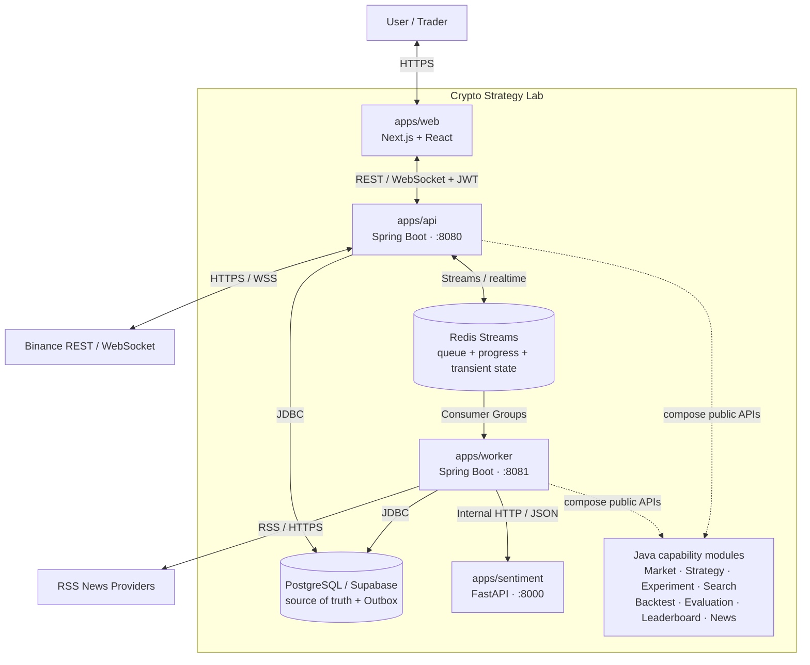
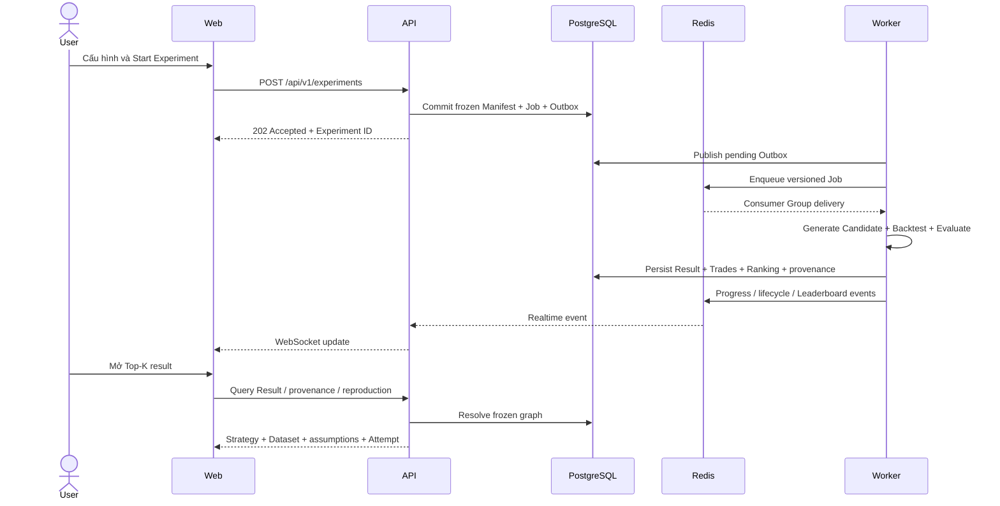

<div align="center">

# ₿ Crypto Strategy Lab 📈

**Nền tảng thử nghiệm, kết hợp, backtest và đánh giá chiến lược giao dịch tiền mã hóa**

[](https://github.com/PhamVanMinhBinhThuan/crypto-strategy-platform/actions/workflows/ci.yml)
[](https://openjdk.org/projects/jdk/21/)
[](https://spring.io/projects/spring-boot)
[](https://nextjs.org/)
[](https://react.dev/)
[](https://www.python.org/)
[](https://fastapi.tiangolo.com/)
[](https://www.postgresql.org/)
[](https://redis.io/)
[](#license)

Một đồ án môn **Kiến trúc phần mềm** tập trung vào khả năng thay đổi, mở rộng, phục hồi và kiểm chứng của một experiment platform — không nhằm đưa ra lời khuyên đầu tư hay cam kết lợi nhuận.

</div>

## 📑 Mục lục

- [🧭 Tổng quan](#overview)
- [🚦 Trạng thái dự án](#project-status)
- [✨ Tính năng](#features)
- [🧰 Tech Stack](#tech-stack)
- [🏗️ Kiến trúc](#architecture)
- [🔄 Luồng nghiệp vụ chính](#business-flow)
- [🧩 Module và trách nhiệm](#modules)
- [🛡️ Reliability và Scalability](#reliability-scalability)
- [📁 Cấu trúc repository](#repository-structure)
- [🚀 Cài đặt và chạy local](#local-setup)
- [⚙️ Biến môi trường](#environment)
- [🧪 Kiểm thử](#testing)
- [📝 Architectural Decisions](#architectural-decisions)
- [📚 Tài liệu](#documentation)
- [🗺️ Known Limitations và Roadmap](#limitations-roadmap)
- [🤝 Quy ước phát triển](#development-guidelines)
- [⚖️ Giấy phép](#license)

<a id="overview"></a>

## 🧭 Tổng quan

Crypto Strategy Lab cho phép người dùng lấy dữ liệu thị trường từ Binance, theo dõi tối đa bốn biểu đồ độc lập, xây dựng Strategy đơn hoặc Composite Strategy, chạy Backtest trên dataset bất biến, đánh giá kết quả và tìm kiếm candidate tốt hơn. Kết quả được xếp hạng trên Top-K Leaderboard và có thể truy ngược về Strategy, Dataset, tham số, assumption và lần chạy đã tạo ra nó.

Nền tảng cũng có pipeline thu thập tin RSS và một Sentiment Service độc lập để phân loại nội dung. Các capability trao đổi qua public contract; business logic không phụ thuộc trực tiếp UI, database, Binance payload hoặc ML implementation.

Các architectural drivers chính:

- **Modifiability:** thêm Strategy, Combination Policy hoặc provider với thay đổi cục bộ.
- **Replaceability:** thay Search Generator mà không viết lại Backtester/Evaluator.
- **Scalability:** xử lý Search/Backtest bất đồng bộ và scale ngang Worker.
- **Realtime:** multiplex Candle và workload updates qua WebSocket.
- **Reliability:** retry, recovery, idempotency, Dead Letter và failure isolation.
- **Reproducibility:** đóng băng Manifest, version, seed, checksum và fingerprint.
- **Observability:** correlation ID, progress/lifecycle event và health/readiness endpoint.

<a id="project-status"></a>

## 🚦 Trạng thái dự án

| Nhãn            | Ý nghĩa trong repository                                                   |
| --------------- | -------------------------------------------------------------------------- |
| **Implemented** | Có source code và/hoặc automated test trong repository.                    |
| **Verified**    | Có evidence record từ một phép kiểm tra đã chạy trong phạm vi được ghi rõ. |
| **Planned**     | Là target architecture, roadmap hoặc verification chưa có đủ evidence.     |

### Implemented baseline

- Java modular backend, API, Worker, Python Sentiment Service và Next.js Web.
- Binance historical/realtime adapter, canonical Candle, reconnect/gap recovery và immutable Dataset.
- Bốn Strategy plugin: Moving Average Crossover, RSI, Bollinger Bands và Support/Resistance.
- Composite Strategy với Majority Vote và Weighted Vote; User Strategy có version và ownership.
- Random Search, finite stop conditions, durable candidate/job orchestration và bounded in-flight window.
- Backtest, Trade records, Evaluation metrics, Top-K Leaderboard và read projection.
- PostgreSQL/Supabase persistence, Transactional Outbox, Redis Streams Consumer Groups, retry, reclaim, deduplication và Dead Letter flow.
- REST/WebSocket public boundary, Supabase JWT authentication và các màn hình Market, Strategy, Backtest, Search/Leaderboard, News/Sentiment.
- News RSS provider, normalization/deduplication và versioned Sentiment inference contract.
- Provenance và reproduction verification từ Leaderboard/Result về frozen Experiment graph.

### Verified trong phạm vi kiểm soát

- Durable integration đã ghi đúng **100 candidate riêng biệt** vào PostgreSQL với active window bằng 4.
- Controlled performance profiles đã chạy **1.000** và **10.000 candidate** với bounded executor/backpressure.
- Các profile này không bao gồm toàn bộ PostgreSQL round-trip, Binance và candle-by-candle production Backtest; xem [F-015 evidence](docs/evidence/f015/).

### Chưa được tuyên bố

- F014 chưa đạt nhãn `LIVE VERIFIED`: authenticated browser session, một số external dependency gate và cross-owner evidence/sign-off vẫn còn mở.
- Chưa có bằng chứng cho 100.000 full production Backtests hoặc production SLA.

Nguồn trạng thái: [Implementation Roadmap](docs/implementation-roadmap.md), [F014 Release Review](docs/evidence/f014/release-review.md) và [Architecture Evidence](docs/architecture/architecture-evidence.md).

<a id="features"></a>

## ✨ Tính năng

| Capability            | Trạng thái           | Nội dung đã có                                                                                  |
| --------------------- | -------------------- | ----------------------------------------------------------------------------------------------- |
| Market Data           | Implemented          | Binance REST/WebSocket, canonical Candle, fixture provider, retry, reconnect và recovery        |
| Multi-timeframe UI    | Implemented          | Tối đa 4 chart; pair/timeframe và subscription state độc lập                                    |
| Strategy Engine       | Implemented          | Contract `BUY`/`SELL`/`HOLD`, descriptor, parameter schema, Plugin/Registry                     |
| Strategy Library      | Implemented          | MA Crossover, RSI, Bollinger Bands, Support/Resistance                                          |
| Composite Strategy    | Implemented          | Majority Vote, Weighted Vote, versioned personal/composite Strategy                             |
| Search                | Implemented          | `random-search@1.0.0`, deterministic seed/state, finite stop conditions, composite Search Space |
| Backtesting           | Implemented          | Historical simulation, execution assumptions, Trade và immutable Result                         |
| Evaluation            | Implemented          | Return, Win Rate, Maximum Drawdown, Number of Trades và versioned scoring inputs                |
| Leaderboard           | Implemented          | Top-K projection, deterministic ranking/tie-break và revision                                   |
| Reliable Worker       | Implemented          | Redis Streams, Consumer Group, Outbox, retry, reclaim, idempotency và DLQ                       |
| News Intelligence     | Implemented          | RSS collection, normalize, deduplicate, persist và analysis lifecycle                           |
| Sentiment             | Implemented          | FastAPI, token-protected contract, model/input version và readiness                             |
| Public API & Realtime | Implemented          | REST, JWT authorization, WebSocket ticket, multiplex subscription và reconciliation             |
| Web Application       | Implemented          | Auth, Market, Strategy, Backtest, Search/Leaderboard và News routes                             |
| Full LIVE demo        | Planned verification | Automated/controlled gates có evidence; authenticated LIVE evidence chưa hoàn tất               |

<a id="tech-stack"></a>

## 🧰 Tech Stack

| Layer                 | Technology                                                     | Vai trò                                                                |
| --------------------- | -------------------------------------------------------------- | ---------------------------------------------------------------------- |
| Web                   | Next.js 16, React 19, TypeScript 5.9                           | Dashboard, authentication, REST/WebSocket client và presentation state |
| Backend API           | Java 21, Spring Boot 3.5                                       | REST, WebSocket, security, validation và composition root              |
| Background processing | Java 21, Spring Boot 3.5                                       | Search coordination, Backtest/Evaluation/Ranking và News jobs          |
| ML boundary           | Python 3.11/3.12, FastAPI, TensorFlow CPU                      | Stateless Sentiment inference                                          |
| Durable data          | PostgreSQL/Supabase, JDBC                                      | Business source of truth, immutable records và Outbox                  |
| Queue/transient state | Redis/Redis Streams                                            | Consumer Groups, progress events, queue và recoverable transient state |
| Build                 | Gradle 8.14.5, npm, Hatchling                                  | Java multi-project build, Web và Python packaging                      |
| Quality               | JUnit 5, ArchUnit, Vitest, Testing Library, Playwright, pytest | Unit, architecture, contract, integration và browser tests             |
| Delivery              | Docker, Docker Compose, GitHub Actions                         | Sentiment packaging và automated CI                                    |

Phiên bản được lấy từ `gradle/libs.versions.toml`, Gradle Wrapper, `apps/web/package.json`, `.nvmrc` và `apps/sentiment/pyproject.toml`.

<a id="architecture"></a>

## 🏗️ Kiến trúc

Backend Java cốt lõi theo **Modular Monolith**: capability được chia thành module có public API/port rõ ràng và được composition trong `apps/api` hoặc `apps/worker`. Queue/event chỉ được dùng tại boundary cần xử lý nền, retry hoặc scale; không thay mọi direct call bằng event.



### Nguyên tắc kiến trúc

1. Strategy nhận `StrategyContext`; không gọi database, Binance, Spring hoặc UI.
2. Frontend chỉ biết public REST/WebSocket contract, không biết Binance payload hay business table.
3. Module khác chỉ gọi public API/port/event; không import `internal` hoặc đọc chéo bảng.
4. PostgreSQL là nguồn sự thật; Redis không giữ bản duy nhất của business state.
5. At-least-once delivery luôn đi kèm idempotency; hệ thống không giả định exactly-once end-to-end.
6. Experiment, Strategy version, Dataset và Result đã chốt là immutable.
7. News/Sentiment failure không được kéo sập Market và technical Backtest flow.

Chi tiết: [Architecture Overview](docs/architecture/architecture-overview.md), [Container View](docs/architecture/container-view.md), [Module View](docs/architecture/module-view.md) và [Dynamic Data Flows](docs/architecture/data-flows.md).

<a id="business-flow"></a>

## 🔄 Luồng nghiệp vụ chính



Luồng tương ứng với sáu bước nghiệp vụ:

1. API xác thực user, validate request và đóng băng Experiment Manifest.
2. Search Generator sinh Candidate từ versioned Search Space, seed và durable state.
3. Job và Outbox được ghi cùng database transaction rồi publish sang Redis Stream.
4. Worker trong Consumer Group nhận Job, đọc Dataset theo batch và chạy Backtest.
5. Evaluation tính metrics; Ranking cập nhật Top-K projection và revision.
6. Result truy ngược được về Candidate, successful Attempt, Strategy version, Dataset checksum và Manifest; reproduction tạo graph mới thay vì sửa source.

Public contract: [OpenAPI](docs/api/openapi.yaml), [API Conventions](docs/api/conventions.md) và [WebSocket Events](docs/api/websocket-events.md).

<a id="modules"></a>

## 🧩 Module và trách nhiệm

| Module                 | Trách nhiệm chính                                                                   |
| ---------------------- | ----------------------------------------------------------------------------------- |
| `domain`               | Value object và invariant ổn định dùng chung có kiểm soát                           |
| `contracts`            | DTO/message versioned đi qua HTTP, WebSocket và queue/runtime                       |
| `market-data`          | Market provider port, Binance adapter, canonical Candle, Dataset và recovery        |
| `strategy-core`        | Strategy contract, descriptor, parameter schema, Registry và version identity       |
| `strategies`           | Bốn Strategy plugin kỹ thuật                                                        |
| `combination`          | Composite Strategy, Majority Vote và Weighted Vote                                  |
| `experiment`           | Frozen Manifest, Candidate/Job/Attempt lifecycle và reproduction ownership          |
| `search`               | Generator Registry, deterministic generation, Search Space và stop conditions       |
| `experiment-execution` | Điều phối Search → Backtest → Evaluation → Leaderboard và reproduction verification |
| `backtesting`          | Mô phỏng execution và tạo Trade/Backtest Result                                     |
| `evaluation`           | Tính metrics độc lập với Strategy implementation                                    |
| `leaderboard`          | Scoring, tie-break, Top-K projection và revision                                    |
| `news`                 | Provider contract, normalization, persistence lifecycle và Sentiment ownership      |
| `persistence`          | JDBC/Redis adapters implement output ports; không chứa business policy              |

`apps/api` và `apps/worker` là composition roots; `apps/web` và `apps/sentiment` là runtime riêng, không import Java capability implementation.

<a id="reliability-scalability"></a>

## 🛡️ Reliability và Scalability

| Cơ chế                                | Vấn đề được xử lý                                                 |
| ------------------------------------- | ----------------------------------------------------------------- |
| Transactional Outbox                  | Tránh khoảng trống giữa DB commit và publish queue message        |
| At-least-once + idempotency           | Message có thể được giao lại nhưng không tạo Result/Ranking trùng |
| Redis Consumer Groups                 | Phân phối Job giữa nhiều Worker instance                          |
| Pending reclaim + stale sweeper       | Worker crash trước ACK hoặc Attempt bị treo                       |
| Retry có backoff/jitter + DLQ         | Phân biệt lỗi tạm thời và lỗi vĩnh viễn                           |
| Bounded in-flight window/backpressure | Không nạp vô hạn Candidate/Job vào RAM hoặc downstream            |
| Batched Dataset reader                | Không giữ toàn bộ lịch sử Candle lớn trong bộ nhớ                 |
| Top-K projection                      | Không sort lại toàn bộ Result cho mỗi lần đọc Leaderboard         |
| Circuit breaker/timeout Sentiment     | News degraded mà Market/Backtest vẫn hoạt động                    |
| WebSocket revision/dedup/reconcile    | Bỏ duplicate/bản cũ và phục hồi sau reconnect                     |

Worker được thiết kế stateless theo business state. Có thể tăng instance với consumer name riêng, nhưng throughput không được giả định tăng tuyến tính: PostgreSQL connection pool, lock contention, network và Dataset I/O có thể trở thành bottleneck. Mọi tuyên bố scale phải gắn với phạm vi benchmark cụ thể.

<a id="repository-structure"></a>

## 📁 Cấu trúc repository

```text
crypto-strategy-platform/
├── apps/
│   ├── api/                   # REST, WebSocket, JWT và composition root
│   ├── worker/                # Search/Backtest/News background runtime
│   ├── web/                   # Next.js dashboard và Supabase Auth client
│   └── sentiment/             # Python/FastAPI inference boundary
├── modules/                   # 14 Java capability/adapter modules
├── architecture-tests/        # ArchUnit và dependency/boundary verification
├── build-logic/               # Gradle convention plugins dùng chung
├── docs/                      # Architecture, ADR, API, DB, demo và evidence
├── infra/
│   ├── compose/               # Sentiment Docker Compose
│   └── database/              # Database process và demo seed
├── specs/                     # Feature specs, plans, tasks và contracts
├── supabase/
│   ├── migrations/            # Nguồn migration PostgreSQL chính thức
│   └── tests/                 # SQL verification
├── tests/                     # Shared test-layout placeholders
├── .github/workflows/         # Java, Python contract và Web CI
└── README.md
```

<a id="local-setup"></a>

## 🚀 Cài đặt và chạy local

### Prerequisites

- Git.
- JDK 21; Gradle Wrapper tự tải Gradle 8.14.5.
- Node.js 22 và npm.
- Python 3.11 hoặc 3.12 nếu chạy Sentiment ngoài Docker.
- Docker Desktop nếu chạy Redis/Sentiment bằng container.
- PostgreSQL/Supabase đã áp dụng migrations trong `supabase/migrations/`.
- Supabase Auth development project/user và network truy cập Binance cho live profile.

> [!IMPORTANT]
> `infra/compose/docker-compose.yml` chỉ định nghĩa Sentiment Service. PostgreSQL/Supabase và Redis phải được cung cấp riêng. Xem [hướng dẫn database](infra/database/README.md).

### 1. Clone và cài dependency

```bash
git clone https://github.com/PhamVanMinhBinhThuan/crypto-strategy-platform.git
cd crypto-strategy-platform

cd apps/web
npm ci
cd ../..

./gradlew projects
```

Trên Windows PowerShell, thay `./gradlew` bằng `.\gradlew.bat`.

### 2. Tạo cấu hình local

macOS/Linux/WSL:

```bash
cp .env.example .env.local
cp apps/web/.env.example apps/web/.env.local
```

Windows PowerShell:

```powershell
Copy-Item .env.example .env.local
Copy-Item apps/web/.env.example apps/web/.env.local
```

Điền giá trị local an toàn vào hai file. Không commit `.env.local`, database password, JWT, service token hoặc model credential.

Ứng dụng Spring Boot không tự đọc `.env.local`. Với PowerShell, nạp biến trong mỗi terminal API/Worker/Sentiment bằng đoạn đã được dùng trong [Windows runbook](docs/RUN_LOCAL.md):

```powershell
Get-Content .env.local | ForEach-Object {
  $line = $_.Trim()
  if ($line -and -not $line.StartsWith('#') -and $line.Contains('=')) {
    $name, $value = $line.Split('=', 2)
    Set-Item "Env:$($name.Trim())" $value.Trim().Trim('"').Trim("'")
  }
}
```

Trên macOS/Linux/WSL:

```bash
set -a
source .env.local
set +a
```

### 3. Chuẩn bị database

PostgreSQL/Supabase phải được database owner áp dụng đầy đủ forward migrations trong `supabase/migrations/`. Không chỉnh schema thủ công trên dashboard. Quy trình và seed tham chiếu cho demo nằm trong [infra/database/README.md](infra/database/README.md).

### 4. Khởi động Redis

```bash
docker run --rm --name crypto-strategy-redis -p 6379:6379 redis:7-alpine
```

Kiểm tra từ terminal khác:

```bash
docker exec crypto-strategy-redis redis-cli ping
```

Kết quả mong đợi: `PONG`.

### 5. Khởi động Sentiment Service

Sau khi nạp `.env.local` vào terminal:

```bash
docker compose -f infra/compose/docker-compose.yml up --build sentiment
```

Compose yêu cầu `SENTIMENT_SERVICE_TOKEN` và `SENTIMENT_BUNDLE_PATH`. Kiểm tra:

```bash
curl -fsS http://127.0.0.1:8000/health/live
curl -fsS http://127.0.0.1:8000/health/ready
```

### 6. Khởi động API

Trong terminal đã nạp `.env.local`:

```bash
./gradlew :apps:api:bootRun --no-daemon
```

API chạy mặc định tại `http://localhost:8080`. Muốn dùng Binance thay fixture:

```bash
export PLATFORM_MARKET_DATA_PROVIDER=binance
export PLATFORM_SECURITY_ALLOWED_ORIGINS=http://localhost:3000
```

PowerShell tương ứng:

```powershell
$env:PLATFORM_MARKET_DATA_PROVIDER = 'binance'
$env:PLATFORM_SECURITY_ALLOWED_ORIGINS = 'http://localhost:3000'
.\gradlew.bat :apps:api:bootRun --no-daemon
```

### 7. Khởi động Worker

Trong terminal khác đã nạp `.env.local`:

```bash
export NEWS_ENABLED=true
export SENTIMENT_SERVICE_URL=http://127.0.0.1:8000
export WORKER_CONSUMER_CONSUMER_NAME=worker-local-1
./gradlew :apps:worker:bootRun --no-daemon
```

PowerShell tương ứng:

```powershell
$env:NEWS_ENABLED = 'true'
$env:SENTIMENT_SERVICE_URL = 'http://127.0.0.1:8000'
$env:WORKER_CONSUMER_CONSUMER_NAME = 'worker-local-1'
.\gradlew.bat :apps:worker:bootRun --no-daemon
```

Mỗi Worker chạy song song phải có `WORKER_CONSUMER_CONSUMER_NAME` riêng.

### 8. Khởi động Web

```bash
cd apps/web
npm run dev
```

Mở `http://localhost:3000/login`. Web tự đọc `apps/web/.env.local`; live profile phải đặt `NEXT_PUBLIC_ENABLE_FIXTURES=false`.

### 9. Health checks

```bash
curl -fsS http://127.0.0.1:8080/actuator/health/liveness
curl -fsS http://127.0.0.1:8080/actuator/health/readiness
curl -fsS http://127.0.0.1:8081/actuator/health/liveness
curl -fsS http://127.0.0.1:8081/actuator/health/readiness
curl -fsS http://127.0.0.1:8000/health/ready
```

Startup order, migration preflight, failure demo và cleanup đầy đủ: [macOS/Linux/WSL guide](docs/run.md), [Windows PowerShell guide](docs/RUN_LOCAL.md) và [F014 Demo Runbook](docs/demo/f014/runbook.md).

<a id="environment"></a>

## ⚙️ Biến môi trường

Giá trị dưới đây chỉ là placeholder an toàn. Danh sách canonical nằm trong [.env.example](.env.example) và [apps/web/.env.example](apps/web/.env.example).

| Biến                                | Bắt buộc                     | Runtime           | Mục đích                                             | Giá trị mẫu an toàn                                             |
| ----------------------------------- | ---------------------------- | ----------------- | ---------------------------------------------------- | --------------------------------------------------------------- |
| `DATABASE_URL`                      | Có                           | API, Worker       | JDBC URL tới PostgreSQL/Supabase                     | `jdbc:postgresql://localhost:5432/crypto_lab`                   |
| `DATABASE_USERNAME`                 | Có                           | API, Worker       | Database user                                        | `crypto_app`                                                    |
| `DATABASE_PASSWORD`                 | Có                           | API, Worker       | Database password                                    | `<local-password>`                                              |
| `SUPABASE_JWT_ISSUER`               | Có cho API auth              | API               | JWT issuer                                           | `https://project-ref.supabase.co/auth/v1`                       |
| `SUPABASE_JWT_JWKS_URI`             | Có cho API auth              | API               | JWKS endpoint                                        | `https://project-ref.supabase.co/auth/v1/.well-known/jwks.json` |
| `SUPABASE_JWT_AUDIENCE`             | Có cho API auth              | API               | Expected audience                                    | `authenticated`                                                 |
| `PLATFORM_MARKET_DATA_PROVIDER`     | Không                        | API               | `fixture` mặc định hoặc Binance live                 | `binance`                                                       |
| `PLATFORM_SECURITY_ALLOWED_ORIGINS` | Có khi chạy Web              | API               | CORS/WebSocket origin                                | `http://localhost:3000`                                         |
| `NEWS_ENABLED`                      | Không                        | Worker            | Bật News collection/analysis                         | `true`                                                          |
| `SENTIMENT_SERVICE_URL`             | Khi bật News                 | Worker            | Internal inference endpoint                          | `http://127.0.0.1:8000`                                         |
| `SENTIMENT_SERVICE_TOKEN`           | Khi bật Sentiment            | Worker, Sentiment | Token bảo vệ internal API                            | `<random-local-token>`                                          |
| `SENTIMENT_BUNDLE_PATH`             | Có cho Sentiment ML          | Sentiment/Compose | Model bundle mount path                              | `/absolute/path/to/active_release`                              |
| `SENTIMENT_MODEL_NAME`              | Không                        | Worker            | Model identity ghi vào Result                        | `multichannel-english`                                          |
| `SENTIMENT_MODEL_VERSION`           | Không                        | Worker            | Model version                                        | `multichannel-english-1.0.0`                                    |
| `SENTIMENT_PREPROCESSING_VERSION`   | Không                        | Worker            | Input/preprocessing version                          | `multichannel-whitespace-en-1`                                  |
| `WORKER_CONSUMER_CONSUMER_NAME`     | Không; phải unique khi scale | Worker            | Redis consumer identity                              | `worker-local-1`                                                |
| `NEXT_PUBLIC_SUPABASE_URL`          | Có                           | Web               | Supabase Auth URL                                    | `https://project-ref.supabase.co`                               |
| `NEXT_PUBLIC_SUPABASE_ANON_KEY`     | Có                           | Web               | Browser-safe publishable/anon key                    | `<public-anon-key>`                                             |
| `NEXT_PUBLIC_API_BASE_URL`          | Có                           | Web               | REST base URL                                        | `http://localhost:8080/api/v1`                                  |
| `NEXT_PUBLIC_WS_URL`                | Có                           | Web               | WebSocket endpoint                                   | `ws://localhost:8080/ws`                                        |
| `NEXT_PUBLIC_ENABLE_FIXTURES`       | Không                        | Web               | Controlled UI fixtures; không dùng làm live evidence | `false`                                                         |

Không đặt `DATABASE_PASSWORD`, service-role key hoặc `SENTIMENT_SERVICE_TOKEN` trong biến `NEXT_PUBLIC_*`; mọi biến có prefix này có thể xuất hiện trong browser bundle.

> [!NOTE]
> `.env.example` hiện liệt kê `NEWS_AUDIT_SERVICE_TOKEN`, trong khi API runtime bind internal audit token từ `PLATFORM_SECURITY_INTERNAL_NEWS_AUDIT_TOKEN`. Hãy đối chiếu `apps/api/src/main/resources/application.yml` trước khi bật internal audit endpoint; đây là config-parity gap chưa nên che giấu.

<a id="testing"></a>

## 🧪 Kiểm thử

Các lệnh dưới đây chạy từ repository root. Trên Windows dùng `.\gradlew.bat` thay `./gradlew`.

### Java unit, contract và architecture tests

```bash
./gradlew test
./gradlew :architecture-tests:test
./gradlew clean check
```

### Integration tests có PostgreSQL/Supabase

Nạp `DATABASE_URL`, `DATABASE_USERNAME`, `DATABASE_PASSWORD` trước khi chạy:

```bash
./gradlew :modules:persistence:marketDataIntegrationTest
./gradlew :modules:persistence:strategyIntegrationTest
./gradlew :modules:persistence:experimentIntegrationTest
./gradlew :modules:persistence:backtestEvaluationLeaderboardIntegrationTest
./gradlew :modules:persistence:newsIntegrationTest

./gradlew supabaseIntegrationTest
```

### Controlled performance profile

```bash
./gradlew :apps:worker:performanceTest -Pf015Performance=true
```

Phạm vi và kết quả phải đọc cùng [F-015 evidence](docs/evidence/f015/); không diễn giải profile này thành production throughput.

### Sentiment tests

```bash
python -m pip install -e "apps/sentiment[test]"
cd apps/sentiment
python -m pytest
```

### Web tests

```bash
cd apps/web
npm ci
npm run check

# Browser E2E chạy riêng khi môi trường phù hợp
npm run test:e2e
```

`npm run check` chạy Prettier check, ESLint, TypeScript, Vitest và production build. CI hiện chạy Java tests, Python contract/tests và Web verification theo path trong `.github/workflows/`.

<a id="architectural-decisions"></a>

## 📝 Architectural Decisions

| ADR                                                                   | Quyết định                                                |
| --------------------------------------------------------------------- | --------------------------------------------------------- |
| [ADR-0001](docs/adr/0001-modular-monolith.md)                         | Modular Monolith cho backend cốt lõi                      |
| [ADR-0002](docs/adr/0002-module-boundaries.md)                        | Module ownership, public boundary và dependency direction |
| [ADR-0003](docs/adr/0003-market-data-adapter.md)                      | Market Data Provider Adapter và canonical Candle          |
| [ADR-0004](docs/adr/0004-websocket-realtime.md)                       | Native WebSocket, multiplexing, recovery và backpressure  |
| [ADR-0005](docs/adr/0005-strategy-plugin-registry.md)                 | Strategy contract, Plugin và Registry                     |
| [ADR-0006](docs/adr/0006-queue-worker-backtesting.md)                 | Redis Streams, Queue–Worker, idempotency và Outbox        |
| [ADR-0007](docs/adr/0007-postgresql-redis-ownership.md)               | PostgreSQL source of truth và Redis transient boundary    |
| [ADR-0008](docs/adr/0008-sentiment-service-boundary.md)               | Python Sentiment Service và failure isolation             |
| [ADR-0009](docs/adr/0009-reproducible-experiments.md)                 | Frozen Manifest, versioning, fingerprint và provenance    |
| [ADR-0010](docs/adr/0010-strategy-generator-contract.md)              | Replaceable Strategy Generator contract                   |
| [ADR-0011](docs/adr/0011-supabase-auth-user-ownership.md)             | Supabase Auth và user ownership                           |
| [ADR-0013](docs/adr/0013-backtest-execution-integration.md)           | Backtest execution và cross-capability integration        |
| [ADR-0014](docs/adr/0014-experiment-execution-orchestrator.md)        | Experiment Execution orchestration module                 |
| [ADR-0016](docs/adr/0016-search-coordinator-durable-orchestration.md) | Durable Search Coordinator decisions                      |
| [ADR-0017](docs/adr/0017-composite-search-space-and-refill.md)        | Versioned Composite Search Space và bounded refill        |

Xem danh sách đầy đủ và trạng thái từng quyết định tại [ADR Index](docs/adr/README.md). ADR ở trạng thái Proposed không được xem là governance approval chỉ vì đã có implementation liên quan.

<a id="documentation"></a>

## 📚 Tài liệu

### Yêu cầu và kiến trúc

- [Đề bài — Crypto Strategy Lab](docs/Crypto%20Strategy%20Lab%20%E2%80%93%20%C4%90%E1%BB%93%20%C3%A1n%20cu%E1%BB%91i%20k%E1%BB%B3.pdf)
- [Slide kiến trúc](docs/KienTrucDoAn_slide.pdf)
- [Architecture Documentation Index](docs/architecture/README.md)
- [System Context](docs/architecture/system-context.md)
- [Container View](docs/architecture/container-view.md)
- [Module View](docs/architecture/module-view.md)
- [Data Model & Ownership](docs/architecture/data-model-overview.md)
- [Quality Attribute Scenarios](docs/architecture/quality-attributes.md)
- [Architecture Evidence](docs/architecture/architecture-evidence.md)

### API, database và vận hành

- [Setup, cài đặt và build](docs/SETUP.md)
- [API Documentation](docs/api/README.md)
- [OpenAPI Contract](docs/api/openapi.yaml)
- [Database Documentation](docs/database/README.md)
- [Implementation Roadmap](docs/implementation-roadmap.md)
- [Local Run Guide](docs/run.md)
- [Windows PowerShell Run Guide](docs/RUN_LOCAL.md)
- [F014 Demo Runbook](docs/demo/f014/runbook.md)
- [Evidence Index](docs/evidence/f014/README.md)

### Ôn bảo vệ

- [23 câu hỏi và câu trả lời kiến trúc](docs/questions/README.md)

<a id="limitations-roadmap"></a>

## 🗺️ Known Limitations và Roadmap

- **LIVE evidence:** hoàn thiện authenticated browser journey, external dependency gates, media evidence và cross-owner sign-off cho F014.
- **Scale verification:** mở rộng từ controlled 1.000/10.000 candidate profile sang durable, full-pipeline benchmark có PostgreSQL, Binance/dataset I/O và candle-by-candle Backtest; chưa tuyên bố 100.000 production Backtests.
- **Provider:** production adapter hiện là Binance; OKX, Bybit và Coinbase mới là extension points.
- **Search:** Random Search đã có; Domain-guided, Genetic, Bayesian, Agent/LLM generators chưa phải production implementation.
- **MLOps:** model/input versioning đã có; automated quality-drift detection và alerting chưa hoàn chỉnh.
- **Operations:** không có Kubernetes, Kafka, service mesh hoặc microservice-per-capability; chỉ bổ sung khi driver và measurement biện minh được chi phí.
- **CQRS/Event Sourcing:** chỉ dùng read projection có chọn lọc cho Leaderboard, không triển khai full Event Sourcing.
- **Trading:** không có order execution, wallet hoặc kết nối giao dịch tiền thật.
- **Configuration parity:** biến internal News audit trong `.env.example` và API binding cần được thống nhất trước live use.

<a id="development-guidelines"></a>

## 🤝 Quy ước phát triển

1. Tạo branch từ `main` theo dạng `feature/<ten-ngan-gon>`, `fix/<ten-ngan-gon>` hoặc convention của feature hiện tại.
2. Không đưa business logic vào Controller, UI hoặc infrastructure adapter.
3. Public contract nằm dưới `api`, `port` hoặc `event`; implementation nằm dưới `internal`.
4. Không import chéo package `internal` và không truy cập trực tiếp business table của module khác.
5. Mọi thay đổi contract/schema phải có test và cập nhật OpenAPI, migration hoặc ADR tương ứng.
6. Không sửa migration đã chạy trên môi trường dùng chung; tạo forward migration mới.
7. Chạy test phù hợp trước Pull Request và ghi rõ profile nào là LIVE hay CONTROLLED.
8. Không commit `.env.local`, token, cookie, database URL có credential hoặc artifact chứa secret.

> [!WARNING]
> Dự án phục vụ học tập và nghiên cứu. Kết quả backtest không bảo đảm hiệu quả giao dịch trong tương lai và không phải lời khuyên tài chính. Hệ thống không thực hiện giao dịch bằng tiền thật.

<a id="license"></a>

## ⚖️ Giấy phép

Repository hiện chưa công bố giấy phép. Không mặc định sao chép, phân phối hoặc sử dụng ngoài phạm vi được chủ sở hữu cho phép.
