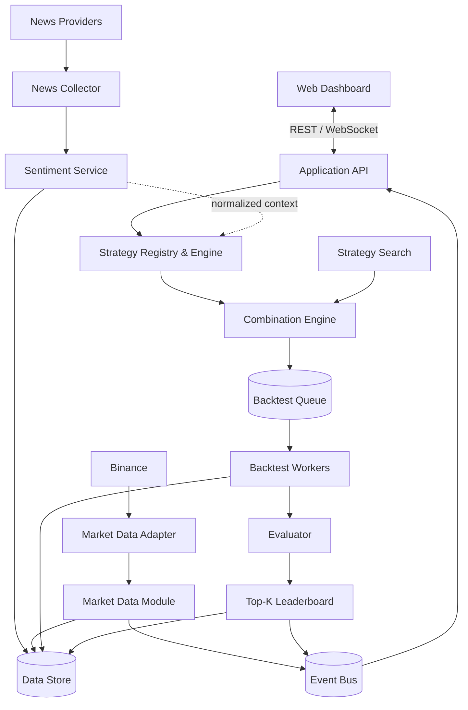

# Crypto Strategy Lab

> Nền tảng thử nghiệm, kết hợp và đánh giá chiến lược giao dịch tiền mã hóa theo thời gian thực.

[](#trạng-thái-dự-án)
[](#mục-tiêu-kiến-trúc)
[](#giấy-phép)

## Tổng quan

Crypto Strategy Lab là đồ án cuối kỳ môn **Kiến trúc phần mềm**, hướng tới xây dựng một nền tảng có thể:

- tiếp nhận dữ liệu thị trường lịch sử và thời gian thực;
- hiển thị đồng thời tối đa 4 biểu đồ nến với các khung thời gian độc lập;
- bổ sung strategy mới dưới dạng plugin;
- kết hợp nhiều strategy thành composite strategy;
- sinh, backtest, đánh giá và xếp hạng các chiến lược;
- thu thập tin tức và phân tích sentiment;
- liên tục tìm kiếm các tổ hợp strategy tiềm năng.

Trọng tâm của dự án là **khả năng thay đổi, mở rộng và vận hành độc lập giữa các thành phần**, không phải tạo ra lời khuyên đầu tư hay cam kết lợi nhuận.

> [!WARNING]
> Dự án chỉ phục vụ mục đích học tập và nghiên cứu. Kết quả backtest không phản ánh chắc chắn hiệu quả giao dịch trong tương lai và không phải lời khuyên tài chính.

## Trạng thái dự án

🚧 **Đang trong giai đoạn phân tích yêu cầu và thiết kế kiến trúc.**

Tài liệu đề bài gốc: [Crypto Strategy Lab – Đồ án cuối kỳ](docs/Crypto%20Strategy%20Lab%20%E2%80%93%20%C4%90%E1%BB%93%20%C3%A1n%20cu%E1%BB%91i%20k%E1%BB%B3.pdf)

README sẽ được cập nhật cùng với source code, quyết định công nghệ và hướng dẫn triển khai trong các giai đoạn tiếp theo.

## Tính năng cốt lõi

| Nhóm chức năng | Phạm vi |
| --- | --- |
| Market Data | Historical candles và realtime stream từ Binance qua adapter chuẩn hóa |
| Multi-timeframe | Tối đa 4 candlestick chart; mỗi chart đổi pair/timeframe độc lập |
| Strategy Engine | Chuẩn hóa tín hiệu `BUY`, `SELL`, `HOLD`; hỗ trợ strategy plugin |
| Composite Strategy | Majority vote hoặc weighted combination giữa nhiều strategy |
| Search Engine | Sinh candidate bằng Random Search; có thể thay thế bằng thuật toán khác |
| Backtesting | Mô phỏng giao dịch từ dữ liệu lịch sử và lưu vết từng trade |
| Evaluation | Return, Win Rate, Maximum Drawdown và Number of Trades |
| Leaderboard | Xếp hạng và duy trì Top-K strategy theo scoring policy |
| Visualization | Indicator, Buy/Sell signal, Entry/Exit, Support/Resistance |
| News & Sentiment | Collect → Normalize → Store → Analyze sentiment |
| Observability | Theo dõi trạng thái loop, tiến độ, thời gian xử lý và lỗi |

## Mục tiêu kiến trúc

Dự án ưu tiên các architectural drivers sau:

- **Modifiability:** thêm strategy, search algorithm hoặc data provider với thay đổi tối thiểu.
- **Scalability:** có đường nâng cấp từ vài backtest sang hàng chục nghìn job qua queue và worker pool.
- **Realtime:** truyền candle và trạng thái tác vụ tới giao diện với độ trễ thấp.
- **Reliability:** tự động reconnect, retry và bù dữ liệu khi nguồn market data gián đoạn.
- **Maintainability:** tách biệt business logic, hạ tầng, giao diện và tích hợp bên ngoài.
- **Reproducibility:** mỗi experiment tham chiếu chính xác strategy version, parameters và dataset.
- **Observability:** có log, metric và trạng thái rõ ràng cho toàn bộ experiment loop.

## Kiến trúc đề xuất

Kiến trúc khởi đầu là **modular monolith theo hướng event-driven**, đủ đơn giản để phát triển MVP nhưng giữ ranh giới module rõ ràng để có thể tách worker hoặc service khi tải tăng.



### Nguyên tắc thiết kế

- Frontend chỉ sử dụng contract nội bộ, không phụ thuộc trực tiếp vào schema của Binance.
- Strategy chỉ phân tích `StrategyContext`; không gọi exchange, database hoặc UI.
- `StrategyRegistry` thay cho chuỗi điều kiện hard-coded theo tên strategy.
- Search Engine chỉ sinh `CandidateStrategy`; không phụ thuộc implementation của Backtester.
- Evaluator tách khỏi Strategy và Backtester để có thể thay đổi metric/scoring độc lập.
- News Provider và Market Data Provider đều nằm sau abstraction/adapter.
- Các tác vụ nặng chạy qua queue để có thể scale worker theo chiều ngang.

## Luồng xử lý chính

### Realtime market data

```text
Binance → Market Data Adapter → Candle Event → Backend → WebSocket → Dashboard
```

Khi một chart đổi timeframe, hệ thống chỉ thay subscription và dữ liệu của chart đó thay vì tải lại toàn bộ dashboard.

### Strategy experiment loop

```text
Generate → Backtest → Evaluate → Rank → Persist → Notify → Repeat
```

Mỗi experiment cần lưu tối thiểu:

- strategy definition và version;
- parameter set và combination rule;
- pair, timeframe và khoảng dữ liệu;
- cấu hình mô phỏng giao dịch;
- metrics, score và danh sách trade;
- thời điểm chạy và trạng thái thực thi.

### News sentiment

```text
Provider → Collect → Normalize → Store → Analyze → Publish sentiment
```

Sentiment sau khi chuẩn hóa có thể được dùng làm dữ liệu đầu vào cho `NewsSentimentStrategy` mà không làm thay đổi contract chung của Strategy Engine.

## Strategy contract

Contract minh họa, không phụ thuộc ngôn ngữ triển khai:

```ts
type Signal = "BUY" | "SELL" | "HOLD";

interface Strategy {
  readonly id: string;
  readonly version: string;
  analyze(context: StrategyContext): StrategyResult;
}

interface StrategyGenerator {
  generate(searchSpace: SearchSpace): CandidateStrategy;
}
```

Một strategy mới như MACD dự kiến chỉ cần:

1. implement `Strategy`;
2. khai báo metadata và parameter schema;
3. đăng ký với `StrategyRegistry`;
4. bổ sung unit test tương ứng.

Backtester, Evaluator và Leaderboard không cần biết candidate được tạo bởi MA, MACD hay một plugin khác.

## Strategy dự kiến cho MVP

- Moving Average Crossover;
- Relative Strength Index (RSI);
- Bollinger Bands;
- Support/Resistance;
- Composite Strategy với majority vote hoặc weighted score;
- Random Strategy Generator.

Các hướng mở rộng gồm MACD, SMC, Wyckoff, Genetic Search, Bayesian Optimization và News Sentiment Strategy.

## Cấu trúc repository dự kiến

```text
crypto-strategy-lab/
├── apps/
│   ├── web/                   # Dashboard và realtime visualization
│   ├── api/                   # API, orchestration và WebSocket gateway
│   └── worker/                # Backtest/news/sentiment background jobs
├── packages/
│   ├── domain/                # Entity, value object và domain contract
│   ├── strategies/            # Strategy plugins và registry
│   ├── backtesting/           # Simulation engine
│   ├── evaluation/            # Metrics và ranking policy
│   └── contracts/             # API/event schemas dùng chung
├── docs/
│   ├── architecture/          # C4 diagrams và quality scenarios
│   ├── adr/                   # Architecture Decision Records
│   └── Crypto Strategy Lab – Đồ án cuối kỳ.pdf
├── infra/                     # Container, database, queue và deployment
├── tests/                     # Integration, E2E và performance tests
└── README.md
```

Cấu trúc này là định hướng ban đầu và sẽ được điều chỉnh sau khi chốt technology stack.

## Dữ liệu chính

| Nhóm dữ liệu | Nội dung tiêu biểu |
| --- | --- |
| Candle | Pair, timeframe, timestamp, OHLCV |
| Strategy Definition | ID, loại, version, parameters, metadata |
| Experiment | Candidate, dataset, configuration, status, result |
| Trade | Entry/exit, side, price, P&L, timestamps |
| Leaderboard Entry | Experiment, metrics, overall score, rank |
| News | Title, content, source, URL, publish/crawl time, related coins |
| Sentiment | Label, score, model version, analyzed time |

Strategy definition là **immutable theo version**; thay đổi logic hoặc parameter mặc định phải tạo version mới để bảo đảm tái lập kết quả.

## Phạm vi MVP

- [ ] Nhận historical và realtime data từ Binance
- [ ] Hiển thị candlestick chart cập nhật realtime
- [ ] Theo dõi tối đa 4 timeframe độc lập
- [ ] Cài đặt ít nhất 4 strategy đơn lẻ
- [ ] Tạo và thực thi composite strategy
- [ ] Backtest trên historical data
- [ ] Tính Return, Win Rate, Maximum Drawdown và Number of Trades
- [ ] Random Search và continuous experiment loop
- [ ] Top-K Leaderboard cập nhật realtime
- [ ] Hiển thị signal và Entry/Exit trên chart
- [ ] Pipeline thu thập, lưu trữ và phân tích sentiment tin tức
- [ ] Logging, error handling và trạng thái job cơ bản

## Cài đặt và chạy dự án

Source code và technology stack đang được khởi tạo. Hướng dẫn dưới đây sẽ được hoàn thiện khi các ứng dụng đầu tiên được scaffold:

```bash
# 1. Clone repository
git clone <repository-url>
cd crypto-strategy-lab

# 2. Tạo cấu hình local
cp .env.example .env

# 3. Khởi động dependencies và ứng dụng
docker compose up --build
```

Các biến môi trường dự kiến:

```dotenv
BINANCE_API_BASE_URL=
BINANCE_WS_BASE_URL=
DATABASE_URL=
REDIS_URL=
NEWS_PROVIDER_API_KEY=
```

Không commit API key, credential hoặc file `.env` lên repository.

## Kiểm thử

Chiến lược kiểm thử dự kiến gồm:

- **Unit test:** indicator, strategy rule, combination, metric và scoring policy;
- **Contract test:** adapter Binance, news provider và event schema;
- **Integration test:** dữ liệu → strategy → backtest → leaderboard;
- **E2E test:** dashboard realtime và luồng chạy experiment;
- **Performance test:** backtest throughput, queue latency và WebSocket fan-out;
- **Resilience test:** reconnect Binance, retry job và xử lý duplicate event.

Một backtest chỉ được xem là có thể tái lập khi cùng strategy version, parameters, dataset và simulation configuration tạo ra cùng kết quả.

## Tài liệu kiến trúc

Các tài liệu sẽ được bổ sung trong `docs/`:

- System Context và Container/Component diagrams;
- Data Flow, Realtime Flow và Search/Backtest Flow;
- quality attribute scenarios;
- API và event contracts;
- Architecture Decision Records (ADR).

ADR dự kiến đầu tiên:

- `ADR-001`: giao tiếp realtime bằng WebSocket;
- `ADR-002`: Strategy Plugin Architecture;
- `ADR-003`: queue và worker cho backtesting;
- `ADR-004`: tách biệt News Collector và Sentiment Service;
- `ADR-005`: version hóa strategy và experiment reproducibility.

## Quy ước đóng góp

1. Tạo branch từ nhánh chính theo dạng `feature/<ten-ngan-gon>` hoặc `fix/<ten-ngan-gon>`.
2. Giữ thay đổi tập trung vào một mục tiêu và bổ sung test phù hợp.
3. Không đưa business logic vào controller, UI hoặc infrastructure adapter.
4. Cập nhật tài liệu/ADR khi thay đổi contract hoặc quyết định kiến trúc quan trọng.
5. Mở pull request kèm mô tả, phạm vi kiểm thử và ảnh demo nếu có thay đổi giao diện.

## Nhóm phát triển

| Thành viên | Vai trò | Trách nhiệm |
| --- | --- | --- |
| _Đang cập nhật_ | _Đang cập nhật_ | _Đang cập nhật_ |

## Giấy phép

Chưa xác định. Vui lòng không sử dụng hoặc phân phối ngoài phạm vi môn học cho đến khi repository công bố giấy phép chính thức.
