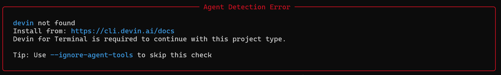
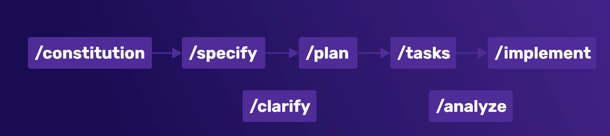

# Hướng dẫn sử dụng Spec-Kit

## Bước 1: Cài đặt Spec-Kit

> **Lưu ý:** Nếu project đã có sẵn Spec-Kit thì không cần cài lại. Phần dưới đây chỉ áp dụng khi cần cài mới.

### 1.1. Cài đặt `uv`

Nếu máy chưa có `uv` (gặp lỗi `command not found: uv`), chạy lệnh tương ứng với hệ điều hành:

**Mac/Linux:**
```bash
curl -LsSf https://astral.sh/uv/install.sh | sh
```

**Windows (PowerShell):**
```powershell
powershell -ExecutionPolicy ByPass -c "irm https://astral.sh/uv/install.ps1 | iex"
```

### 1.2. Cài đặt Spec-Kit CLI

Chạy lệnh sau trong PowerShell (hoặc terminal):

```bash
uv tool install specify-cli --from git+https://github.com/github/spec-kit.git
```

### 1.3. Khởi tạo project

- **Nếu chưa có project**, tạo project mới:
  ```bash
  specify init "Tên project"
  ```

- **Nếu đã có project sẵn**, khởi tạo Spec-Kit ngay trong thư mục hiện tại:
  ```bash
  specify init --here
  ```
Trường hợp nếu gặp lỗi như này khi chọn agent: 



thì thêm cờ --ignore-agent-tools sau câu lệnh

### 1.4. Hoàn tất khởi tạo

Sau khi `init` xong, làm theo hướng dẫn hiển thị từ Spec-Kit để hoàn tất thiết lập.

### 1.5. Thêm agent mới vào project

Nếu muốn thêm một agent mới (miễn là AI của IDE có thể đọc được skills của agent đó), dùng lệnh:

```bash
specify integration install <tên_agent> --force
```

- `--force`: ép Spec-Kit cài đặt mà không xóa cấu hình cũ.

Để xem danh sách các agent/integration hiện có:

```bash
specify integration list
```

---

## Bước 2: Quy trình implement một tính năng

Dưới đây là các lệnh sử dụng theo đúng thứ tự trong quy trình implement một tính năng mới.

    

| Lệnh | Mục đích |
|---|---|
| `/constitution <prompt>` | Tạo các quy tắc chung cho project (ngôn ngữ code, phong cách code, framework...). Chỉ cần thực hiện **một lần**. |
| `/specify <prompt>` | Chỉ định rõ những gì cần làm. Prompt càng chi tiết thì kết quả càng chính xác. Dùng khi cần thêm tính năng mới - lệnh này sẽ tạo một **branch mới** để không ảnh hưởng đến `main`. |
| `/clarify <prompt>` | Hỏi lại những phần chưa rõ trong spec, thực hiện **trước khi** Spec-Kit bắt đầu lên plan. |
| `/plan <prompt>` | Lên kế hoạch cụ thể cho tính năng cần implement. |
| `/tasks <prompt>` | Chia nhỏ công việc thành các task phù hợp - có thể là task cho Spec-Kit thực hiện hoặc task giao cho dev. |
| `/analysis <prompt>` | Phân tích những gì cần làm dựa trên spec. Thường dùng **sau** lệnh `/tasks`. |
| `/implement <prompt>` | Thực hiện implement tính năng. |

### Thứ tự sử dụng khuyến nghị

```
/constitution → /specify → /clarify → /plan → /tasks → /analysis → /implement
```

---

## Tài liệu tham khảo

- Video hướng dẫn: https://www.youtube.com/watch?v=61K-2VRaC6s&list=PL4cUxeGkcC9h9RbDpG8ZModUzwy45tLjb