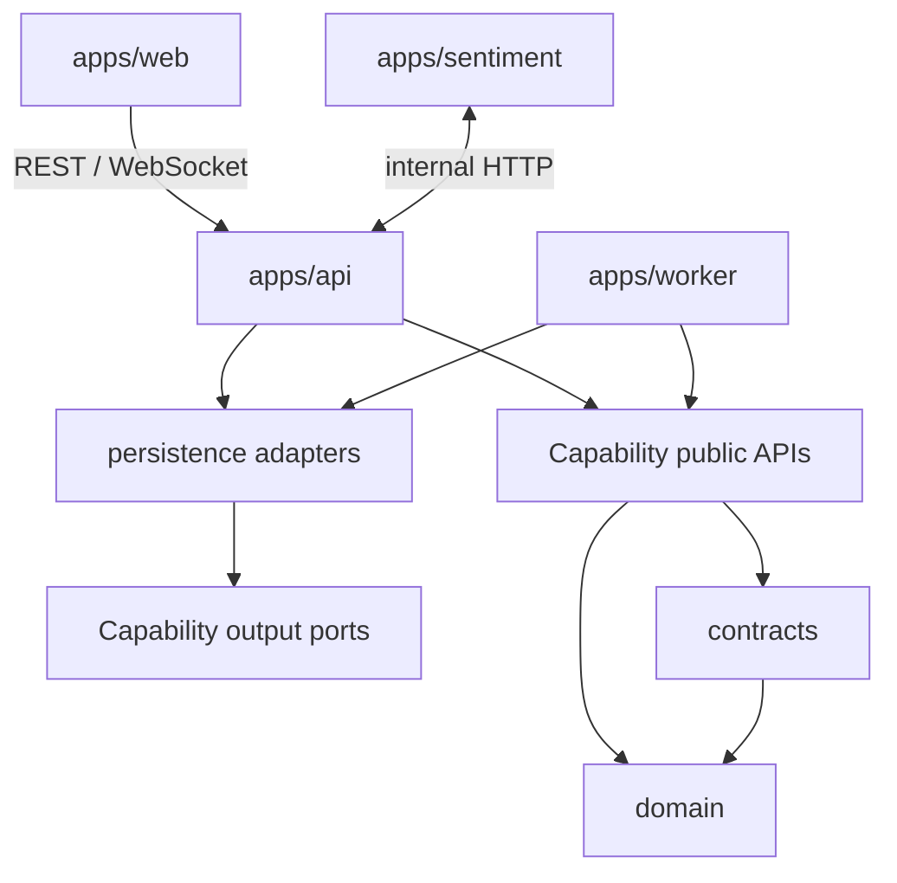

# ADR-0002: Ranh giới và phụ thuộc giữa các Module

**Status**: Proposed
**Date**: 2026-08-10
**Owners**: Tiến Luật

## Context

Modular Monolith chỉ có giá trị nếu module boundaries được bảo vệ bằng dependency direction, public contracts và automated checks. Nếu không, Strategy có thể gọi Binance/database, Search có thể hard-code Backtester/Evaluator, Controller chứa business logic và shared database trở thành đường tắt xuyên boundary.

Đề bài yêu cầu thêm Strategy, Search Algorithm và Market Provider mới với ảnh hưởng tối thiểu, đồng thời tách Evaluation khỏi Strategy implementation.

## Drivers and Quality Scenarios

- [QA-01 Add New Strategy](../architecture/quality-attributes.md#qa-01--add-new-strategy)
- [QA-02 Replace Search Algorithm](../architecture/quality-attributes.md#qa-02--replace-search-algorithm)
- [QA-03 Replace Market Data Provider](../architecture/quality-attributes.md#qa-03--replace-market-data-provider)

## Decision

### Module groups

| Group | Modules/applications | Vai trò |
| --- | --- | --- |
| Foundation | `domain`, `contracts` | Stable domain types và cross-boundary contracts |
| Capabilities | `market-data`, `strategy-core`, `strategies`, `combination`, `search`, `backtesting`, `evaluation`, `leaderboard`, `news` | Business policy theo capability |
| Adapters | `persistence` và provider adapters | Implement output ports và external integration |
| Runtime | `apps/api`, `apps/worker` | Composition, transaction boundary và orchestration |

`apps/web` và `apps/sentiment` là application boundaries riêng, chỉ giao tiếp qua versioned HTTP/WebSocket contracts.

### Dependency direction

Chi tiết module graph được duy trì trong [Module View](../architecture/module-view.md).

### Allowed dependencies

| Module | Có thể phụ thuộc trực tiếp |
| --- | --- |
| `domain` | Không module nội bộ nào |
| `contracts` | `domain` |
| `market-data`, `strategy-core` | `domain`, `contracts` |
| `strategies`, `combination` | `domain`, `strategy-core` |
| `backtesting` | `domain`, `contracts`, `strategy-core` |
| `evaluation`, `leaderboard`, `news` | `domain`, `contracts` |
| `search` | `domain`, `contracts`, `strategy-core` |
| `persistence` | foundation và owner output ports |
| `apps/api`, `apps/worker` | published capability APIs và adapters cần wiring |

### Forbidden dependencies

- Domain/Strategy không phụ thuộc Spring, provider, persistence hoặc UI.
- Backtester không phụ thuộc concrete Strategy, Search, Evaluation/Ranking implementation.
- Evaluator không phụ thuộc Strategy implementation, Search, Leaderboard hoặc database adapter.
- Search Generator không gọi Backtester/Evaluator/Leaderboard; nó chỉ tạo CandidateStrategy.
- Capability module không import repository/table nội bộ của owner khác.
- Frontend không phụ thuộc Binance/Supabase/internal Java model.

### Public boundary

Mỗi capability chỉ công khai `api`, input/output `port` và versioned `event`. Internal entity/helper không được import từ module khác. Cross-runtime DTO nằm trong `contracts` chỉ khi thực sự đi qua HTTP, WebSocket hoặc queue; không tạo `common/shared/utils` chứa business logic.

Runtime được phép điều phối nhiều use cases nhưng không sao chép policy. Pipeline trách nhiệm tuân theo [ADR-0010](0010-backtester-evaluator-separation.md) và Search contract theo [ADR-0011](0011-strategy-generator-contract.md).

## Alternatives Considered

- **Technical layers toàn cục**: dễ bắt đầu nhưng capability bị phân tán và boundary nghiệp vụ mờ.
- **Import tự do giữa modules**: nhanh ngắn hạn nhưng tạo cycle/coupling và không chứng minh change scenarios.
- **Mọi interaction qua event**: giảm direct coupling nhưng tăng eventual consistency/debug complexity không cần thiết.
- **Database/service riêng cho mọi module**: isolation mạnh nhưng vượt chi phí MVP của nhóm bốn người.

## Consequences

### Positive

- Dependency graph phản ánh business capabilities và Clean Architecture direction.
- Strategy, Search, Backtest, Evaluation và Leaderboard thay đổi độc lập.
- Worker/service có thể được tách sau mà không sao chép business logic.
- Architecture violations có thể bị phát hiện trước merge.

### Negative

- Cần interfaces, DTO/mappers, wiring và architecture tests.
- Shared contracts/data ownership cần review thường xuyên.
- Orchestration layer có nguy cơ thành God Service nếu chứa policy.

## Affected Components

- `apps/api`, `apps/worker`, `apps/web`, `apps/sentiment`
- toàn bộ Java capability/foundation/adapter modules
- build dependency graph, ArchUnit suite và PR checklist

## Validation Plan

- ArchUnit cấm dependency ngược, package internal imports và capability cycles.
- Build dependency khớp allowed matrix.
- AP-01/02/03 chứng minh thêm Strategy, Search Generator và Provider không sửa downstream consumers.
- Review orchestration xác nhận business decision nằm trong owner module.

## Evidence

**Status**: Planned — chưa thu thập do chưa có implementation.

- AP-01, AP-02 và AP-03 trong [Architecture Evidence](../architecture/architecture-evidence.md).

## Risks and Mitigations

- **Risk**: `contracts` thành dumping ground — **Mitigation**: Chỉ nhận contract đi qua boundary có consumer xác định.
- **Risk**: Shared DB tạo coupling — **Mitigation**: Owner output ports, schema/prefix và migration review.
- **Risk**: Rules bị bỏ qua để code nhanh — **Mitigation**: Build/ArchUnit/PR gates thay vì chỉ dựa tài liệu.
- **Risk**: Coordinator thành God Service — **Mitigation**: Coordinator nhỏ, policy nằm ở capability owner.

## References

- [Đề bài Crypto Strategy Lab — §12, §20, §32, §40–44](../Crypto%20Strategy%20Lab%20%E2%80%93%20%C4%90%E1%BB%93%20%C3%A1n%20cu%E1%BB%91i%20k%E1%BB%B3.pdf)
- [Slide kiến trúc — C4, boundaries và Architecture Proof](../KienTrucDoAn_slide.pdf)
- [Module View](../architecture/module-view.md)
- [ADR-0001](0001-modular-monolith.md), [ADR-0003](0003-market-data-adapter.md), [ADR-0005](0005-strategy-plugin-registry.md)
- [ADR-0010](0010-backtester-evaluator-separation.md), [ADR-0011](0011-strategy-generator-contract.md)

## Supersession

- Supersedes: None
- Superseded by: None
