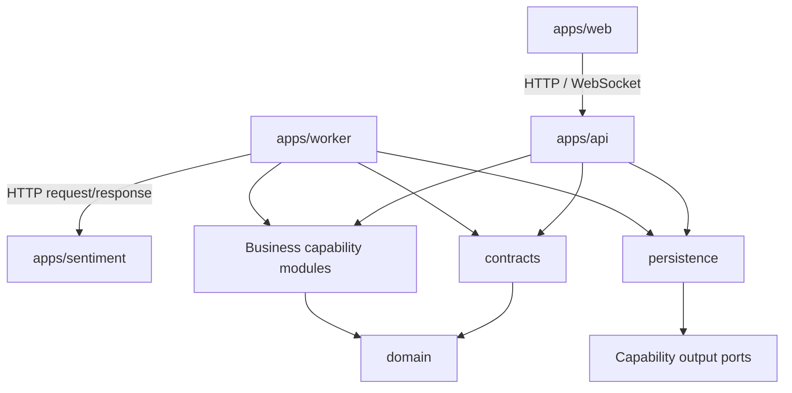
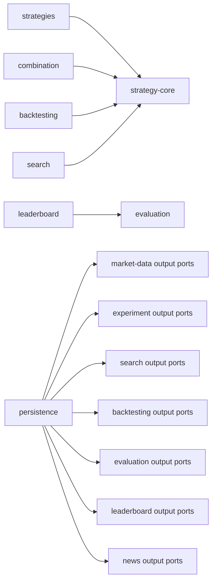

# ADR-0002: Ranh giới và phụ thuộc giữa các Module

**Status**: Accepted
**Date**: 2026-08-10
**Owners**: Tiến Luật

## Context

[ADR-0001: Sử dụng Modular Monolith cho Backend cốt lõi](0001-modular-monolith.md) quyết định chia Java Backend thành các module theo business capability. Tuy nhiên, việc chỉ tạo nhiều thư mục hoặc Maven/Gradle module chưa đủ để bảo vệ kiến trúc.

Nếu không có dependency rule rõ ràng, các vấn đề sau có thể xuất hiện:

- Strategy gọi trực tiếp Binance hoặc database;
- Backtester phụ thuộc vào từng implementation như MA hoặc RSI;
- Search gọi trực tiếp implementation của Backtest, Evaluation và Leaderboard;
- Controller chứa business logic hoặc truy cập repository;
- module khác truy cập trực tiếp bảng dữ liệu không thuộc quyền sở hữu;
- các module tạo dependency vòng, khiến thay đổi một phần ảnh hưởng toàn hệ thống;
- `contracts` hoặc một thư mục `utils` trở thành nơi chứa mọi loại logic dùng chung.

Đề bài yêu cầu có thể thêm Strategy, thay Search Algorithm, thay Market Data Provider và scale Backtest với ảnh hưởng tối thiểu. Vì vậy, ranh giới module phải được thể hiện bằng dependency direction, public contract và kiểm tra tự động, không chỉ bằng tài liệu.

## Decision

### 1. Phân loại module

Các module được chia thành năm nhóm:

| Nhóm                | Module/Application                                                                                                        | Vai trò                                                      |
| ------------------- | ------------------------------------------------------------------------------------------------------------------------- | ------------------------------------------------------------ |
| Foundation          | `domain`                                                                                                                  | Kiểu dữ liệu và quy tắc domain ổn định                        |
| Integration         | `contracts`                                                                                                               | DTO/message đi qua HTTP, WebSocket, queue hoặc runtime khác   |
| Business capability | `market-data`, `strategy-core`, `strategies`, `combination`, `backtesting`, `evaluation`, `experiment`, `search`, `leaderboard`, `news` | Chứa logic theo từng năng lực nghiệp vụ            |
| Adapter             | `persistence`                                                                                                             | Kết nối PostgreSQL/Supabase, Redis và triển khai output port |
| Composition/runtime | `apps/api`, `apps/worker`                                                                                                 | Wiring module, transaction boundary và điều phối use case    |

`apps/web` và `apps/sentiment` là application boundary riêng. Chúng giao tiếp với Java Backend qua API/event contract, không tạo Java build dependency vào các module nội bộ.

### 2. Dependency direction

Dependency chỉ được hướng từ runtime/adapter vào public contract và domain ổn định:



Sơ đồ trên chỉ thể hiện dependency ở mức tổng quát. Xem ranh giới và trách nhiệm chi tiết của từng module tại [Module View](../architecture/module-view.md).

Dependency chính giữa các capability module:



Sơ đồ capability chỉ thể hiện các dependency đáng chú ý. Bảng “Dependency được phép” bên dưới là nguồn tham chiếu đầy đủ và chính thức.

Không module nào được tạo dependency ngược từ `domain` vào Spring, database, Binance hoặc một capability module.

### 3. Dependency được phép

| Module          | Được phụ thuộc trực tiếp                                                  |
| --------------- | ------------------------------------------------------------------------- |
| `domain`        | Không phụ thuộc module nội bộ nào                                         |
| `contracts`     | `domain` khi integration DTO thực sự cần domain type ổn định              |
| `market-data`   | `domain`                                                                  |
| `strategy-core` | `domain`                                                                  |
| `strategies`    | `domain`, `strategy-core`                                                 |
| `combination`   | `domain`, `strategy-core`                                                 |
| `backtesting`   | `domain`, public API của `market-data`, `strategy-core`, `combination`, `experiment` |
| `evaluation`    | `domain`, public API của `backtesting`, `experiment`                      |
| `experiment`    | `domain`                                                                  |
| `search`        | `domain`, `strategy-core`                                                 |
| `leaderboard`   | `domain` và public API của `evaluation`, `experiment`                     |
| `news`          | `domain`                                                                  |
| `persistence`   | `domain` và output port công khai của module sở hữu dữ liệu               |
| `apps/api`      | Public API của các capability module, `contracts`, `persistence`          |
| `apps/worker`   | Public API cần thiết cho Backtest/Search flow, `contracts`, `persistence` |

#### Giải thích dependency với `contracts`

Từ `contract` trong dự án có hai nghĩa khác nhau:

| Loại contract | Nơi đặt | Ví dụ |
| ------------- | ------- | ----- |
| Contract nghiệp vụ nội bộ | Module sở hữu, trong `api/`, `port/in/`, `port/out/` hoặc `event/` | `Strategy`, `RunBacktestUseCase`, `Evaluator` |
| Integration contract | `modules/contracts` | HTTP DTO, WebSocket event, `BacktestJobMessage` |

Ví dụ:

- `Strategy` là contract nghiệp vụ, nên nằm trong `strategy-core`.
- `BacktestJobMessage` là integration contract đi qua queue, nên nằm trong `modules/contracts`. `apps/worker` mapping message này thành command nội bộ trước khi gọi `backtesting`.

Không đưa model nội bộ vào `modules/contracts` chỉ để tiện import. Bảng “Dependency được phép” phía trên là nguồn tham chiếu chính thức cho dependency giữa các module.

Thêm dependency ngoài bảng phải cập nhật ADR này hoặc tạo ADR thay thế và được nhóm review.

### 4. Dependency bị cấm

| From                          | Không được phụ thuộc                                                 | Lý do                                                         |
| ----------------------------- | -------------------------------------------------------------------- | ------------------------------------------------------------- |
| `domain`                      | Spring, database driver, Binance SDK, module nghiệp vụ               | Giữ domain độc lập và dễ kiểm thử                             |
| `strategy-core`, `strategies` | `persistence`, `market-data`, Spring Web, `apps/*`                   | Strategy chỉ phân tích input và trả BUY/SELL/HOLD             |
| `backtesting`                 | Strategy implementation cụ thể, `search`, `leaderboard`, Controller  | Backtester chỉ làm việc với Strategy contract                 |
| `evaluation`                  | Strategy implementation, `search`, `leaderboard`, database adapter   | Evaluation phải thay đổi độc lập với Strategy và Ranking      |
| `search`                      | Implementation cụ thể của `backtesting`, `evaluation`, `leaderboard` | Có thể thay Search Algorithm mà không sửa các module phía sau |
| `leaderboard`                 | `search` hoặc `backtesting` implementation                           | Leaderboard chỉ nhận Evaluation Result chuẩn hóa              |
| `news`                        | Sentiment model implementation                                       | Có thể thay crawler/provider và model độc lập                 |
| Capability module             | Repository/table nội bộ của module khác                              | Bảo vệ data ownership                                         |
| Capability module             | DTO/message trong `modules/contracts`                                | Không để transport model xâm nhập business logic              |
| `apps/web`                    | Binance hoặc Java module nội bộ                                      | Frontend chỉ phụ thuộc API/WebSocket contract chuẩn hóa       |

### 5. Quy tắc public contract

Mỗi capability module chỉ công khai những thành phần cần thiết qua các package sau:

```text
<module>/api/       Public use case và facade
<module>/port/in/   Input port
<module>/port/out/  Output port cần adapter triển khai
<module>/event/     Event được phép phát ra ngoài module
```

Implementation, entity nội bộ và helper được đặt trong package `internal` hoặc package không được module khác import trực tiếp.

Quy tắc sử dụng:

1. Module khác gọi public use case/facade, không gọi class `internal`.
2. Contract nghiệp vụ như `Strategy`, `Backtester`, `Evaluator` hoặc input/output port nằm trong module sở hữu.
3. DTO qua HTTP, WebSocket, queue hoặc service boundary nằm trong `modules/contracts` khi thực sự được nhiều runtime dùng chung.
4. `apps/api`, `apps/worker` hoặc adapter mapping integration DTO sang command/query/model nội bộ.
5. Model chỉ dùng bên trong một module phải ở lại module đó, không chuyển vào `modules/contracts` để tiện import.
6. Không tạo `common`, `shared` hoặc `utils` chứa business logic chung chung.
7. Business logic không nằm trong Controller, Spring configuration, repository adapter hoặc mapper.

### 6. Quy tắc điều phối luồng

`apps/api` hoặc `apps/worker` được phép điều phối nhiều public use case để hoàn thành một application flow. Ví dụ Search loop có thể thực hiện:

```text
Generate Candidate
  -> Backtest
  -> Evaluate
  -> Rank
  -> Update Top-K
```

Tuy nhiên:

- `search` chỉ chịu trách nhiệm sinh candidate và stop condition;
- `backtesting` chỉ mô phỏng giao dịch;
- `evaluation` chỉ tính metrics;
- `leaderboard` chỉ tính ranking và duy trì Top-K;
- orchestration không được sao chép business rule của các module trên.

Khi chuyển sang Queue/Worker, contract và boundary vẫn giữ nguyên theo [ADR-0006: Queue và Worker cho Backtest/Search](0006-queue-worker-backtesting.md).

### 7. Quy tắc adapter và dữ liệu

- Binance là adapter phía ngoài của `market-data`, theo [ADR-0003: Market Data Adapter](0003-market-data-adapter.md).
- Strategy được đăng ký qua contract/registry, theo [ADR-0005: Strategy Plugin Registry](0005-strategy-plugin-registry.md).
- `persistence` triển khai output port do module sở hữu khai báo; capability module không import repository implementation.
- Quyền sở hữu PostgreSQL/Supabase và Redis được quy định trong [ADR-0007: PostgreSQL và Redis Ownership](0007-postgresql-redis-ownership.md).
- Sentiment Service chỉ được truy cập qua contract của [ADR-0008: Tách Sentiment Service](0008-sentiment-service-boundary.md).
- Experiment, Strategy Version và Dataset Version tuân theo [ADR-0009: Reproducible Experiments](0009-reproducible-experiments.md).

## Alternatives Considered

- **Cho phép module import lẫn nhau tự do**: Nhanh trong vài ngày đầu nhưng tạo dependency vòng và làm mất khả năng thay thế Strategy, Search hoặc Provider.
- **Chia theo technical layer toàn cục (`controller/service/repository`)**: Dễ hiểu với ứng dụng nhỏ nhưng các file của một capability bị phân tán, boundary nghiệp vụ không rõ.
- **Mọi giao tiếp đều qua event**: Giảm coupling trực tiếp nhưng làm luồng MVP khó debug, tăng eventual consistency và không cần thiết cho mọi use case.
- **Đưa tất cả model vào `contracts` hoặc `shared`**: Giảm lỗi import trước mắt nhưng tạo shared kernel quá lớn; thay đổi một model có thể ảnh hưởng toàn hệ thống.
- **Mỗi module có database/service riêng ngay từ đầu**: Boundary mạnh nhưng tăng chi phí triển khai và vận hành vượt nhu cầu của nhóm bốn người.

## Consequences

### Positive

- Có thể nhìn vào dependency graph để hiểu module nào được phép gọi module nào.
- Strategy, Search, Evaluation và Leaderboard có trách nhiệm tách biệt.
- Thêm MACD không yêu cầu sửa Backtester hoặc Evaluation.
- Có thể thay Binance Adapter mà không đổi contract của Frontend.
- Có nền tảng để tách Worker hoặc service riêng trong tương lai.
- Architecture violation có thể được phát hiện tự động trước khi merge.

### Negative

- Cần thêm interface, DTO, mapper và wiring ở boundary.
- Một số luồng đơn giản có nhiều bước hơn so với gọi thẳng repository/service.
- Thành viên phải hiểu public API và data ownership trước khi code.
- Dependency matrix phải được cập nhật khi xuất hiện module hoặc use case mới.

## Affected Components

- `apps/api`
- `apps/worker`
- `apps/web`
- `apps/sentiment`
- toàn bộ thư mục `modules/`
- architecture tests trong Java test suite
- Pull Request checklist và code review

## Validation

- Tạo ArchUnit test cấm `domain` phụ thuộc Spring, persistence hoặc adapter package.
- Tạo ArchUnit test cấm `strategies` và `strategy-core` phụ thuộc `persistence` hoặc `market-data`.
- Tạo ArchUnit test cấm capability module phụ thuộc trực tiếp `modules/contracts`.
- Tạo test phát hiện dependency cycle giữa các capability module.
- Build tool phải khai báo dependency đúng với bảng “Dependency được phép”.
- Kiểm tra `apps/worker` mapping `BacktestJobMessage` thành command nội bộ trước khi gọi public API của `backtesting`.
- Thêm Strategy giả `MACDStrategy` và xác nhận không sửa Backtester/Evaluator.
- Thêm Search Generator giả và xác nhận không sửa Backtester/Leaderboard.
- Thay Binance Adapter bằng fixture adapter và xác nhận API response không đổi.
- Review Pull Request phải từ chối import trực tiếp package `internal` của module khác.

## Risks and Mitigations

- **Risk**: Quy tắc quá chặt làm chậm tiến độ MVP.

  **Mitigation**: Chỉ bảo vệ boundary ảnh hưởng architectural driver; cho phép orchestration ở application layer thay vì tạo abstraction cho mọi hàm.

- **Risk**: `contracts` phát triển thành shared dumping ground.

  **Mitigation**: Mọi contract mới phải có ít nhất hai runtime/module thực sự sử dụng hoặc đi qua external boundary.

- **Risk**: `persistence` phụ thuộc quá nhiều module và trở thành điểm coupling.

  **Mitigation**: Chia adapter theo package của owner; mỗi adapter chỉ triển khai output port tương ứng, không chứa business flow.

- **Risk**: Thành viên bỏ qua boundary để sửa nhanh.

  **Mitigation**: Enforce bằng build dependency, ArchUnit và PR review thay vì chỉ dựa vào tài liệu.

- **Risk**: Orchestration trong `apps/api` trở thành God Service mới.

  **Mitigation**: Mỗi application flow có use-case coordinator nhỏ; business decision phải nằm trong module sở hữu.

## References

- [Đề bài Crypto StrategyLab](../Crypto%20Strategy%20Lab%20%E2%80%93%20%C4%90%E1%BB%93%20%C3%A1n%20cu%E1%BB%91i%20k%E1%BB%B3.pdf)
- [Architecture Overview](../architecture/architecture-overview.md)
- [Module View](../architecture/module-view.md)
- [ADR-0001: Modular Monolith](0001-modular-monolith.md)
- [ADR-0003: Market Data Adapter](0003-market-data-adapter.md)
- [ADR-0005: Strategy Plugin Registry](0005-strategy-plugin-registry.md)
- [ADR-0006: Queue và Worker](0006-queue-worker-backtesting.md)
- [ADR-0007: PostgreSQL và Redis Ownership](0007-postgresql-redis-ownership.md)
- [ADR-0008: Sentiment Service Boundary](0008-sentiment-service-boundary.md)
- [ADR-0009: Reproducible Experiments](0009-reproducible-experiments.md)

## Supersession

- Supersedes: None
- Superseded by: None
