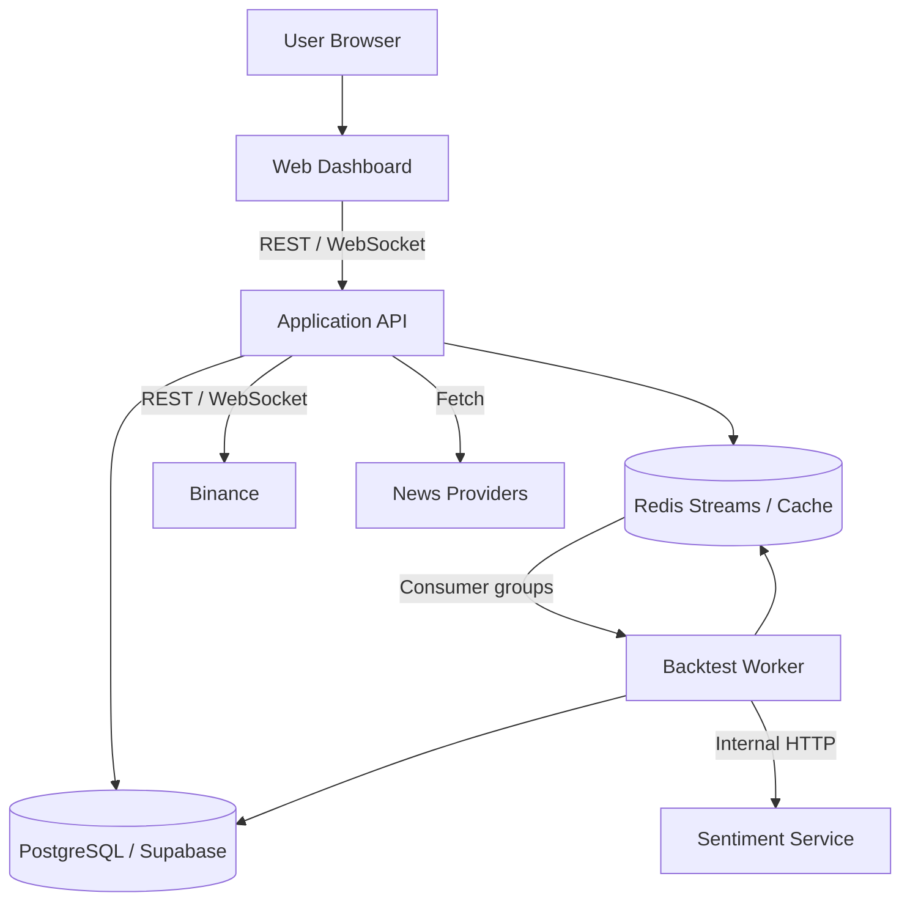

# Container View — C4 Level 2

**Status**: Proposed baseline
**Last Updated**: 2026-08-12
**Owners**: Tiến Luật và Container Owners

## Purpose

Mô tả các process/data store chính, communication và failure isolation của Crypto Strategy Lab.

## Container Diagram

## Container Catalog

| Container | Trách nhiệm | Technology | Interface | Owner |
| --- | --- | --- | --- | --- |
| Web Dashboard | Chart, configuration, progress, Leaderboard, News | React/TypeScript | REST/WebSocket consumer | UI Owner |
| Application API | API gateway, orchestration, provider adapters và realtime fan-out | Java 21/Spring Boot 3 | REST `/api/v1`, WebSocket `/ws` | Backend Owner |
| Backtest Worker | Search coordination, Backtest, Evaluation và ranking handlers | Java 21/Spring Boot 3 | Redis Streams, persistence ports | Experiment Owner |
| Sentiment Service | Stateless sentiment inference | Python/FastAPI | Internal versioned HTTP | ML Owner |
| PostgreSQL/Supabase | Durable state và Outbox | PostgreSQL | JDBC/PostgreSQL protocol | Data Owner |
| Redis | Work distribution, cache và ephemeral state | Redis Streams | Redis protocol | Infra Owner |

## Communication

| From | To | Protocol | Dữ liệu | Mode |
| --- | --- | --- | --- | --- |
| Web | API | HTTPS | Commands, queries và initial state | Synchronous |
| API | Web | WebSocket/JSON | Candle, progress, connection và Leaderboard events | Asynchronous |
| API | Binance | HTTPS/WebSocket | Historical/realtime klines | Sync/stream |
| API | News Providers | HTTPS/RSS | News items | Synchronous collection |
| API/Worker | PostgreSQL | JDBC | Durable state, results, outbox | Transactional |
| API/Worker | Redis | Streams | Jobs, evaluated events, dead letter | Asynchronous |
| Worker | Sentiment | Internal HTTP/JSON | Normalized text và sentiment result | Synchronous call inside async job |

## Data Ownership

| Container | Dữ liệu sở hữu/đọc | Ghi chú |
| --- | --- | --- |
| Application API | Không sở hữu domain table; điều phối owner ports | Không chứa business rule trong controller |
| Worker | Không sở hữu schema; gọi capability ports | Retry không tạo duplicate result |
| PostgreSQL | Durable source of truth | Ownership logic theo module |
| Redis | Queue/cache/ephemeral state | Không là nguồn duy nhất của Experiment/Result |
| Sentiment Service | Model runtime, không giữ business state | Không có DB credential |
| Web | View state và subscription state | Không chứa Strategy/Ranking logic |

## Failure Isolation

| Failure | Expected behavior |
| --- | --- |
| Binance disconnect | UI báo reconnecting; adapter reconnect/backfill; closed Candle được reconcile |
| Redis unavailable | Durable command/outbox vẫn lưu; Search/Worker tạm dừng; market flow có thể tiếp tục in-process |
| PostgreSQL unavailable | Từ chối command cần durable write; realtime forwarding có thể chạy degraded |
| Worker crash | Pending message được reclaim; idempotency ngăn duplicate result |
| Sentiment down | News giữ pending/degraded; Market, technical Strategy và Backtest tiếp tục |
| WebSocket client disconnect | Reconnect/resubscribe/backfill; cleanup subscription cũ |

## Deferred Decisions

- Physical ports, replicas và resource limits thuộc deployment environment.
- Authentication mechanism được bổ sung khi user/account scope được xác định.
- Không tách thêm microservice nếu chưa có measured scaling/failure need.
