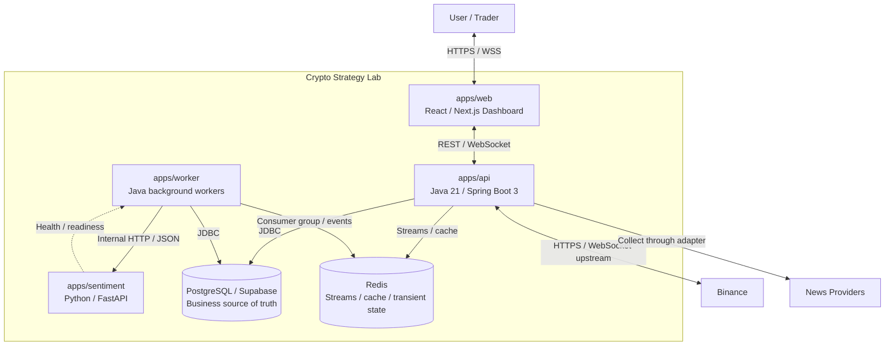

# C4 Level 2 — Container View

**Status**: Draft — Target MVP Architecture

**Last Updated**: 2026-08-14

**Owner**: Văn Minh

## Purpose

View này mô tả các application/process/data store chạy độc lập trong boundary Crypto Strategy Lab và cách chúng giao tiếp.

## Container Diagram

## Container Catalog

| Container | Trách nhiệm | Interface | Scale strategy |
| --- | --- | --- | --- |
| `apps/web` | UI, chart rendering, subscription state và progress presentation | REST, WebSocket | CDN/web replicas khi có nhu cầu |
| `apps/api` | Public API, WebSocket gateway, validation, provider integration và orchestration | HTTP/JSON, WebSocket | Scale sau khi state/subscription strategy được kiểm chứng |
| `apps/worker` | Search coordination, Backtest/Evaluation và background News jobs | Redis Streams, JDBC, internal HTTP | Tăng Worker instance trong cùng consumer group |
| `apps/sentiment` | Stateless text inference | Versioned internal HTTP/JSON | Nhiều instance độc lập nếu inference là bottleneck |
| PostgreSQL/Supabase | Experiment, Job, Result, Trade, News, Outbox và durable read model | JDBC/PostgreSQL | Connection pool và database plan là giới hạn chính |
| Redis | Queue, pending delivery, cache, latest/open Candle và progress snapshot | Redis protocol/Streams | Scale topology chỉ khi measurement yêu cầu |

## Communication

| From | To | Protocol | Dữ liệu | Mode |
| --- | --- | --- | --- | --- |
| Web | API | REST/JSON | Query, command, result detail | Synchronous |
| Web | API | WebSocket/JSON | Candle, progress, status, Leaderboard revision | Bidirectional push |
| API | Binance | HTTPS/WebSocket | Historical/realtime market data | Sync + stream |
| API/Worker | News Providers | HTTPS/RSS | Raw news input | Synchronous collection |
| API/Worker | PostgreSQL | JDBC | Durable state và Outbox | Transactional |
| API/Worker | Redis | Streams/cache | Job, event, cache và transient state | Asynchronous/cache |
| Worker | Sentiment | Internal HTTP/JSON | Normalized text và Sentiment Result | Synchronous call inside async job |

## Data Ownership

- PostgreSQL lưu bản chính của Experiment, Candidate, Job, Result, Trade, Evaluation, Leaderboard revision, News, Sentiment và Outbox.
- Redis không là bản duy nhất của dữ liệu nghiệp vụ; cache/progress phải rebuild được và job phải recover được từ PostgreSQL/Outbox.
- Sentiment Service stateless và không truy cập shared database.
- Web không truy cập trực tiếp Binance, Supabase hoặc Sentiment Service.
- Ownership chi tiết theo module nằm trong [Data Model Overview](data-model-overview.md) và [ADR-0007](../adr/0007-postgresql-redis-ownership.md).

## Failure Isolation

| Failure | Expected behavior |
| --- | --- |
| Binance disconnect | API báo trạng thái, reconnect có backoff, historical backfill và deduplicate; UI không giả trạng thái connected |
| News Provider lỗi | News pipeline retry/degrade; Market, technical Strategy và Backtest tiếp tục |
| Sentiment Service lỗi | News giữ pending/failed-retryable; circuit breaker mở; Market Dashboard tiếp tục |
| Worker crash | Pending job được reclaim; idempotency ngăn Result/Ranking trùng |
| Redis lỗi | Durable command/Outbox vẫn ở PostgreSQL; queue/cache tạm unavailable và được phục hồi |
| PostgreSQL lỗi | Từ chối command cần durable write; không dùng Redis thay source of truth; realtime có thể chạy giới hạn |
| WebSocket client mất mạng | Client reconnect có jitter, subscribe lại và tải snapshot/history cần thiết |
