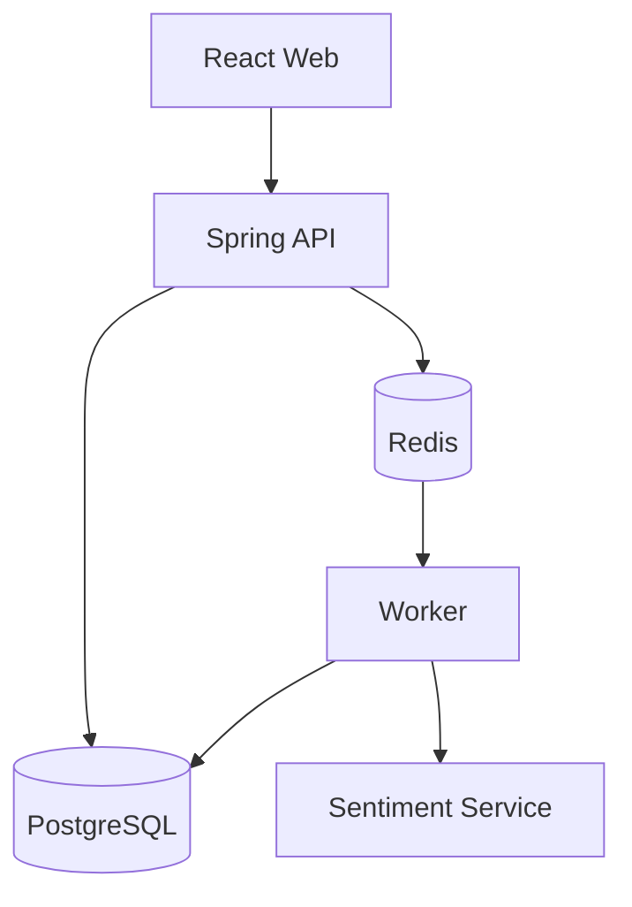

# Container View

**Status**: Draft  
**Owners**: [Tên/vai trò]

## Purpose

[Mô tả các application/process/database chính]

## Container Diagram

## Container Catalog

| Container | Trách nhiệm | Công nghệ | Interface | Owner |
| --- | --- | --- | --- | --- |
| [Điền] | [Điền] | [Điền] | [Điền] | [Điền] |

## Communication

| From | To | Protocol | Dữ liệu | Sync/Async |
| --- | --- | --- | --- | --- |
| [Điền] | [Điền] | [Điền] | [Điền] | [Điền] |

## Data Ownership

| Container | Dữ liệu sở hữu/đọc | Ghi chú |
| --- | --- | --- |
| [Điền] | [Điền] | [Điền] |

## Failure Isolation

| Container lỗi | Thành phần bị ảnh hưởng | Expected behavior |
| --- | --- | --- |
| [Điền] | [Điền] | [Điền] |

## Open Questions

- [Câu hỏi chưa chốt]

