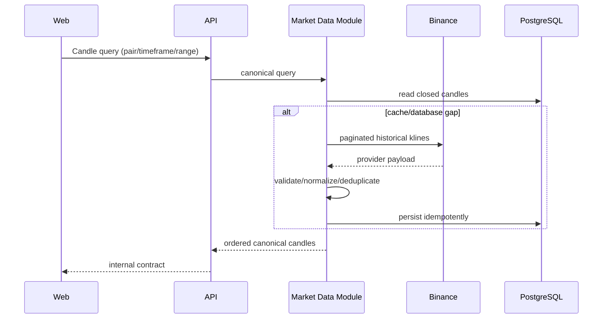
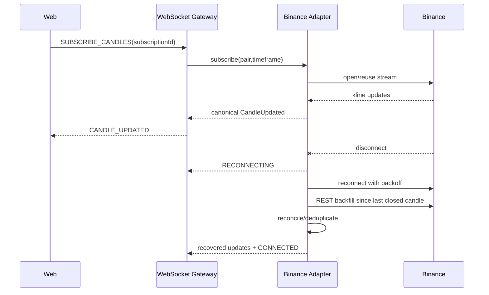
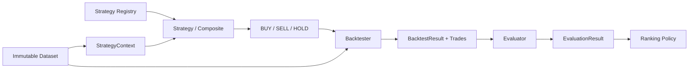
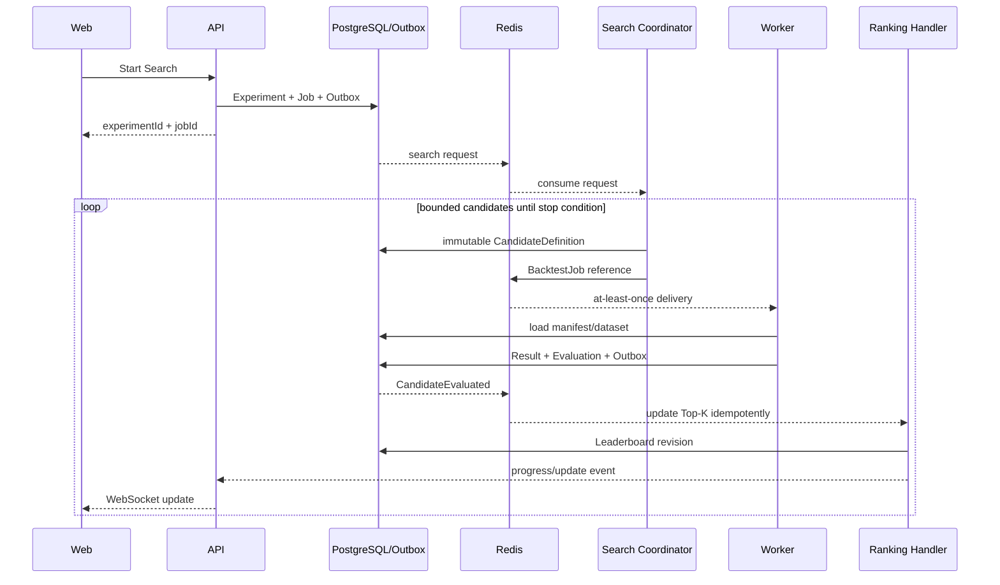
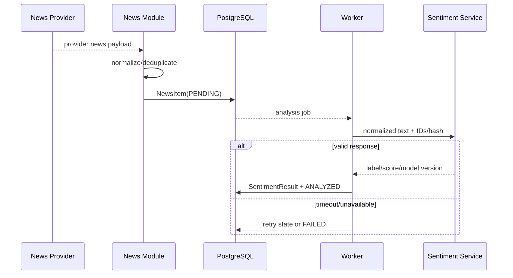

# Dynamic Views and Data Flows

**Status**: Proposed baseline
**Last Updated**: 2026-08-12
**Owners**: Tiến Luật và Flow Owners

## 1. Historical Market Data

- Input dùng pair, timeframe, UTC range hoặc limit; output tăng dần theo `openTime`.
- Provider errors được chuyển thành stable error catalog; không trả Binance payload/error trực tiếp.
- Backtest dataset chỉ nhận closed candles và được freeze/checksum trước execution.

## 2. Realtime Market Data

- Một browser tab dùng một WebSocket và nhiều logical subscriptions, tối đa bốn market subscriptions.
- Đổi timeframe chỉ unsubscribe/resubscribe chart tương ứng.
- Identity `provider + pair + timeframe + openTime`, event time và `closed` ngăn stale/duplicate update.
- Frontend reconnect, resubscribe và REST backfill nếu application WebSocket bị ngắt.

## 3. Strategy, Backtest và Evaluation

1. Registry resolve exact Strategy/Composite version và parameters.
2. Strategy phân tích ordered context, không gọi provider/database.
3. Backtester diễn giải signals theo immutable simulation assumptions.
4. Evaluator tính Return, Win Rate, Maximum Drawdown và Number of Trades.
5. Ranking áp versioned formula/tie-break và cập nhật Top-K idempotently.
6. Validation error dừng candidate; zero trade là valid business result, không phải system error.

## 4. Search, Queue và Leaderboard

### Job contract

Message chứa `messageType/version/id`, correlation ID, job/experiment/candidate/dataset references, strategy version và attempt; không chứa Candle dataset, secret, class name hay Java serialized object.

### State and stop conditions

- Experiment: `CREATED → QUEUED → RUNNING → COMPLETED|FAILED|STOP_REQUESTED → STOPPED`.
- Job: `QUEUED → RUNNING → SUCCEEDED|RETRY_SCHEDULED|FAILED|CANCELLED`.
- Mỗi Search có ít nhất một giới hạn: max candidates, max duration hoặc iterations without improvement.
- Stop ngừng candidate mới, cancel queued jobs và cho running job kết thúc tại safe checkpoint.
- At-least-once delivery yêu cầu unique constraints, processed-message record và idempotent handlers.

## 5. News và Sentiment

- News Provider nằm sau abstraction và trả canonical NewsItem.
- Sentiment Service stateless, không crawl, không truy cập shared database và không quyết định Strategy signal.
- Timeout/retry/circuit breaker cô lập failure; Market/technical strategies không chờ Sentiment.
- Sentiment dùng trong Backtest phải frozen theo event time/model version để tránh look-ahead bias.
