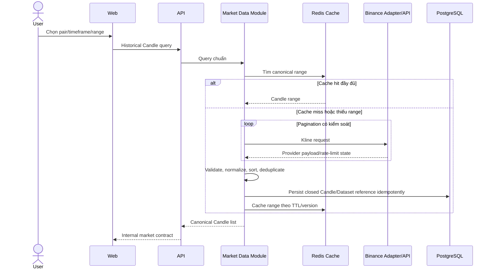
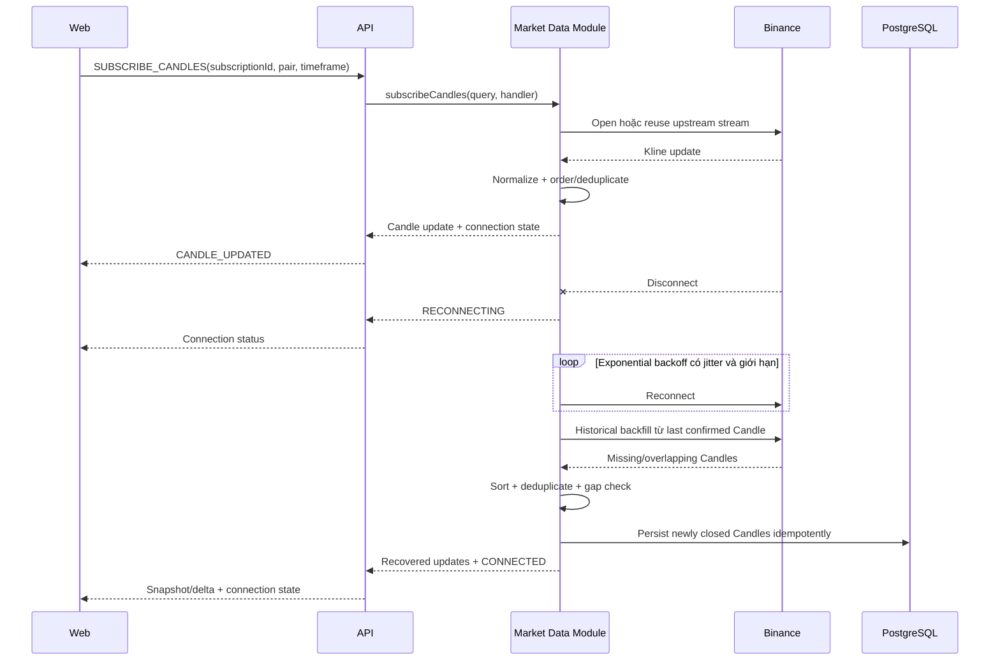
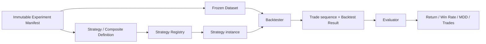
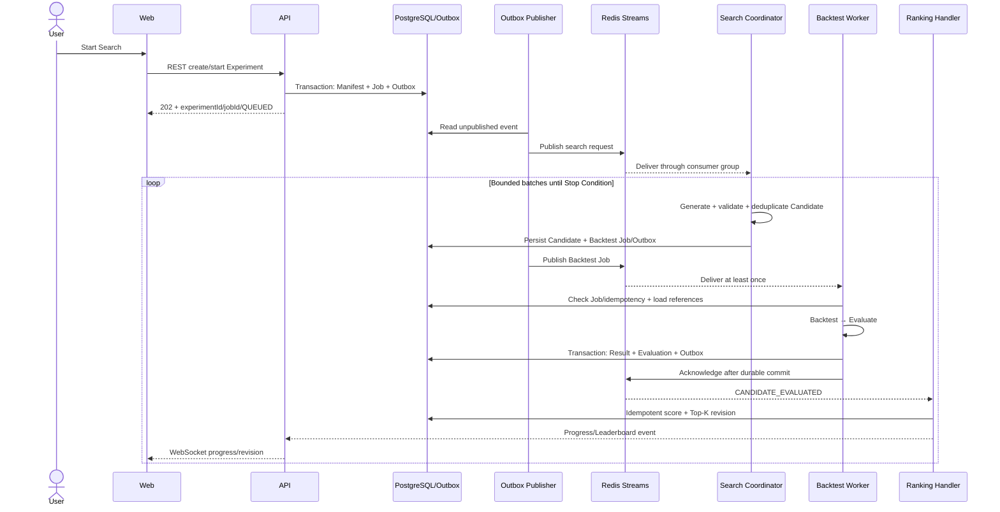

# Dynamic Views and Data Flows

**Status**: Draft — Target MVP Architecture

**Last Updated**: 2026-08-14

**Owner**: Văn Minh

Các flow dưới đây là runtime story cấp kiến trúc. Payload chi tiết thuộc [API documentation](../api/README.md); state và identity thuộc [Data Model Overview](data-model-overview.md).

## 1. Historical Market Data



Quy tắc:

- Query dùng pair, timeframe, start/end hoặc limit chuẩn; adapter chịu trách nhiệm ánh xạ symbol/interval.
- Pagination đáp ứng giới hạn mỗi response và phối hợp rate-limit/exponential backoff có giới hạn.
- Candle được sắp tăng theo `openTime`; identity là `provider + pair + timeframe + openTime`.
- Provider array/object và error riêng không được đi ra ngoài `market-data`.
- Cache miss không phải lỗi; PostgreSQL/provider là nguồn đọc lại.
- Request sai là lỗi chuẩn không retry; timeout/429/5xx có thể retry theo policy.

## 2. Realtime Market Data and Recovery



Quy tắc:

- Một upstream Binance stream được chia sẻ cho nhiều subscriber cùng pair/timeframe và đóng khi subscriber count bằng 0.
- WebSocket giữ thứ tự trong một connection nhưng client vẫn deduplicate theo `eventId` và bỏ stale Candle/revision sau reconnect.
- Update mới hơn thay update cũ của cùng open Candle; `closed=true` là trạng thái cuối của khoảng nến.
- Backend coalesce update trung gian khi outbound chậm nhưng không bỏ Candle close, connection state hoặc completion event.
- Frontend render theo batch/frame, không nhận lại toàn bộ history ở mỗi tick.

## 3. Strategy, Backtest và Evaluation



Main steps:

1. Worker đọc manifest, Dataset version/checksum và Candidate Definition bằng ID.
2. Registry resolve đúng Strategy/Composite version và validate exact parameters.
3. Backtester truyền ordered Candle/`evaluationTime` vào Strategy, diễn giải BUY/SELL/HOLD theo assumptions đã lưu.
4. Backtester tạo Trade sequence và Result; Strategy không truy cập network/database.
5. Evaluator tính bốn metrics bắt buộc độc lập với Strategy/Search/Ranking.
6. Result và Evaluation Result được persist immutable; retry cùng Candidate không tạo business result trùng.

Nếu Strategy version/dataset không resolve hoặc checksum sai, job thất bại có cấu trúc và không tạo Result một phần. “Không có Trade” là business result hợp lệ, không phải infrastructure error.

## 4. Search, Queue và Leaderboard



Stop và backpressure:

- Stop Condition thuộc Search Coordinator: `maxCandidates`, `maxDuration`, `maxIterationsWithoutImprovement` hoặc user stop.
- `STOP_REQUESTED` ngừng sinh candidate; queued job bị skip/cancel; running job kết thúc tại safe checkpoint.
- Coordinator giới hạn `QUEUED + RUNNING`, sinh batch nhỏ và giảm tốc khi queue vượt threshold.
- Worker concurrency và job timeout cấu hình theo môi trường; Dataset chỉ truyền bằng reference.

Reliability:

- Delivery là at-least-once; `jobId`, `candidateId`, unique constraint và Processed Message ngăn effect trùng.
- Worker chỉ acknowledge sau durable commit; Worker chết trước ack cho phép consumer khác reclaim.
- Transient error retry có giới hạn/backoff; permanent validation error không retry; hết retry đưa Dead Letter và đánh dấu `FAILED`.
- Transactional Outbox tránh “DB đã lưu nhưng Redis chưa nhận”; recovery scan republish event/job chưa hoàn thành.
- Top-K dùng revision và stable tie-break, không phụ thuộc thứ tự Worker hoàn thành.

## 5. News và Sentiment

```mermaid
sequenceDiagram
    participant Provider as News Provider Adapter
    participant News as Java News Module
    participant DB as PostgreSQL
    participant Worker
    participant Sentiment as Python/FastAPI
    participant API
    participant Web

    Provider-->>News: Raw news payload
    News->>News: Normalize, sanitize, contentHash, deduplicate
    News->>DB: Store News Item as PENDING
    Worker->>DB: Claim analysis job; mark ANALYZING
    Worker->>Sentiment: Versioned internal HTTP request
    alt Valid response
        Sentiment-->>Worker: Label, confidence, score, modelVersion
        Worker->>Worker: Validate contract/ranges
        Worker->>DB: Store immutable Sentiment Result; ANALYZED
    else Timeout/429/5xx
        Worker->>Worker: Limited retry/backoff/circuit breaker
        Worker->>DB: Keep PENDING/FAILED_RETRYABLE or FAILED
    end
    API->>DB: Read News/Sentiment view
    API-->>Web: News Item + analysis state/result
```

Quy tắc:

- Python Service stateless, tải model khi startup, không crawl News và không truy cập PostgreSQL/Redis.
- `newsId + contentHash + modelVersion` xác định một logical result; model/content mới tạo version mới.
- Circuit breaker và concurrency limit bảo vệ Worker/model; Sentiment lỗi chỉ làm News/Sentiment degraded.
- Technical Strategy, Backtest và realtime chart không chờ Sentiment.
- Sentiment Strategy tương lai chỉ nhận frozen `sentimentData` trong StrategyContext; không gọi Python trực tiếp và không dùng News xuất bản sau `evaluationTime`.
