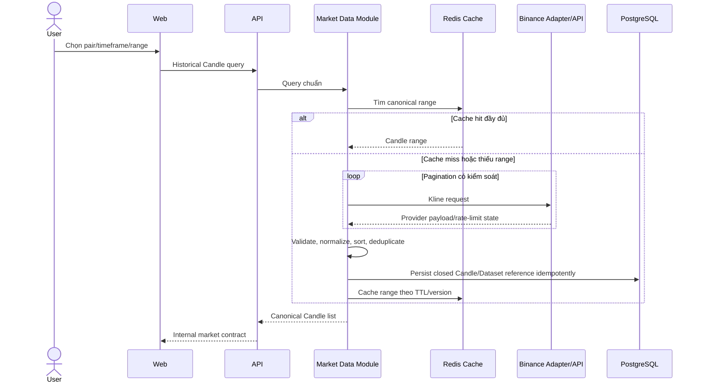
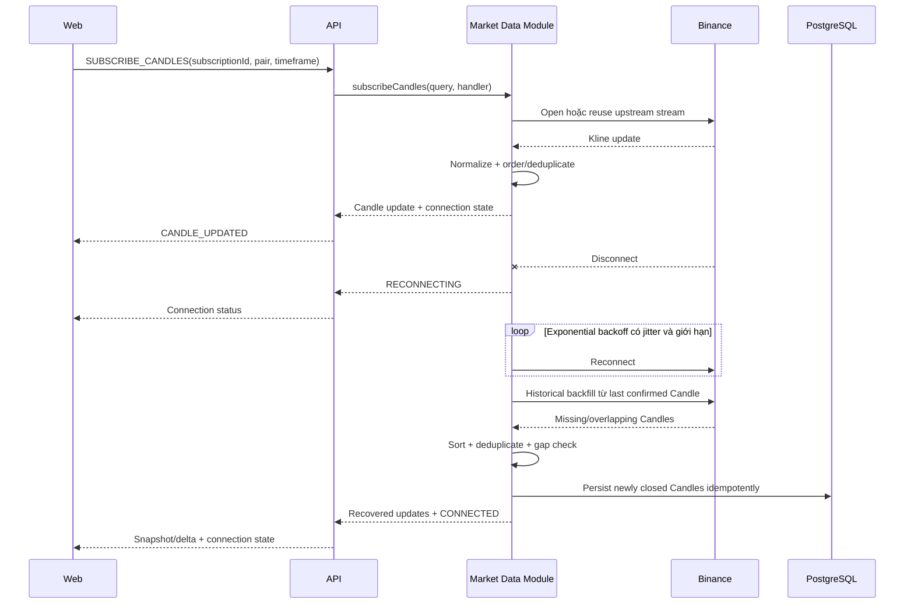
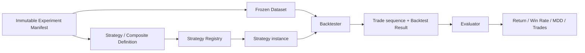
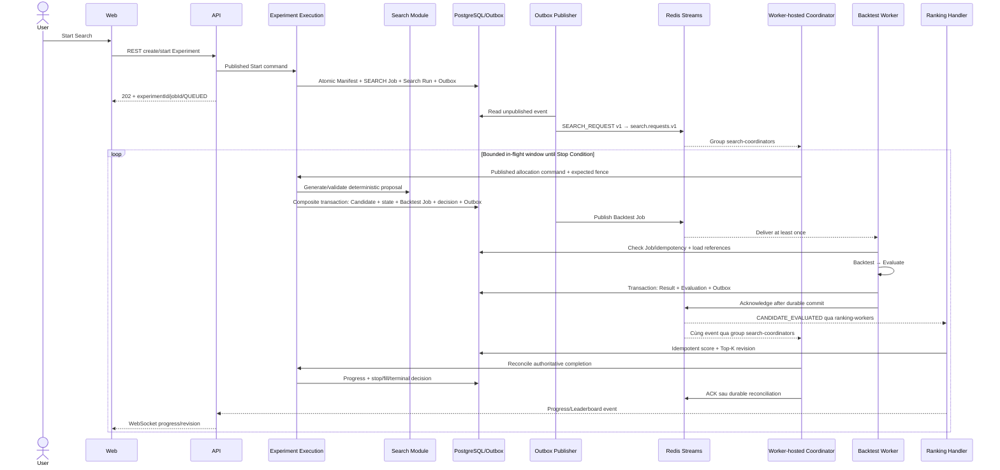
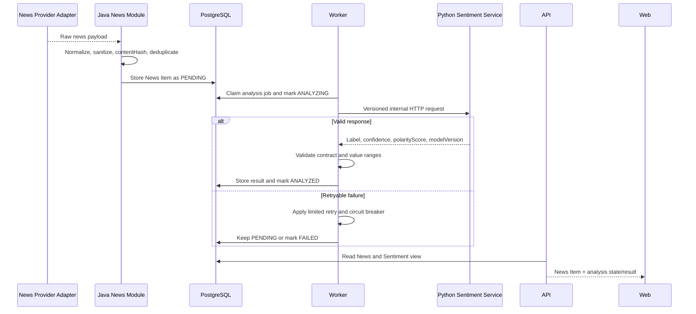
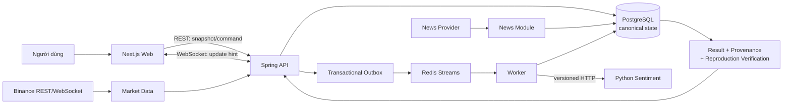
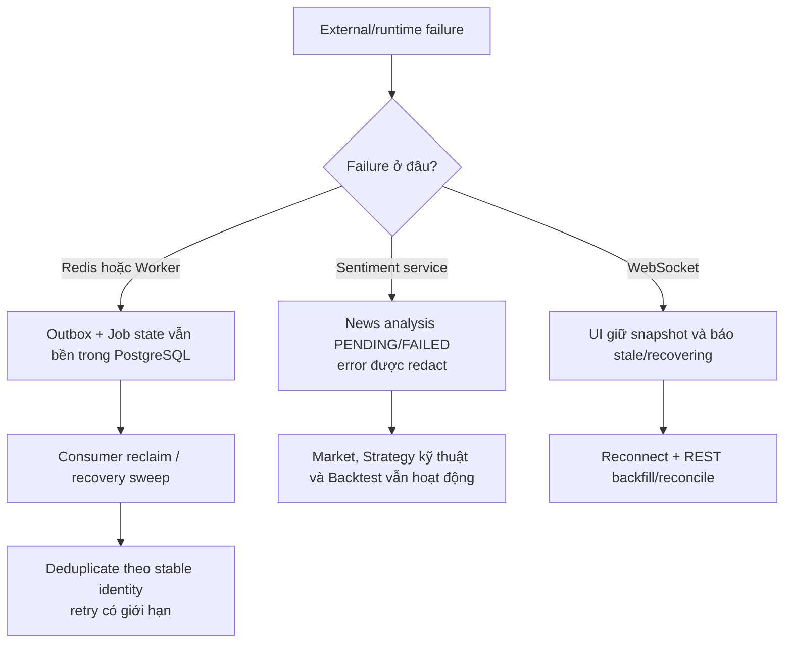

# Dynamic Views and Data Flows

**Status**: Implemented baseline — synchronized for F014 demo hardening

**Last Updated**: 2026-09-04

**Owner**: Văn Minh

Các flow dưới đây là runtime story cấp kiến trúc. Payload chi tiết thuộc [API documentation](../api/README.md); state và identity thuộc [Data Model Overview](data-model-overview.md).

## 1. Historical Market Data

Quy tắc:

- Query dùng pair, timeframe, start/end hoặc limit chuẩn; adapter chịu trách nhiệm ánh xạ symbol/interval.
- Pagination đáp ứng giới hạn mỗi response và phối hợp rate-limit/exponential backoff có giới hạn.
- Candle được sắp tăng theo `openTime`; identity là `provider + pair + timeframe + openTime`.
- Provider array/object và error riêng không được đi ra ngoài `market-data`.
- Cache miss không phải lỗi; PostgreSQL/provider là nguồn đọc lại.
- Request sai là lỗi chuẩn không retry; timeout/429/5xx có thể retry theo policy.

## 2. Realtime Market Data and Recovery

Quy tắc:

- Một upstream Binance stream được chia sẻ cho nhiều subscriber cùng pair/timeframe và đóng khi subscriber count bằng 0.
- WebSocket giữ thứ tự trong một connection nhưng client vẫn deduplicate theo `eventId` và bỏ stale Candle/revision sau reconnect.
- Update mới hơn thay update cũ của cùng open Candle; `closed=true` là trạng thái cuối của khoảng nến.
- Backend coalesce update trung gian khi outbound chậm nhưng không bỏ Candle close, connection state hoặc completion event.
- Frontend render theo batch/frame, không nhận lại toàn bộ history ở mỗi tick.

## 3. Strategy, Backtest và Evaluation

Main steps:

1. Worker đọc manifest, Dataset version/checksum và Candidate Definition bằng ID.
2. Registry resolve đúng Strategy/Composite version và validate exact parameters.
3. Backtester truyền ordered Candle/`evaluationTime` vào Strategy, diễn giải BUY/SELL/HOLD theo assumptions đã lưu.
4. Backtester tạo Trade sequence và Result; Strategy không truy cập network/database.
5. Evaluator tính bốn metrics bắt buộc độc lập với Strategy/Search/Ranking.
6. Result và Evaluation Result được persist immutable; retry cùng Candidate không tạo business result trùng.

Nếu Strategy version/dataset không resolve hoặc checksum sai, job thất bại có cấu trúc và không tạo Result một phần. “Không có Trade” là business result hợp lệ, không phải infrastructure error.

## 4. Search, Queue và Leaderboard

F-015 configuration, stop và backpressure:

- Người dùng chọn `pair`, `timeframe`, `startTime` và `endTime` theo khoảng UTC half-open `[start,end)` rồi tạo hoặc chọn một Frozen Dataset. Chỉ bước tạo dataset gọi Market Data Provider; mọi Candidate Backtest đọc cùng snapshot/checksum đã lưu trong PostgreSQL qua `DatasetCandleReader`.
- Mỗi Search v2 đóng băng Strategy pool, typed parameter domains, component bounds, constraints, Majority Vote, generator/version/seed, stop conditions, Top-K và requested concurrency trong immutable manifest.
- Stop Conditions gồm `maximumCandidates`, frozen `deadlineAt` từ `maximumDuration`, `maximumWithoutImprovement` và user stop. Terminal reason được persist để REST/recovery không phải suy đoán lại quyết định.
- `STOP_REQUESTED` ngừng sinh candidate; queued job bị skip/cancel; running job kết thúc tại safe checkpoint.
- Coordinator refill cửa sổ active sau mỗi trusted completion và trong scheduled reconciliation. Cửa sổ bị chặn bởi requested concurrency, per-experiment limit và global active limit; Top-K chỉ giới hạn kết quả xếp hạng, không giới hạn Candidate được Backtest.
- Candidate được resolve từ immutable composite definition, không thay bằng Strategy đầu tiên. Generator traversal/fingerprint độc lập với thứ tự Worker hoàn thành và không materialize toàn bộ không gian 100–10.000 Candidate trong bộ nhớ.
- Worker concurrency và job timeout cấu hình theo môi trường; Dataset và Candidate chỉ truyền bằng immutable reference/evidence.
- Legacy Search v1 vẫn đọc/reproduce được; mọi Start Search F-015 mới ghi configuration schema v2.

Reliability:

- Mọi envelope dùng `messageType`/`messageVersion`, `messageId`, `occurredAt` và `correlationId`.
- Delivery là at-least-once; durable decision/fence và unique constraint là correctness boundary,
  còn Processed Message chỉ tối ưu duplicate delivery.
- Search Request và Candidate Evaluated đều dùng group Coordinator riêng `search-coordinators`;
  không dùng chung `ranking-workers`, nên Ranking và Search đều nhận logical fan-out.
- Worker chỉ acknowledge sau durable commit; Worker chết trước ack cho phép consumer khác reclaim.
- Transient error retry có giới hạn/backoff; permanent validation error không retry; hết retry đưa Dead Letter và đánh dấu `FAILED`.
- Transactional Outbox tránh “DB đã lưu nhưng Redis chưa nhận”; recovery scan republish event/job chưa hoàn thành.
- Top-K dùng revision và stable tie-break, không phụ thuộc thứ tự Worker hoàn thành.
- Reproduction tạo linked run và durable verification `PENDING`, dispatch exact frozen Candidate
  sequence, rồi verify bất đồng bộ sau terminal; request thread không chạy Backtest hoặc comparator.
- Verification reconciler claim bằng version fence và phục hồi `PENDING/RUNNING` sau restart;
  outcome terminal là `MATCHED`, `MISMATCHED` hoặc `FAILED`, với differences đã giới hạn/redact.

## 5. News và Sentiment

Quy tắc:

- Python Service stateless, tải model khi startup, không crawl News và không truy cập PostgreSQL/Redis.
- `newsId + contentHash + modelVersion` xác định một logical result; model/content mới tạo version mới.
- Circuit breaker và concurrency limit bảo vệ Worker/model; Sentiment lỗi chỉ làm News/Sentiment degraded.
- Technical Strategy, Backtest và realtime chart không chờ Sentiment.
- Sentiment Strategy tương lai chỉ nhận frozen `sentimentData` trong StrategyContext; không gọi Python trực tiếp và không dùng News xuất bản sau `evaluationTime`.

## 6. F014 End-to-End Demo Boundary

F014 không tạo một pipeline riêng cho demo. Web phải đi qua public REST/WebSocket contract; API,
Worker và các module dùng cùng persistence/queue path của hệ thống. Fixture chỉ được dùng trong
automated browser fallback và phải được ghi nhãn `CONTROLLED`, không được dùng để tuyên bố runtime
`LIVE` đã hoạt động.

### Luồng demo chính

1. Web đọc market snapshot qua REST và nhận update realtime qua WebSocket. WebSocket chỉ là tín hiệu
   cập nhật; sau reconnect, Web gọi REST để backfill và đối chiếu lại trạng thái chuẩn.
2. Người dùng chọn Strategy có sẵn hoặc Strategy thuộc user, cấu hình Dataset và tạo Experiment.
   API đóng băng Manifest, Strategy version/parameters, Dataset reference/checksum và Candidate
   definition trước khi enqueue.
3. API commit business state cùng Outbox trong PostgreSQL. Publisher chuyển event sang Redis Streams;
   Worker xử lý Search/Backtest/Evaluation và chỉ acknowledge sau durable commit.
4. Leaderboard và progress được cập nhật từ kết quả đã persist. WebSocket giúp UI cập nhật sớm,
   còn REST response từ PostgreSQL vẫn là nguồn chuẩn sau refresh hoặc reconnect.
5. Trang Result hiển thị metrics, trades và đầy đủ provenance. Reproduction tạo một Experiment mới
   liên kết với nguồn, chạy lại frozen input rồi công bố `MATCHED`, `MISMATCHED` hoặc `FAILED` từ
   verification record bền vững.
6. News được đọc độc lập. Sentiment bổ sung kết quả phân tích khi service khả dụng; lỗi Sentiment
   không chặn market, Strategy kỹ thuật, Search hay Backtest.

### Nguồn sự thật theo capability

| Capability | Nguồn chuẩn | Dữ liệu realtime/cache có vai trò gì |
|---|---|---|
| Market history | Candle/Dataset đã chuẩn hóa; provider dùng để backfill | Redis/cache và WebSocket giảm độ trễ, không thay identity của Candle |
| Experiment/Search | Manifest, Job, Search Run và progress trong PostgreSQL | Redis Streams vận chuyển at-least-once; không phải business source of truth |
| Backtest/Leaderboard | Result, Evaluation và Top-K revision đã persist | WebSocket báo revision mới; client đọc REST để reconcile |
| Provenance/Reproduction | Frozen references, fingerprints và verification record | UI polling chỉ phản ánh trạng thái đã persist |
| News/Sentiment | News Item và analysis state/result trong PostgreSQL | Python service tính toán stateless; không sở hữu dữ liệu nghiệp vụ |

### Failure boundary được trình diễn trong F014

- **Redis/Worker interruption**: dữ liệu đã commit không mất; delivery có thể lặp nên Worker dùng
  stable Job/Candidate identity và idempotent persistence. Pending message được reclaim; retry vượt
  policy trở thành terminal failure thay vì treo vô hạn.
- **Sentiment unavailable**: Worker lưu trạng thái có thể retry/failed và trả public error an toàn.
  News vẫn đọc được; các flow kỹ thuật không phụ thuộc Sentiment tiếp tục hoạt động.
- **Realtime disconnect**: UI không xóa snapshot đang có và không xem event stream là nguồn chuẩn.
  Khi kết nối lại, REST backfill/reconcile sửa gap hoặc event bị lặp.
- **PostgreSQL hoặc migration chưa sẵn sàng**: đây là blocker của demo `LIVE`; không chuyển sang
  fixture rồi ghi nhận là live pass. Runbook phải dừng ở preflight và công bố migration còn thiếu.

Runbook vận hành, checkpoint chụp minh chứng và fallback tương ứng nằm tại
[F014 Demo Runbook](../demo/f014/runbook.md),
[F014 Demo Checklist](../demo/f014/demo-checklist.md) và
[F014 Evidence Index](../evidence/f014/README.md).
