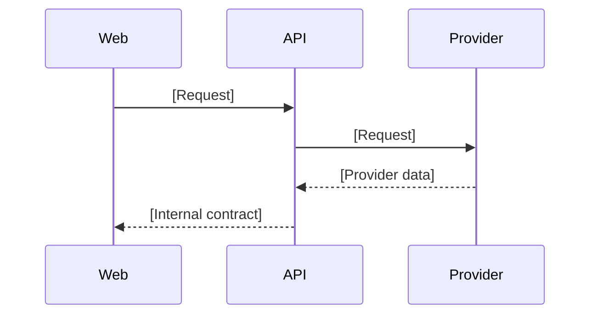
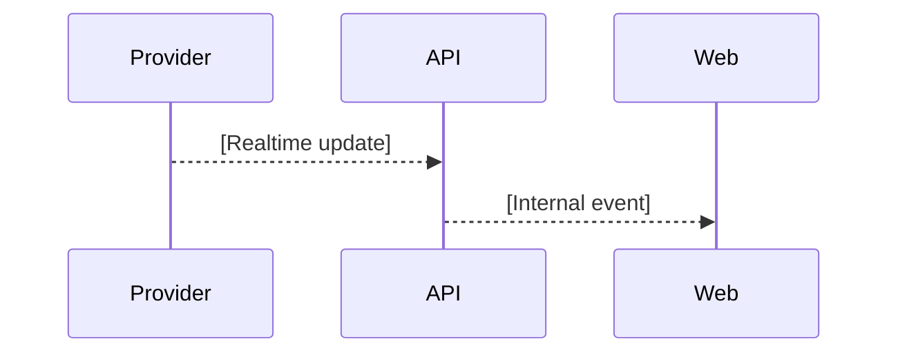
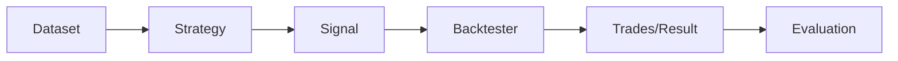
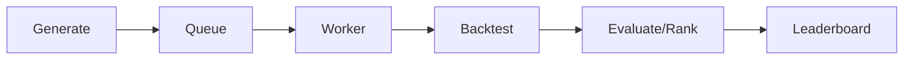
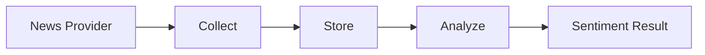

# Data Flows

**Status**: Draft  
**Owners**: [Tên/vai trò]

## 1. Historical Market Data

### Input/Output

[Điền]

### Error Flow

[Điền]

## 2. Realtime Market Data

### Subscribe/Unsubscribe

[Điền]

### Reconnect/Gap Recovery

[Điền]

## 3. Strategy and Backtest

### Main Steps

[Điền]

### Error Flow

[Điền]

## 4. Search and Leaderboard

### Stop Conditions

[Điền]

### Progress Events

[Điền]

## 5. News and Sentiment

### Main Steps

[Điền]

### Failure Isolation

[Điền]

