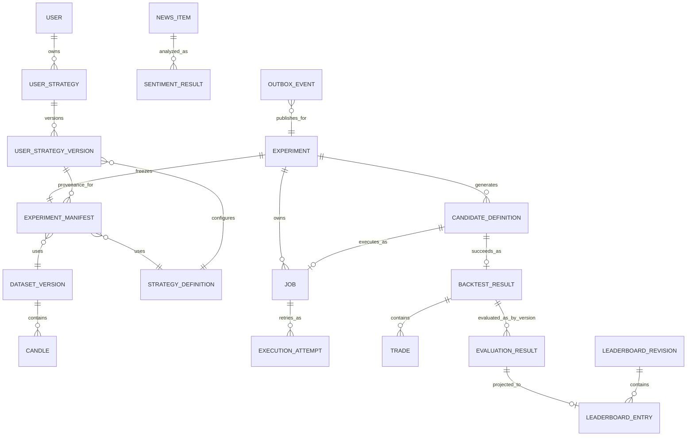
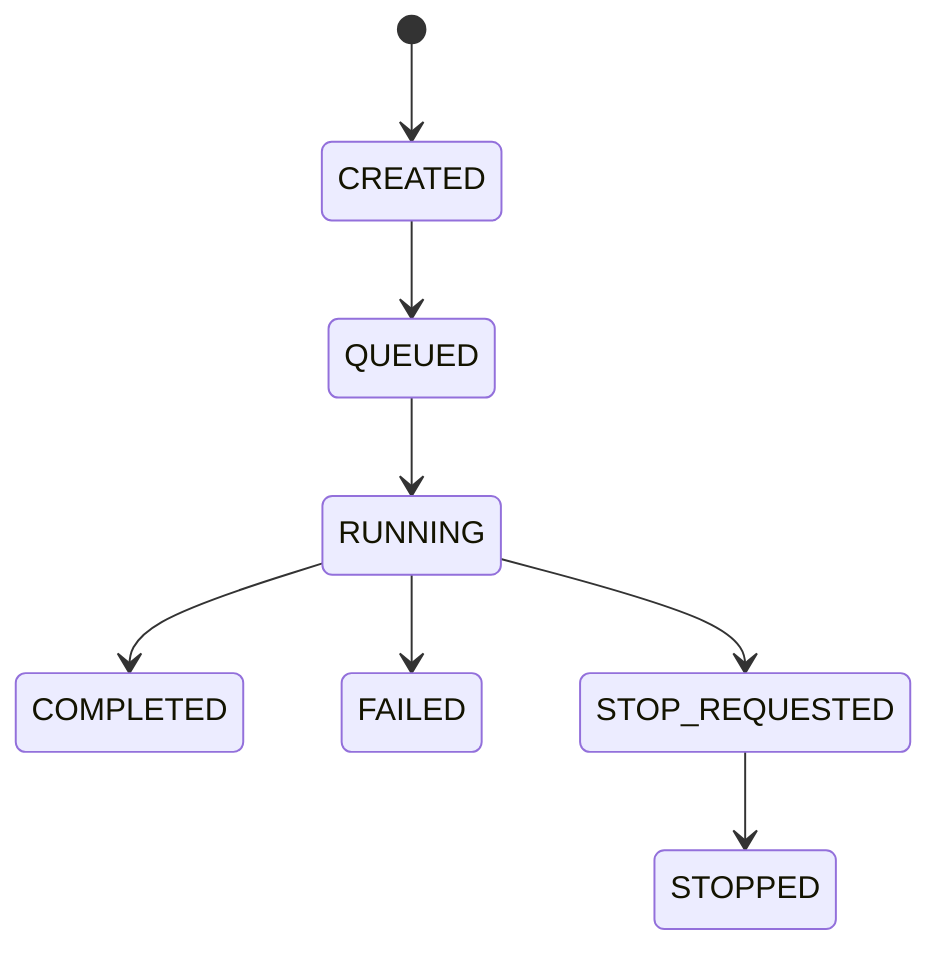
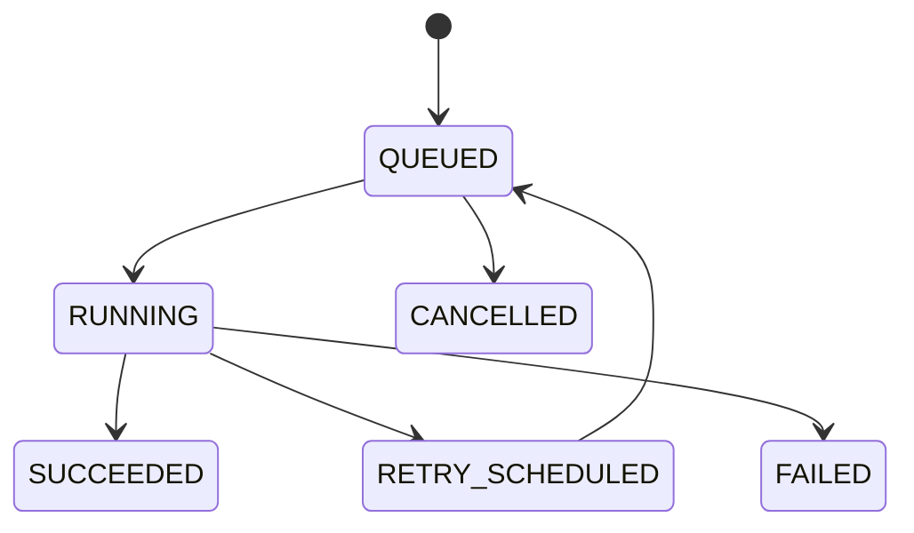
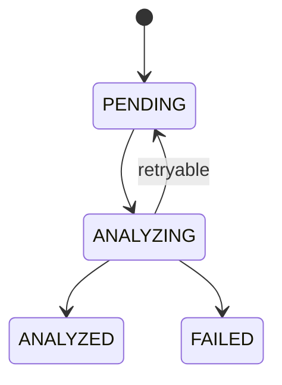

# Conceptual Data Model and Ownership

**Status**: Draft — Target MVP Architecture

**Last Updated**: 2026-08-28

**Owner**: Văn Minh

Tài liệu này mô tả entity, identity, ownership và lifecycle cấp hệ thống. Column/index/schema vật lý được chốt trong feature plan và migration, không nằm trong view này.

## Conceptual Diagram

## Entity Catalog

| Entity/Value | Ý nghĩa | Owner | Identity/version |
| --- | --- | --- | --- |
| Pair/Timeframe | Canonical market scope | `market-data` | Stable normalized value |
| Candle | OHLCV trong một khoảng | `market-data` | provider + pair + timeframe + openTime |
| Dataset Version | Frozen ordered Candle membership | `market-data` | datasetId + version + checksum |
| Strategy Definition | Plugin descriptor và exact parameters | `strategy-core` | pluginId + version + parameters |
| Composite Definition | Policy và Strategy con | `combination` | compositeId + version/fingerprint |
| User Strategy | Tên, kind và lifecycle của cấu hình riêng | `strategy-core` | userStrategyId + ownerUserId |
| User Strategy Version | Exact plugin/parameters hoặc composite policy đã publish | `strategy-core` | userStrategyVersionId + versionNo/fingerprint |
| Experiment | Identity và runtime lifecycle của một lần chạy | `experiment` | experimentId |
| Experiment Manifest | Immutable input/configuration | `experiment` | manifestVersion + fingerprint |
| Candidate Definition | Strategy/Composite cụ thể được sinh | `search` | candidateId + generationIndex/fingerprint |
| Job | Công việc Search/Backtest logic, status và progress bền vững | `experiment` | jobId |
| Execution Attempt | Một lần Worker thử xử lý Backtest Job | `backtesting` | attemptId; unique jobId + attemptNo |
| Backtest Result | Kết quả mô phỏng thành công | `backtesting` | resultId; unique theo Candidate/Job policy |
| Trade | Entry/exit/P&L mô phỏng | `backtesting` | tradeId + stable sequence index |
| Evaluation Result | Metrics/version từ Result; một Result có thể được đánh giá bằng nhiều metric version | `evaluation` | evaluationId; unique theo resultId + metricVersion |
| Leaderboard Revision/Entry | Top-K projection và stable rank | `leaderboard` | experimentId + revision + evaluationId |
| News Item | Tin đã normalize/deduplicate | `news` | newsId + contentHash/source identity |
| Sentiment Result | Kết quả model immutable | `news` | newsId + contentHash + modelVersion |
| Outbox Event | Durable message chờ publish | Platform persistence | outboxId/messageId |
| Processed Message | Dấu vết idempotency consumer | Platform persistence | consumer + messageId |

## Immutable Experiment Relationships

Một Experiment Manifest đã xác nhận phải tham chiếu chính xác:

- Dataset ID/version/checksum, provider, pair, timeframe, range và Candle count.
- Strategy/Composite ID, version, exact parameters và Combination Policy.
- User Strategy version nguồn khi user chọn cấu hình đã lưu; owner phải trùng với
  Experiment. Manifest vẫn đóng băng exact snapshot, không chỉ giữ reference.
- Backtest assumptions: initial capital, fee, execution price, position/slippage/end-position policy.
- Search algorithm/generator version, seed, Search Space, Stop Conditions, Top-K và Candidate thực tế.
- Evaluation/Ranking version và tie-break rule.
- Sentiment dataset/model/preprocessing version khi có dùng.
- Application version, Git commit và business-relevant configuration.

Thay input tạo Experiment mới; chạy kiểm chứng tạo Reproduction Run mới. Result gốc không bị overwrite.

## Lifecycle and State Machines

Transition được kiểm tra ở Backend; Frontend không tự đặt status.

User Strategy có lifecycle `ACTIVE → ARCHIVED`. Version được soạn ở `DRAFT` và
chuyển một chiều sang `PUBLISHED`; published version/component là bất biến. Thay
cấu hình tạo version mới, còn archive không xóa provenance của Experiment cũ.

## Source of Truth and Storage Roles

PostgreSQL/Supabase là source of truth cho business state, immutable result, Outbox và durable Leaderboard revision. Redis chỉ giữ:

- Redis Streams, consumer group, pending/dead-letter state.
- Cache historical range/Strategy descriptor/Top-K.
- Latest/open Candle, subscriber count, connection/progress snapshot.
- Rate-limit counter hoặc short-lived coordination lock.

Xóa Redis không được làm mất Experiment/Result; cache và pending work phải rebuild/recover được từ PostgreSQL/provider/Outbox.

## CQRS and Event Sourcing Decision

MVP **không dùng full CQRS**: command và query vẫn đi qua cùng Java application/domain model và PostgreSQL. Chỉ Leaderboard có projection/read model riêng vì Top-K cần format đọc nhanh, revision và realtime update. Projection có thể lưu PostgreSQL và cache Redis, đồng thời rebuild từ Evaluation Result.

MVP **không dùng Event Sourcing**: business state không được dựng độc quyền bằng replay toàn bộ event. Immutable Manifest/Result, status/attempt records và Outbox cung cấp audit/provenance cần thiết với độ phức tạp thấp hơn. Outbox là cơ chế reliable publish, không phải event store.

Nếu sau này read/write shape hoặc audit/replay trở thành driver mạnh, nhóm phải tạo ADR mới trước khi mở rộng thành CQRS/Event Sourcing đầy đủ.

## Cross-cutting Rules

- Timestamp dùng ISO-8601 UTC; `evaluationTime` thay cho system clock trong Strategy.
- Price, fee và metric quan trọng dùng decimal/BigDecimal cùng rounding policy được version hóa.
- Canonical serialization sắp field ổn định trước khi tính checksum/fingerprint.
- Foreign key vật lý không cấp quyền ghi chéo module; owner output port vẫn là boundary.
- Migration trong Git là nguồn schema; không sửa demo database chỉ bằng Dashboard.
- Retention không được xóa Dataset/Strategy/Result đang được Experiment tham chiếu.
