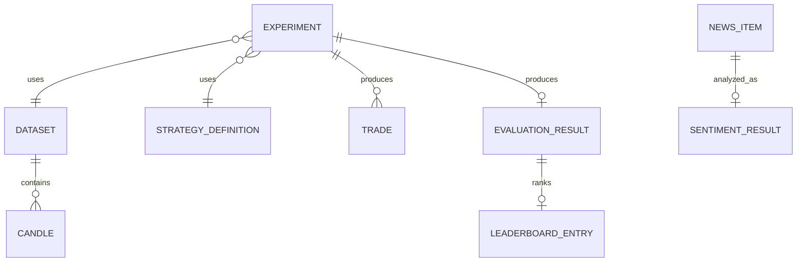

# Data Model Overview

**Status**: Draft  
**Owners**: Strategy Owner, Infra Owner, Tech Lead

Tài liệu này chỉ mô tả dữ liệu khái niệm cấp hệ thống. Field chi tiết thuộc `specs/<feature>/data-model.md`.

## Conceptual Diagram

## Entity Catalog

| Entity/Value Object | Ý nghĩa | Owner Module | Identity/Version |
| --- | --- | --- | --- |
| Candle | [Điền] | [Điền] | [Điền] |
| Strategy Definition | [Điền] | [Điền] | [Điền] |
| Experiment | [Điền] | [Điền] | [Điền] |
| Trade | [Điền] | [Điền] | [Điền] |
| Evaluation Result | [Điền] | [Điền] | [Điền] |
| Leaderboard Entry | [Điền] | [Điền] | [Điền] |
| News Item | [Điền] | [Điền] | [Điền] |
| Sentiment Result | [Điền] | [Điền] | [Điền] |

## Relationships

[Điền quan hệ chính]

## Lifecycle and States

| Entity | States | Transition chính |
| --- | --- | --- |
| [Điền] | [Điền] | [Điền] |

## Cross-cutting Rules

- [Timestamp/timezone]
- [Decimal precision]
- [Versioning]
- [Data ownership]
- [Retention]

## Open Questions

- [Câu hỏi chưa chốt]

