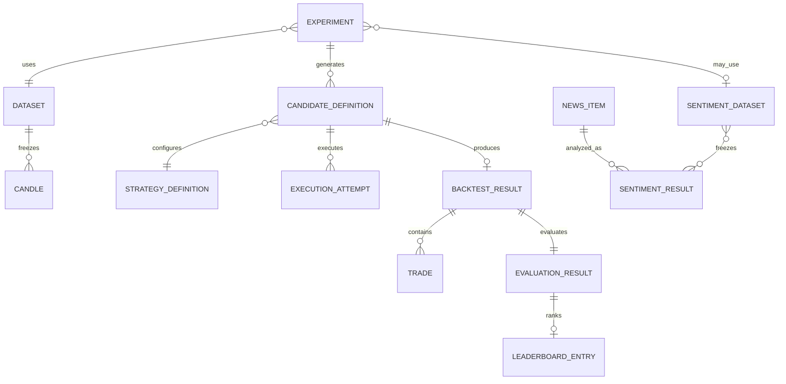

# Data Model Overview

**Status**: Proposed conceptual model
**Last Updated**: 2026-08-12
**Owners**: Tiến Luật, Strategy Owner và Data Owner

Tài liệu mô tả dữ liệu cấp hệ thống; physical tables/columns thuộc feature plan và migration.

## Conceptual Diagram

## Entity Catalog

| Entity/Value Object | Ý nghĩa | Owner Module | Identity/Version |
| --- | --- | --- | --- |
| Candle | Canonical closed/open OHLCV | `market-data` | provider + pair + timeframe + openTime |
| Dataset | Immutable ordered candle snapshot/reference | `market-data` | datasetId + version + checksum |
| Strategy Definition | Plugin/composite config và parameter schema | `strategy-core`/`combination` | stable ID + semantic version |
| Experiment | Immutable input manifest và mutable runtime status | `search` | experimentId + manifestVersion + fingerprint |
| Candidate Definition | Immutable generated strategy configuration | `search` | experimentId + candidateId + generationIndex |
| Execution Attempt | Một worker attempt của candidate | `backtesting` | jobId + attempt |
| Backtest Result | Immutable trade simulation result | `backtesting` | resultId, unique successful result per candidate policy |
| Trade | Entry/exit và P&L thuộc result | `backtesting` | tradeId/resultId/order |
| Evaluation Result | Versioned metrics từ Backtest Result | `evaluation` | evaluationId + evaluator version |
| Leaderboard Entry | Top-K read model/revision | `leaderboard` | leaderboard context + revision + candidate |
| News Item | Canonical collected article metadata/content | `news` | newsId + contentHash |
| Sentiment Result | Label/score và model provenance | Sentiment boundary | newsId + contentHash + modelVersion |

## Experiment Manifest

Manifest bất biến lưu tối thiểu:

- dataset ID/version/checksum, provider, pair, timeframe, range và candle count;
- Strategy/Composite IDs, versions, exact parameters, policy, weights/tie rule;
- initial capital, fee, execution price, position mode, slippage và end-position policy;
- evaluator/ranking formula versions;
- Search algorithm/version, search space, seed, stop conditions và Top-K;
- sentiment dataset/model/preprocessing versions nếu có;
- application version, Git commit và contract/manifest version.

`experimentFingerprint` là SHA-256 của canonical manifest: stable field order, UTC timestamp, canonical decimal strings và không gồm runtime status/worker ID.

## Lifecycles

| Entity | States | Transition chính |
| --- | --- | --- |
| Experiment | CREATED, QUEUED, RUNNING, STOP_REQUESTED, STOPPED, COMPLETED, FAILED | Backend validates transitions; UI không tự đặt state |
| Candidate Job | QUEUED, RUNNING, RETRY_SCHEDULED, SUCCEEDED, FAILED, CANCELLED | Retry tạo attempt, không tạo candidate mới |
| News Item | PENDING, ANALYZING, ANALYZED, FAILED | News vẫn tồn tại khi sentiment lỗi |
| Dataset | PREPARING, FROZEN, ARCHIVED | FROZEN không sửa tại chỗ |
| Strategy Definition | AVAILABLE, DEPRECATED, ARCHIVED | Version đã được tham chiếu không overwrite |

## Cross-cutting Rules

- Timestamp dùng ISO-8601 UTC; display timezone thuộc UI preference.
- Price, volume, fee và metrics quan trọng dùng decimal, không dùng binary floating point.
- Durable definition/result là immutable; thay đổi logic/input tạo version hoặc record mới.
- PostgreSQL là source of truth; Redis chỉ giữ queue/cache/ephemeral state.
- Module chỉ ghi dữ liệu qua owner output port; foreign key không trao quyền cập nhật chéo.
- Dataset/Strategy/Result còn được Experiment tham chiếu không bị xóa nếu chưa có retention-safe archive.
- Random/time-based Search lưu Candidate Definitions thực tế để replay không phụ thuộc tốc độ máy.

## Deferred Physical Design

Physical schema, index, partition, retention duration và decimal scale được chốt sau workload/data-volume measurement trong feature plan. Quyết định deferred này không thay đổi identity, ownership và immutability rules ở trên.
