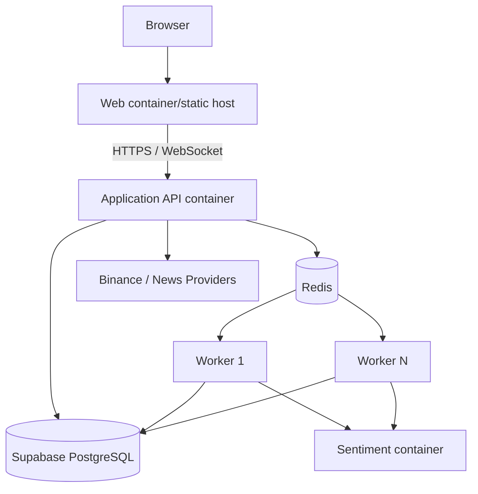

# Deployment View

**Status**: Proposed baseline
**Last Updated**: 2026-08-12
**Owners**: Tiến Luật và Infra Owner

## Environments

| Environment | Mục đích | Thành phần |
| --- | --- | --- |
| Local | Development và deterministic tests | Web, API, Worker, Sentiment, local PostgreSQL, Redis, fixture providers |
| CI | Build, unit/contract/integration/architecture tests | Ephemeral PostgreSQL/Redis và test doubles; không yêu cầu live Binance |
| Demo | End-to-end và architecture proofs | Web, API, 1–3 Workers, Sentiment, Redis, Supabase PostgreSQL, Binance/fixture fallback |

## Deployment Diagram

## Runtime Components

| Component | Process/Container | Interface/Health | Scale Strategy |
| --- | --- | --- | --- |
| Web | Browser app/static assets | HTTP readiness by hosting platform | Static horizontal/CDN if needed |
| Application API | Java/Spring Boot process | REST/WebSocket; liveness/readiness endpoint in implementation plan | Scale only after connection/state strategy is measured |
| Worker | Java/Spring Boot process | Consumer heartbeat/readiness | Horizontal consumers in same Redis group |
| Sentiment | Python/FastAPI process | `/health/live`, `/health/ready` | Stateless horizontal replicas |
| PostgreSQL | Local container or Supabase managed instance | DB connection/pool metrics | Pool/plan capacity before worker increase |
| Redis | Local or managed instance | PING, stream lag/pending metrics | Vertical/managed scaling for MVP |

Physical ports are environment configuration and are not fixed by this architecture baseline. Public contracts use `/api/v1` and `/ws`; the Sentiment endpoint is internal-only.

## Configuration and Secrets

- `.env.example` documents required variables; real `.env` and credentials never commit.
- Backend/Worker hold Binance/database/Redis credentials; browser never receives service-role keys.
- Profiles separate local fixture/live provider and demo resource limits.
- Retry, timeout, buffer, pool, queue threshold and worker concurrency are centralized configuration.
- Versioned application artifacts and Git commit are written into Experiment provenance when they affect results.

## Startup and Readiness

1. PostgreSQL and Redis become reachable.
2. Migrations run from version-controlled files.
3. Sentiment loads model and becomes ready; its failure does not block Market API readiness.
4. API starts adapters, outbox publisher and WebSocket gateway.
5. Workers join consumer groups and reclaim eligible pending jobs.
6. Web becomes available after API contract/config is known.

Docker startup order is not a reliability guarantee; every client still handles runtime outage, retry and degraded state.

## Backup and Recovery

- PostgreSQL backup covers manifests, datasets, results, news, outbox and idempotency records.
- Redis loss is recoverable from PostgreSQL/outbox and cache warm-up; it is not a durable backup.
- Incomplete jobs are discovered and republished idempotently after recovery.
- Demo retains a frozen fixture dataset and precomputed result only as fallback, not as fabricated evidence.

## Compatibility Verification

- Container image architecture, ARM64 support, memory/model startup and Supabase connection limits remain `Planned` until built and measured.
- Results are recorded in [Architecture Evidence](architecture-evidence.md); absence of verification is not reported as support.
