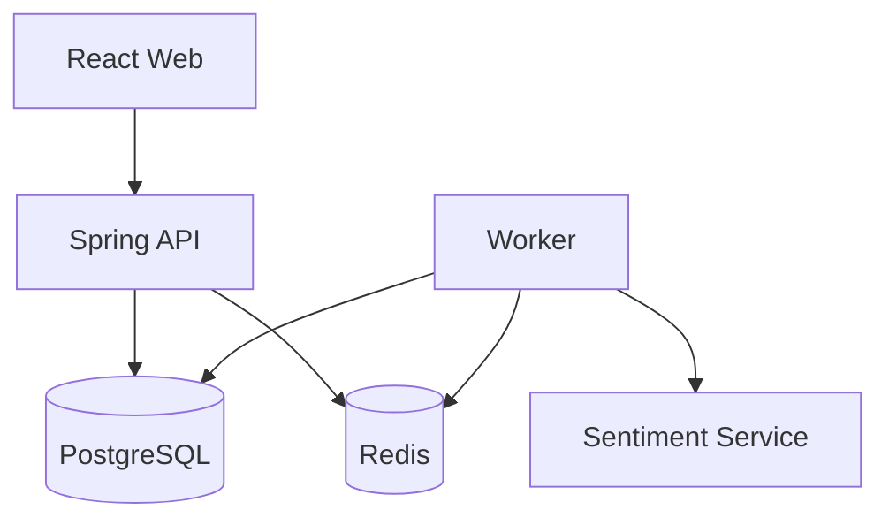

# Deployment View

**Status**: Draft  
**Owners**: Tech Lead, Infra Owner

## Environments

| Environment | Mục đích | Thành phần |
| --- | --- | --- |
| Local | [Điền] | [Điền] |
| CI | [Điền] | [Điền] |
| Demo | [Điền] | [Điền] |

## Deployment Diagram

## Runtime Components

| Component | Process/Container | Port | Health Check | Scale Strategy |
| --- | --- | ---: | --- | --- |
| [Điền] | [Điền] |  | [Điền] | [Điền] |

## Configuration

- [Environment variables]
- [Profiles]
- [Secrets]

## Startup Order

1. [Điền]
2. [Điền]

## Backup and Recovery

[Điền phạm vi MVP]

## ARM64 Compatibility

[Điền images/components đã kiểm tra]

## Open Questions

- [Câu hỏi chưa chốt]

