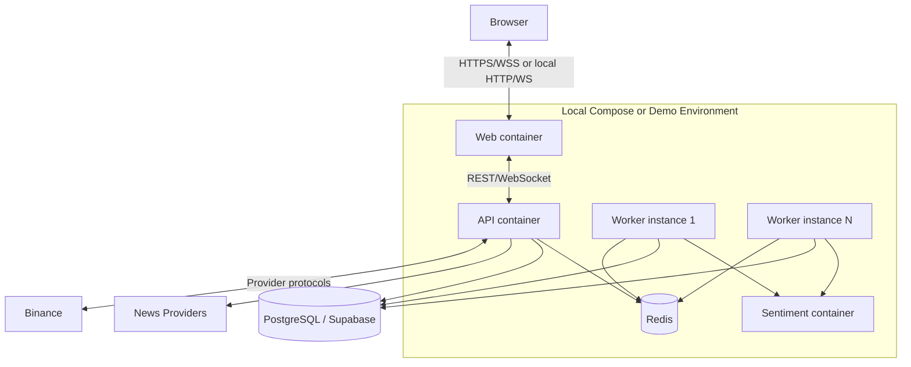

# Deployment View

**Status**: Draft — Target MVP Architecture

**Last Updated**: 2026-08-14

**Owner**: Văn Minh

View này mô tả topology mục tiêu. Repo chưa có source/infra implementation; port, image, hosting và sizing đều là `Planned verification` cho tới khi được cấu hình và chạy thật.

## Environments

| Environment | Mục đích | Thành phần |
| --- | --- | --- |
| Local | Phát triển và integration test | Docker Compose: Web, API, Worker, Sentiment, PostgreSQL tương thích, Redis; fixture provider tùy test |
| CI | Build và kiểm tra tự động | Java/Python/Web build, unit, contract, ArchUnit, integration services dùng container khi cần |
| Demo/shared | Trình diễn MVP và architecture proof | Web, API, một hoặc nhiều Worker, Sentiment; Supabase-hosted PostgreSQL; Redis theo cấu hình demo |

## Deployment Diagram

## Runtime Components

| Component | Process/container | Health/readiness | Scale strategy | Verification |
| --- | --- | --- | --- | --- |
| Web | Node/static web target | HTTP page/asset availability | Replicate/stateless hosting | Planned verification |
| API | Spring Boot JVM | Liveness, readiness, DB/Redis/provider dependency status | Replicate only after WebSocket/state behavior is tested | Planned verification |
| Worker | Spring Boot JVM | Consumer heartbeat, queue access, DB readiness | Add instances to Redis consumer group | Planned QA-05 |
| Sentiment | FastAPI/Python | `/health/live`, `/health/ready`; ready only after model load | Multiple stateless instances | Planned QA-06 |
| PostgreSQL | Local container hoặc Supabase | Connection/query check | Pool/plan sizing before Worker scale | Planned verification |
| Redis | Local/demo Redis | Ping, stream/pending visibility | Topology based on measured need | Planned verification |

Physical port numbers và image names được đặt trong Compose/environment configuration khi implementation tồn tại; tài liệu không đặt giá trị giả.

## Configuration and Secrets

- Environment-specific values gồm provider base URL, database URL, Redis URL, WebSocket origin, timeout/retry/concurrency và feature flags.
- Secret chỉ nằm trong Backend/Worker/Sentiment environment hoặc secret store; browser bundle và Git không chứa credential.
- Repo chỉ commit `.env.example` không có giá trị thật.
- Local, CI và Demo dùng cùng contract; khác biệt nằm ở configuration/adapter selection.
- Connection pool của API + toàn bộ Worker phải nhỏ hơn giới hạn database; scale Worker cần đo pool usage.

## Startup and Readiness

1. PostgreSQL và Redis sẵn sàng.
2. Migration chạy thành công từ schema trống; seed demo chạy riêng.
3. Sentiment process khởi động và tải model; liveness có thể đạt trước readiness.
4. API và Worker khởi động, kiểm tra contract/config và đăng ký consumer/plugin trùng ID/version.
5. Web phục vụ UI; UI hiển thị degraded state nếu dependency tùy chọn chưa ready.

Compose startup order chỉ hỗ trợ bootstrap; mỗi runtime vẫn phải xử lý dependency bị lỗi sau khi khởi động.

## Backup and Recovery

- PostgreSQL backup/restore thuộc cấu hình Supabase/demo; lịch và retention là Planned verification.
- Redis cache không cần backup để giữ business truth; Redis mất yêu cầu cache warm/rebuild và Outbox recovery.
- Recovery scan tìm Outbox/Job chưa hoàn thành, republish idempotently và không tạo Experiment mới.
- Dataset/Manifest/Result/version đang được tham chiếu không được xóa bởi cleanup không kiểm soát.
- Fixture market/news data là fallback demo, phải được nhận diện rõ và không giả là live provider.

## Resource and Compatibility Guardrails

- Worker có concurrency, execution timeout và dataset-size limit để bảo vệ máy demo.
- Search dùng bounded in-flight jobs; không enqueue toàn bộ Search Space.
- Sentiment có request-size/concurrency limit và circuit breaker.
- ARM64 compatibility của Java/Python/Redis/PostgreSQL image và ML model là `Planned verification`; chỉ ghi `Verified` sau khi chạy trên máy đích.
- Kubernetes, service mesh và autoscaling không thuộc MVP; scale demo bằng số Worker instance cấu hình rõ.
