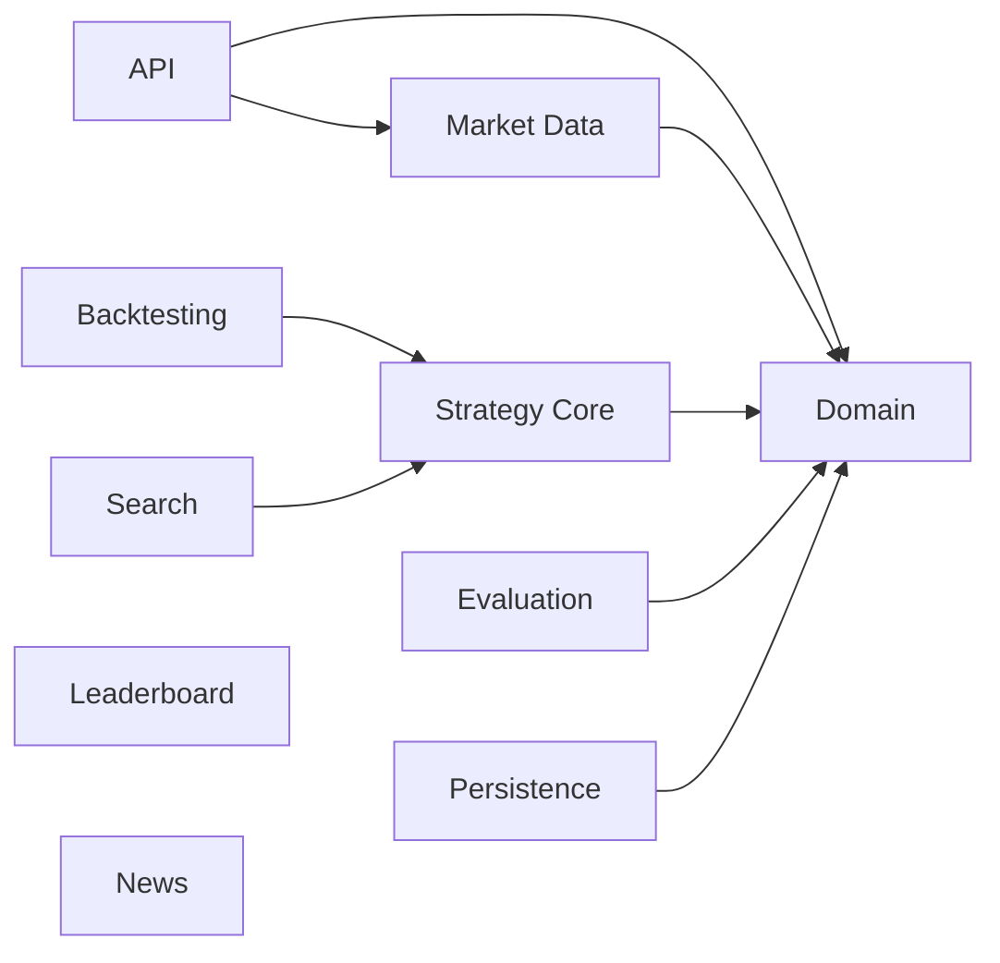

# Module View

**Status**: Draft  
**Owners**: Tech Lead và Module Owners

## Purpose

[Mô tả module boundaries bên trong backend]

## Module Diagram

## Module Catalog

| Module | Trách nhiệm | Public Contract | Không được làm | Owner |
| --- | --- | --- | --- | --- |
| [Điền] | [Điền] | [Điền] | [Điền] | [Điền] |

## Dependency Rules

- [Module nào được phụ thuộc module nào]
- [Domain dependency rule]
- [Strategy dependency rule]
- [Persistence dependency rule]
- [Frontend/API boundary rule]

## Allowed Dependencies

| Module | Có thể phụ thuộc |
| --- | --- |
| [Điền] | [Điền] |

## Forbidden Dependencies

| From | Không được phụ thuộc | Lý do |
| --- | --- | --- |
| [Điền] | [Điền] | [Điền] |

## Enforcement

- [ArchUnit rule]
- [Code review rule]
- [Build/module rule]

## Open Questions

- [Câu hỏi chưa chốt]

