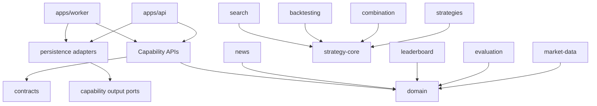

# Module View — C4 Level 3

**Status**: Proposed baseline
**Last Updated**: 2026-08-12
**Owners**: Tiến Luật và Module Owners

## Purpose

Mô tả boundary và dependency direction bên trong Java Backend/Worker. [ADR-0002](../adr/0002-module-boundaries.md) là nguồn quyết định chi tiết.

## Module Diagram

## Module Catalog

| Module | Trách nhiệm | Public Contract | Không được làm |
| --- | --- | --- | --- |
| `domain` | Stable value objects và invariant | Domain types | Phụ thuộc Spring/provider/database |
| `contracts` | Cross-runtime DTO, command, event | Versioned contracts | Chứa business implementation |
| `market-data` | Provider port, normalization, recovery | MarketDataProvider, Candle query/stream | Rò Binance model ra consumer |
| `strategy-core` | Strategy/Plugin/Registry contracts | Strategy, descriptor, registry | Gọi network/database |
| `strategies` | MA, RSI, BB, SR implementations | StrategyPlugin | Điều phối Backtest/UI |
| `combination` | Composite và voting/weight policy | CombinationPolicy | Hard-code từng tổ hợp |
| `search` | Candidate generators và stop conditions | StrategyGenerator, SearchRegistry | Chạy Backtest/Evaluation trực tiếp |
| `backtesting` | Trade simulation | Backtester | Tính ranking hoặc sinh candidate |
| `evaluation` | Metrics từ BacktestResult | Evaluator | Biết Strategy implementation/Search |
| `leaderboard` | Score, deterministic Top-K read model | RankingPolicy, LeaderboardQuery | Sở hữu Backtest logic |
| `news` | Provider abstraction, normalize/deduplicate | NewsProvider, News use cases | Phụ thuộc model Python cụ thể |
| `persistence` | Implement output ports | Repository adapters | Chứa domain flow |

## Dependency Rules

1. Dependency hướng từ runtime/adapter vào capability contract/domain.
2. `domain` không phụ thuộc internal module nào.
3. Strategy implementation chỉ phụ thuộc `strategy-core` và domain.
4. Backtester nhận Strategy contract; Evaluator nhận BacktestResult; Leaderboard nhận EvaluationResult.
5. Search Generator chỉ tạo CandidateStrategy; coordinator/queue nối pipeline.
6. Persistence triển khai output port của owner module; không cho module khác import repository implementation.
7. Frontend chỉ phụ thuộc REST/WebSocket contract.

## Allowed Dependencies

| Module | Có thể phụ thuộc trực tiếp |
| --- | --- |
| `contracts` | `domain` |
| `market-data` | `domain`, `contracts` |
| `strategy-core` | `domain`, `contracts` |
| `strategies`, `combination` | `domain`, `strategy-core` |
| `backtesting` | `domain`, `contracts`, `strategy-core` |
| `evaluation`, `leaderboard`, `news` | `domain`, `contracts` |
| `search` | `domain`, `contracts`, `strategy-core` |
| `persistence` | `domain`, `contracts`, owner output ports |
| `apps/api`, `apps/worker` | Published capability APIs và adapters cần wiring |

## Forbidden Dependencies

| From | Không được phụ thuộc | Lý do |
| --- | --- | --- |
| Domain/Strategy | Spring, Binance, Persistence, UI | Determinism và testability |
| Backtesting | Concrete strategies, Search, Leaderboard | Replaceability |
| Evaluation | Strategy/Search/DB adapter | Metric independence |
| Search | Backtester/Evaluator/Leaderboard implementation | Generator independence |
| Capability module | Repository/table của owner khác | Data ownership |
| Web | Binance/Supabase/internal Java package | Stable frontend boundary |

## Enforcement

- Build/module dependencies phản ánh allowed matrix.
- ArchUnit cấm dependency ngược, package `internal` import và module cycles.
- Contract tests chạy cho mọi Strategy/Market Provider implementation.
- PR checklist yêu cầu version/ADR review khi đổi public boundary.
- Architecture proof và evidence lifecycle nằm trong [Architecture Evidence](architecture-evidence.md).
