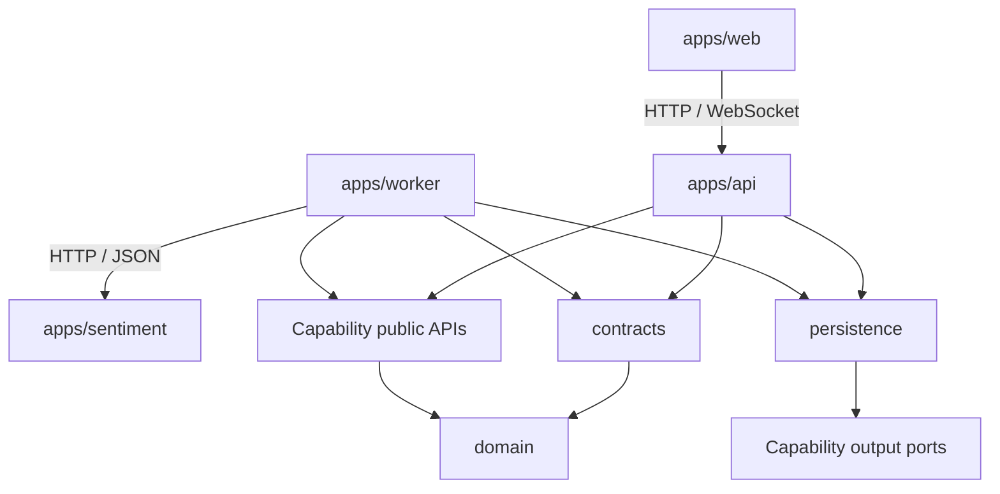
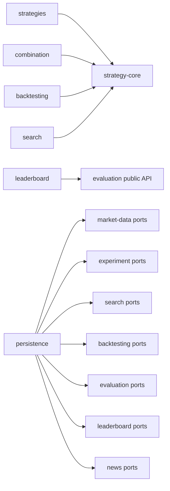

# C4 Level 3 — Backend Module View

**Status**: Planned — F-002 build enforcement in progress

**Last Updated**: 2026-08-28

**Owner**: Văn Minh

## Purpose

View này mô tả ranh giới module bên trong Java Backend. [ADR-0002](../adr/0002-module-boundaries.md) là nguồn chính thức cho dependency được phép; tài liệu này giải thích trách nhiệm và cách các module cộng tác.

## Bounded Contexts

| Context | Capability chính | Khái niệm tiêu biểu |
| --- | --- | --- |
| Market Data | `market-data` | Pair, Timeframe, Candle, Dataset |
| Strategy | `strategy-core`, `strategies`, `combination` | Strategy Definition, Signal, Combination Policy |
| Experiment | `experiment`, `search`, `backtesting`, `evaluation`, `leaderboard` | Manifest, Candidate, Trade, Metrics, Ranking |
| News Intelligence | `news` và Sentiment boundary | News Item, Sentiment Result, Model Version |

`Signal` là quyết định phân tích của Strategy; `Trade` là giao dịch mô phỏng của Backtester. Hai khái niệm không được dùng thay nhau.

## Dependency Direction

Mũi tên `A --> B` nghĩa là code của A được phép phụ thuộc public contract của B; không có nghĩa A được truy cập implementation hoặc bảng nội bộ của B.

## Module Catalog

| Module | Trách nhiệm | Public boundary | Không được làm |
| --- | --- | --- | --- |
| `domain` | Kiểu/value object và invariant ổn định | Domain types | Phụ thuộc Spring/provider/database |
| `contracts` | DTO/message qua HTTP, WebSocket, queue/runtime | Versioned integration contract | Chứa business implementation hoặc internal entity |
| `market-data` | Provider port, Binance adapter, canonical Candle, recovery | Market query/subscription và output ports | Để Binance model thoát ra ngoài |
| `strategy-core` | `Strategy`, decision, descriptor và registry | Strategy/Registry API | Gọi network/database/Spring |
| `strategies` | MA, RSI, Bollinger, Support/Resistance | Plugin implementations | Điều phối Backtest/Search |
| `combination` | Composite Strategy và Combination Policy | Composite factory/policy API | Tính metrics/ranking |
| `experiment` | Immutable manifest, runtime status và reproduction | Experiment use cases/ports | Chứa Strategy hoặc Backtest algorithm |
| `search` | Generator Registry, candidate generation và stop condition | `StrategyGenerator`, coordinator-facing API | Chạy Backtest hoặc cập nhật Top-K |
| `backtesting` | Mô phỏng execution và tạo Trade/Result | Backtest use case/ports | Biết generator/ranking implementation |
| `evaluation` | Tính metrics từ Backtest Result | Evaluator API/ports | Tạo Strategy hoặc Top-K |
| `leaderboard` | Score, tie-break, Top-K và revision | Ranking/query API/ports | Chạy Backtest hoặc Search |
| `news` | Provider contract, normalize/deduplicate News và sentiment ownership | News use cases/ports | Phụ thuộc model Python cụ thể |
| `persistence` | JDBC/Redis adapter triển khai output port | Adapter implementations | Chứa business policy hoặc được capability import ngược |

## Allowed Dependencies

| Module | Có thể phụ thuộc trực tiếp |
| --- | --- |
| `domain` | Không module nội bộ nào |
| `contracts` | `domain` khi DTO cần stable domain type |
| `market-data`, `strategy-core`, `evaluation`, `experiment`, `news` | `domain` |
| `strategies`, `combination`, `backtesting`, `search` | `domain`, `strategy-core` |
| `leaderboard` | `domain`, public API của `evaluation` khi cần |
| `persistence` | `domain`, output port công khai của data owner |
| `apps/api` | Capability public APIs, `contracts`, `persistence` |
| `apps/worker` | Public APIs cần cho background flow, `contracts`, `persistence` |

## Forbidden Dependencies

- Capability module không phụ thuộc `apps/*`, Controller, database adapter hoặc transport DTO.
- Strategy không gọi Market Data Provider, Persistence hoặc Sentiment Service.
- Search không phụ thuộc implementation của Backtesting, Evaluation hoặc Leaderboard.
- Backtesting không phụ thuộc Strategy implementation cụ thể hoặc Search.
- Module không import repository/table/entity nội bộ của data owner khác.
- Web không import Java module hoặc xử lý Strategy/Backtest/Ranking business logic.
- Không tạo `shared/common/utils` làm nơi chứa business model không có owner.

## Public Contract and Enforcement

Public surface của một capability dùng `api/`, `port/in/`, `port/out/` hoặc `event/`; implementation nằm trong `internal` hoặc package không export.

Kế hoạch enforcement:

1. Build/module boundary ngăn import package nội bộ.
2. ArchUnit kiểm tra dependency direction và các forbidden dependency.
3. Contract test cho Strategy, Generator, provider adapter và queue message.
4. Pull Request review bắt buộc khi thêm dependency hoặc cross-module read model.
5. Thêm dependency ngoài bảng phải cập nhật ADR-0002 hoặc ADR thay thế.

## Gradle Build Enforcement

- `settings.gradle.kts` khai báo hai composition root, 13 capability và
  `architecture-tests`; project mới không được đứng ngoài root `check`.
- Library module áp dụng `crypto.java-library-conventions`; runnable Java application áp
  dụng `crypto.spring-application-conventions`.
- Java toolchain được pin ở Java 21; test dùng JUnit Platform với report dùng chung.
- Public package dùng `..api..`; `..internal..` không phải contract cho consumer khác.
- `build-logic` và `architecture-tests` là build/verification infrastructure, không phải
  business capability hoặc nơi chứa model dùng chung.

Quy trình thêm module: xác định owner → review dependency theo bảng → khai báo project và
convention plugin → tạo `api`/`internal` package → bổ sung build/architecture fixture →
chạy `./gradlew clean check`. ADR-0002 phải được `Accepted` trước khi implementation phụ
thuộc boundary này được merge theo Constitution v1.1.0.
