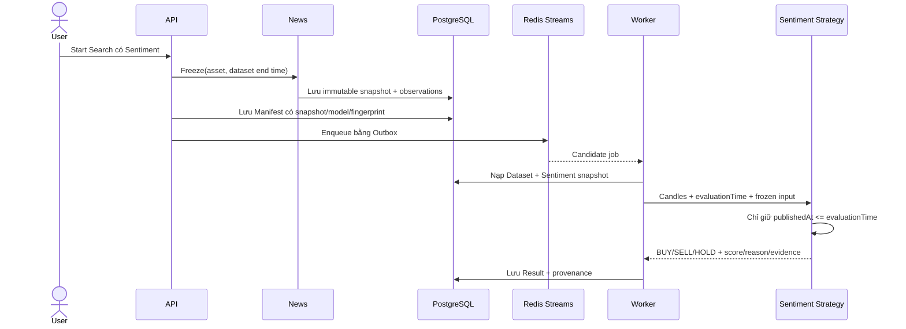

# F016 Sentiment Strategy Flow

**Status:** Implemented
**Last Updated:** 2026-09-11

F016 đưa kết quả News Sentiment vào Strategy Engine mà không cho Strategy gọi trực tiếp Python,
News database hay network. `sentiment-polarity@1.0.0` là plugin thứ năm và dùng cùng contract
BUY/SELL/HOLD với bốn Strategy kỹ thuật.

## Ranh giới module

| Thành phần | Trách nhiệm |
|---|---|
| News | Chọn các kết quả phân tích đã lưu và tạo snapshot bất biến theo asset/cutoff/model |
| Strategy Core | Cung cấp supplemental-input contract tổng quát, không phụ thuộc News |
| Strategies | Tính điểm Sentiment và trả BUY/SELL/HOLD kèm evidence |
| Experiment Execution | Đóng băng snapshot trước khi chấp nhận Search/Reproduction |
| Worker/Backtesting | Nạp snapshot bằng ID, truyền vào `StrategyContext` và lưu decision evidence |
| API/Web | Công bố provenance, tình trạng service và luồng cấu hình/demo |

## Luồng thực thi

Một Search chỉ tạo snapshot một lần, nên mọi Candidate dùng cùng News và model release. Bốn tham số
được Search thay đổi trong miền hữu hạn: `lookbackHours`, `minimumArticles`, `buyThreshold` và
`sellThreshold`; constraint bắt buộc `sellThreshold < buyThreshold`.

## Quy tắc tín hiệu

- Chỉ observations trong cửa sổ `[evaluationTime - lookbackHours, evaluationTime]` được dùng.
- Thiếu `minimumArticles` hoặc tổng confidence bằng 0 thì trả `HOLD`.
- Điểm là trung bình polarity có trọng số confidence. Điểm đạt `buyThreshold` trả `BUY`; điểm thấp
  hơn hoặc bằng `sellThreshold` trả `SELL`; khoảng giữa trả `HOLD`.
- Evidence giữ snapshot ID/fingerprint, model version, article count, thresholds, score và reason code.

## Tái lập và cô lập lỗi

- Reproduction đọc snapshot đã lưu, vì vậy News mới hoặc model mới không làm thay đổi kết quả cũ.
- Python Sentiment chỉ cần khi phân tích News mới; Backtest/Search không gọi Python trong vòng lặp.
- Nếu không tạo được snapshot bắt buộc, API từ chối trước khi tạo graph Search bền vững.
- Sentiment lỗi không chặn Market, Strategy kỹ thuật hoặc Backtest kỹ thuật.

Quyết định đầy đủ nằm tại [ADR-0018](../adr/0018-sentiment-strategy-snapshot-input.md); REST schema
nằm trong [Sentiment Strategy API Notes](../api/sentiment-strategy.md).
