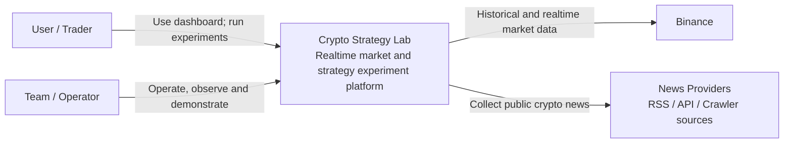

# C4 Level 1 — System Context

**Status**: Draft — Target MVP Architecture

**Last Updated**: 2026-08-14

**Owner**: Văn Minh

## Purpose

View này xác định ai sử dụng Crypto Strategy Lab, hệ thống trao đổi dữ liệu với external system nào và trách nhiệm nào nằm ngoài boundary. Nó không mô tả framework, database hoặc queue.

## Actors

| Actor | Mục tiêu | Tương tác |
| --- | --- | --- |
| User/Trader | Theo dõi market, cấu hình Strategy, chạy Experiment và xem kết quả | Chọn pair/timeframe, start/stop Search, xem chart, Trades, Leaderboard, News/Sentiment |
| Team/Operator | Demo, theo dõi và chẩn đoán hệ thống | Kiểm tra health, log, queue/job status và architecture proof |

## External Systems

| External system | Dữ liệu trao đổi | Boundary contract | Failure concern |
| --- | --- | --- | --- |
| Binance | Historical Kline và realtime Candle/Kline update | Market Data Adapter | Rate limit, schema/provider error, disconnect, duplicate/gap |
| News Providers | Bài viết, metadata và source URL | News Provider Adapter | Quota, HTML/schema khác nhau, duplicate, timeout |

## Context Diagram

## System Boundary

### Inside

- Web Dashboard và public Backend API/WebSocket.
- Market Data normalization và provider abstraction.
- Strategy/Combination/Search/Backtest/Evaluation/Leaderboard capabilities.
- Experiment provenance và data persistence.
- News collection và Sentiment Analysis runtime.
- Queue, cache, progress và operational telemetry của MVP.

### Outside

- Binance availability, market correctness và provider-specific schema.
- Nội dung, bản quyền và availability của nguồn tin.
- Giao dịch tài sản thật, quản lý ví, order execution và custody.
- Cam kết lợi nhuận hoặc đánh giá độ chính xác tài chính production-grade.
- Identity/payment/multi-tenant production features.

## Trust and Data Boundaries

- Binance/News payload là input không tin cậy: adapter phải validate, normalize và translate error.
- User input như pair, timeframe, parameters và command phải được Backend validate.
- Browser không nhận Binance credential, database password, Supabase service-role key hoặc internal service token.
- Sentiment endpoint là internal boundary; Python không tự fetch URL do client cung cấp.
- Public response không chứa provider credential, internal stack trace hoặc database model.

## Assumptions

- MVP dùng dữ liệu công khai và không đặt lệnh giao dịch thật.
- Authentication đơn giản hoặc chưa có trong demo; dữ liệu theo user chỉ được thêm sau khi có authentication/authorization.
- Provider fallback bằng fixture được phép trong test/demo nhưng phải được gắn nhãn rõ.
