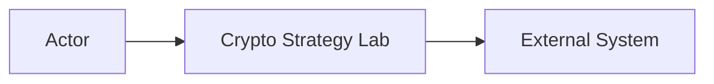

# System Context

**Status**: Draft  
**Owners**: [Tên/vai trò]

## Purpose

[Phạm vi của System Context]

## Actors

| Actor | Mục tiêu | Tương tác với hệ thống |
| --- | --- | --- |
| [Điền] | [Điền] | [Điền] |

## External Systems

| External System | Dữ liệu trao đổi | Protocol | Failure Concern |
| --- | --- | --- | --- |
| [Điền] | [Điền] | [Điền] | [Điền] |

## Context Diagram

## System Boundary

### Inside

- [Thành phần thuộc hệ thống]

### Outside

- [External system hoặc responsibility ngoài phạm vi]

## Trust and Data Boundaries

- [Dữ liệu từ external provider]
- [Dữ liệu do người dùng nhập]
- [Secret/credential boundary]

## Assumptions

- [Giả định]

