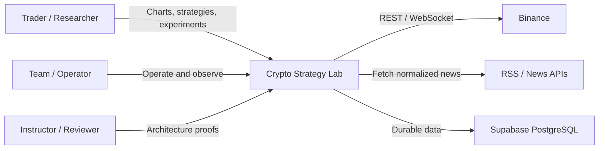

# System Context — C4 Level 1

**Status**: Proposed baseline
**Last Updated**: 2026-08-12
**Owners**: Tiến Luật và Tech Lead

## Purpose

Mô tả ranh giới Crypto Strategy Lab, người dùng và các hệ thống bên ngoài. Chi tiết container nằm trong [Container View](container-view.md).

## Actors

| Actor | Mục tiêu | Tương tác |
| --- | --- | --- |
| Trader/Researcher | Theo dõi market, cấu hình strategy, chạy experiment và xem Top-K | Web Dashboard |
| Project Team/Operator | Vận hành demo, quan sát job, xử lý lỗi và kiểm chứng kiến trúc | Dashboard, logs và evidence artifacts |
| Instructor/Reviewer | Kiểm tra change, failure, scale và provenance scenarios | Demo và architecture documentation |

## External Systems

| External System | Dữ liệu trao đổi | Protocol | Failure Concern |
| --- | --- | --- | --- |
| Binance | Historical/realtime OHLCV | HTTPS/WebSocket | Rate limit, disconnect, missing/duplicate candle |
| News Providers | Title, content, URL, source và timestamps | HTTPS/RSS | Unavailable source, duplicate, malformed content |
| Supabase | Hosted PostgreSQL cho shared/demo environment | PostgreSQL/TLS | Connection limit, outage, credential exposure |

## Context Diagram

## System Boundary

### Inside

- Web Dashboard, Application API và WebSocket gateway.
- Market, Strategy, Combination, Search, Backtest, Evaluation, Leaderboard và News modules.
- Worker runtime, Sentiment Service, queue/cache configuration và persistence adapters.
- Internal contracts, immutable experiment metadata và observability context.

### Outside

- Exchange availability, pricing correctness và provider-specific APIs.
- News copyright/content ownership và upstream source availability.
- Supabase managed infrastructure.
- Real-money order execution; hệ thống không phải trading bot hoặc financial advice platform.

## Trust and Data Boundaries

- Mọi Binance/News payload là untrusted input và phải validate/normalize tại adapter.
- Browser không nhận exchange, database hoặc service-role credentials.
- Python Sentiment Service chỉ nhận normalized text, không tự fetch URL và không truy cập shared database.
- Secret chỉ tồn tại trong Backend/Worker/Sentiment environment; `.env` thật không commit.
- Strategy parameters từ người dùng được validate bằng plugin parameter schema trước execution.

## Assumptions

- MVP chủ yếu dùng dữ liệu market public và không đặt lệnh thật.
- Binance là provider đầu tiên; fixture adapter là demo fallback.
- PostgreSQL là durable source of truth; Redis có thể bị xóa và rebuild/recover.
- Historical Backtest chỉ dùng closed candles và frozen dataset.
