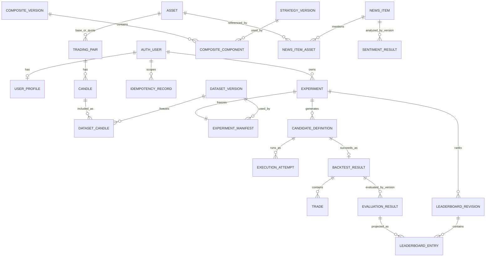

# Database ERD

**Trạng thái**: Draft — Database baseline 0.1  
**Cập nhật**: 2026-08-22

ERD này chuyển conceptual model thành tên bảng vật lý dự kiến. Thiết kế vẫn
đang để review và chưa được triển khai lên Supabase.

## Quy ước

- Năm schema: `market`, `strategy`, `experiment`, `news`, `platform`.
- Public ID là ULID `varchar(26)` do application tạo.
- Foreign key không cho phép module khác ghi trực tiếp dữ liệu của owner.
- Dataset, definition, manifest và result đã chốt là bất biến.

## Quan hệ

## Bảng và ownership

| Schema | Tables | Owner |
| --- | --- | --- |
| `market` | `asset`, `trading_pair`, `candle`, `dataset_version`, `dataset_candle` | `market-data` |
| `strategy` | `strategy_version` | `strategy-core` |
| `strategy` | `composite_version`, `composite_component` | `combination` |
| `experiment` | `experiment`, `experiment_manifest` | `experiment` |
| `experiment` | `candidate_definition` | `search` |
| `experiment` | `execution_attempt`, `backtest_result`, `trade` | `backtesting` |
| `experiment` | `evaluation_result` | `evaluation` |
| `experiment` | `leaderboard_revision`, `leaderboard_entry` | `leaderboard` |
| `news` | `news_item`, `news_item_asset`, `sentiment_result` | `news` |
| `platform` | `user_profile`, `outbox_event`, `processed_message`, `idempotency_record` | platform persistence |

## Quan hệ logic

- Manifest lưu `strategy_kind + strategy_ref_id + version` vì target có thể là
  Strategy đơn hoặc Composite; không dùng foreign key đa hình.
- Candidate lưu exact definition và fingerprint dưới dạng snapshot.
- Outbox dùng `aggregate_type + aggregate_id` vì phục vụ nhiều schema.
- Sentiment dùng cho Strategy sau này phải được freeze trong manifest, không đọc
  kết quả “mới nhất” khi reproduce.

## Invariant bắt buộc

1. Candle duy nhất theo provider, pair, timeframe và open time.
2. Dataset có ordered membership bất biến, không lặp Candle.
3. Mỗi Experiment có đúng một manifest.
4. Candidate không trùng generation index hoặc fingerprint trong Experiment.
5. Mỗi Candidate có tối đa một Backtest Result thành công.
6. Evaluation duy nhất theo Result và metric version.
7. Rank và Evaluation không trùng trong một Leaderboard revision.
8. Sentiment duy nhất theo News, content hash và model version.
9. Một consumer chỉ xử lý một message ID một lần.
10. Mỗi Experiment thuộc đúng một Supabase Auth user; bảng con kế thừa ownership
    qua Experiment.

Chi tiết column và constraint nằm trong
[Data Dictionary](data-dictionary.md); lý do lựa chọn nằm trong
[Database Decisions](decisions.md).
