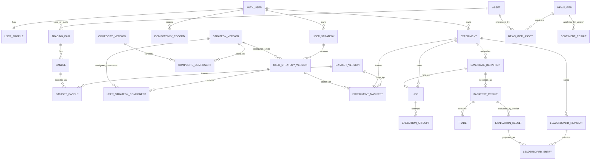

# Database ERD

**Trạng thái**: Baseline 0.1 đã áp dụng; DB setup v2 đang chờ review/apply
**Cập nhật**: 2026-08-28

ERD này chuyển conceptual model thành tên bảng vật lý. Quan hệ v2 là target của
forward migration `20260828000100_add_user_strategies_and_jobs.sql` và chưa được
apply remote.

## Quy ước

- Năm schema: `market`, `strategy`, `experiment`, `news`, `platform`.
- Public ID là ULID `varchar(26)` do application tạo.
- Foreign key không cho phép module khác ghi trực tiếp dữ liệu của owner.
- Dataset, definition, manifest và result đã chốt là bất biến.

## Quan hệ

## Bảng và ownership

| Schema | Tables | Owner |
| --- | --- | --- |
| `market` | `asset`, `trading_pair`, `candle`, `dataset_version`, `dataset_candle` | `market-data` |
| `strategy` | `strategy_version` | `strategy-core` |
| `strategy` | `composite_version`, `composite_component` | `combination` |
| `strategy` | `user_strategy`, `user_strategy_version`, `user_strategy_component` | `strategy-core` |
| `experiment` | `experiment`, `experiment_manifest` | `experiment` |
| `experiment` | `candidate_definition` | `search` |
| `experiment` | `job` | `experiment` |
| `experiment` | `execution_attempt`, `backtest_result`, `trade` | `backtesting` |
| `experiment` | `evaluation_result` | `evaluation` |
| `experiment` | `leaderboard_revision`, `leaderboard_entry` | `leaderboard` |

F-006 bảo vệ chuỗi lineage bằng khóa ngoại tổng hợp:
`Experiment → Candidate → BACKTEST Job → successful Execution Attempt → Backtest Result → Evaluation Result → Leaderboard Entry`.
Các Result, Trade, Evaluation và Leaderboard Revision đã hoàn tất là immutable. Backtest Result lưu assumptions có version và equity digest; Evaluation/Leaderboard lưu fingerprint phân tầng để reproduction không phụ thuộc thời gian chạy hoặc thứ tự Worker hoàn tất.
| `news` | `news_item`, `news_item_asset`, `sentiment_result` | `news` |
| `platform` | `user_profile`, `outbox_event`, `processed_message`, `idempotency_record` | platform persistence |

## Quan hệ logic

- Manifest lưu `strategy_kind + strategy_ref_id + version` vì target có thể là
  Strategy đơn hoặc Composite; không dùng foreign key đa hình.
- `source_user_strategy_version_id` là provenance tùy chọn; exact snapshot trong
  Manifest vẫn là nguồn tái lập và source phải cùng owner với Experiment.
- Job là công việc logic; Execution Attempt là từng lần Worker thử chạy Job.
- Candidate lưu exact definition và fingerprint dưới dạng snapshot.
- Outbox dùng `aggregate_type + aggregate_id` vì phục vụ nhiều schema.
- Sentiment dùng cho Strategy sau này phải được freeze trong manifest, không đọc
  kết quả “mới nhất” khi reproduce.

## Invariant bắt buộc

1. Candle duy nhất theo provider, pair, timeframe và open time.
2. Dataset có ordered membership bất biến, không lặp Candle.
3. Mỗi Experiment có đúng một manifest.
4. Candidate không trùng generation index hoặc fingerprint trong Experiment.
5. Mỗi Candidate có tối đa một Backtest Result thành công.
6. Evaluation duy nhất theo Result và metric version.
7. Backtest Result, successful Execution Attempt và Candidate phải thuộc cùng Candidate/Experiment.
8. Leaderboard Entry chỉ được tham chiếu Evaluation Result thuộc cùng Experiment với Revision.
9. Experiment Manifest lưu đầy đủ Dataset/Strategy provenance; adapter không được dựng metadata mặc định khi đọc.
7. Rank và Evaluation không trùng trong một Leaderboard revision.
8. Sentiment duy nhất theo News, content hash và model version.
9. Một consumer chỉ xử lý một message ID một lần.
10. Mỗi Experiment thuộc đúng một Supabase Auth user; bảng con kế thừa ownership
    qua Experiment.
11. User Strategy có owner trực tiếp; version published và component của nó bất biến.
12. Search Job không có Candidate; Backtest Job có Candidate thuộc cùng Experiment.
13. Execution Attempt phải dùng đúng cặp Job/Candidate và retry giữ nguyên Job ID.

Chi tiết column và constraint nằm trong
[Data Dictionary](data-dictionary.md); lý do lựa chọn nằm trong
[Database Decisions](decisions.md).
