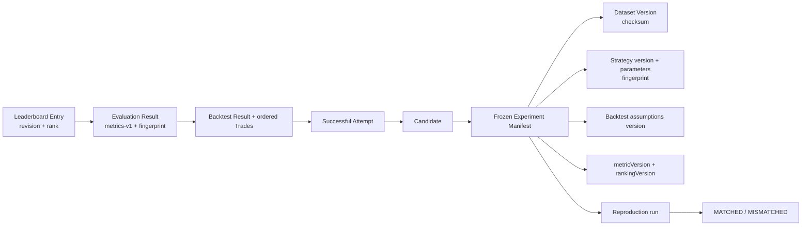

# 10. Leaderboard result truy được provenance thế nào?

## Trả lời ngắn

Từ Leaderboard Entry có thể lần theo Evaluation Result → Backtest Result/Trades → successful Attempt → Candidate → frozen Experiment Manifest. Manifest giữ Dataset version/checksum, exact Strategy version/parameters/fingerprint, Backtest assumptions, metric version và ranking version. Các artifact hoàn tất là immutable. Reproduction tạo một run liên kết mới, chạy lại frozen graph rồi ghi `MATCHED` hoặc `MISMATCHED`, không ghi đè kết quả gốc.

## Minh họa

## Fingerprint và provenance khác nhau thế nào?

- **Provenance** là chuỗi nguồn gốc đầy đủ: dùng dữ liệu, strategy, tham số và phiên bản nào.
- **Fingerprint** là dấu vân tay băm từ nội dung chuẩn hóa; đổi input/version thì dấu vân tay đổi.
- Checksum/fingerprint giúp phát hiện sai khác, còn ID/FK giúp đi từ kết quả về đúng graph đã sinh ra nó.

Khi reproduce, hệ thống so ordered Trades, equity digest, bốn metrics bắt buộc và các fingerprint. Kết quả mới có ID riêng và liên kết với source experiment để audit.

## Trạng thái và trade-off

**Implemented:** typed provenance, immutable relationships, result/evaluation/leaderboard fingerprints, reproduction orchestration/store và tests. Việc giữ version/snapshot làm tốn storage và đòi hỏi canonical serialization, đổi lại nhóm có thể giải thích Top #1 sau nhiều tháng và phát hiện drift.

## Bằng chứng trong project

- [ADR-0009 — Reproducible Experiments](../../adr/0009-reproducible-experiments.md)
- [Data Model Overview](../../architecture/data-model-overview.md)
- [Reproduction execution service](../../../modules/experiment-execution/src/main/java/com/cryptostrategy/platform/execution/internal/ReproduceExperimentExecutionService.java)
- [Reproduction verification store](../../../modules/persistence/src/main/java/com/cryptostrategy/platform/persistence/internal/execution/JdbcReproductionVerificationStore.java)
- [Evaluation reproduction test](../../../modules/evaluation/src/test/java/com/cryptostrategy/platform/evaluation/internal/EvaluationReproductionTest.java)
- [Leaderboard reproduction test](../../../modules/leaderboard/src/test/java/com/cryptostrategy/platform/leaderboard/internal/LeaderboardReproductionTest.java)
- [Reproduction persistence integration test](../../../modules/persistence/src/backtestEvaluationLeaderboardIntegrationTest/java/com/cryptostrategy/platform/persistence/reproduction/ReproductionPersistenceIntegrationTest.java)

## Nguồn đề bài

Mục 35–36 và 40 trong [đề đồ án](../../Crypto%20Strategy%20Lab%20%E2%80%93%20%C4%90%E1%BB%93%20%C3%A1n%20cu%E1%BB%91i%20k%E1%BB%B3.pdf); ATAM scenario E và checklist slide 39 trong [slide kiến trúc](../../KienTrucDoAn_slide.pdf).

