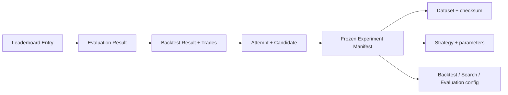

# 10. Từ kết quả Leaderboard truy lại nguồn gốc như thế nào?

## Trả lời ngắn

Mỗi dòng trên Leaderboard không chỉ lưu điểm và thứ hạng. Nó còn giữ ID của Evaluation Result, Backtest Result và fingerprint. Từ các ID này, hệ thống có thể lần ngược về Candidate, lần chạy thành công và Experiment Manifest để biết chính xác kết quả được tạo từ dữ liệu, Strategy, tham số và phiên bản nào.

Chuỗi truy vết:

```text
Leaderboard Entry
→ Evaluation Result
→ Backtest Result và Trades
→ Successful Attempt
→ Candidate
→ Experiment Manifest
```

## Minh họa



## Leaderboard giữ gì?

Mỗi entry giữ thứ hạng, Evaluation Result ID, Backtest Result ID, score, drawdown và evaluation fingerprint.

```java
public record EntryResponse(
        int rank,
        EvaluationResultId evaluationResultId,
        LeaderboardBacktestResultId backtestResultId,
        String score,
        String maximumDrawdown,
        String evaluationFingerprint) {}
```

Bằng chứng: [`LeaderboardDtos.java`](../../../apps/api/src/main/java/com/cryptostrategy/platform/api/leaderboard/LeaderboardDtos.java) và [`LeaderboardController.java`](../../../apps/api/src/main/java/com/cryptostrategy/platform/api/leaderboard/LeaderboardController.java).

## Experiment Manifest giữ gì?

Manifest là bản ghi cấu hình của Experiment tại thời điểm bắt đầu. Nó chứa:

- Dataset version, checksum, nguồn dữ liệu, cặp giao dịch và timeframe;
- Strategy ID, version, exact parameters và fingerprint;
- cấu hình Backtest, Search, Evaluation và Sentiment;
- software version, Git commit và manifest fingerprint.

Bằng chứng: [`ExperimentManifest.java`](../../../modules/experiment/src/main/java/com/cryptostrategy/platform/experiment/api/ExperimentManifest.java), [`DatasetProvenanceSnapshot.java`](../../../modules/experiment/src/main/java/com/cryptostrategy/platform/experiment/api/provenance/DatasetProvenanceSnapshot.java) và [`StrategyProvenanceSnapshot.java`](../../../modules/experiment/src/main/java/com/cryptostrategy/platform/experiment/api/provenance/StrategyProvenanceSnapshot.java).

Manifest được **freeze** trước khi Experiment được đưa vào hàng đợi. Sau đó cấu hình gốc không được sửa, nên kết quả luôn trỏ về đúng input đã sử dụng.

Bằng chứng: [`ExperimentAggregateTest.java`](../../../modules/experiment/src/test/java/com/cryptostrategy/platform/experiment/internal/ExperimentAggregateTest.java) và [ADR-0009 — Reproducible Experiments](../../adr/0009-reproducible-experiments.md).

## Provenance và fingerprint khác nhau thế nào?

- **Provenance** là thông tin nguồn gốc đầy đủ, ví dụ Dataset nào, Strategy nào và tham số nào.
- **Fingerprint** là dấu vân tay được tính từ nội dung đó.

Có thể hiểu provenance giống như danh sách nguyên liệu, còn fingerprint giống mã niêm phong của danh sách. Nếu dữ liệu, tham số hoặc version thay đổi thì fingerprint cũng thay đổi.

Bằng chứng: [`BacktestFingerprintV1Test.java`](../../../modules/backtesting/src/test/java/com/cryptostrategy/platform/backtesting/internal/BacktestFingerprintV1Test.java) và [`StrategyProvenanceBindingTest.java`](../../../modules/experiment/src/test/java/com/cryptostrategy/platform/experiment/internal/StrategyProvenanceBindingTest.java).

## Reproduction hoạt động thế nào?

Khi reproduce, hệ thống tạo một lần chạy mới từ Manifest đã đóng băng rồi so sánh kết quả mới với kết quả gốc. Kết quả gốc không bị ghi đè. Hệ thống ghi nhận trạng thái `MATCHED` nếu giống nhau hoặc `MISMATCHED` nếu có sai khác.

Bằng chứng: [`ReproduceExperimentExecutionService.java`](../../../modules/experiment-execution/src/main/java/com/cryptostrategy/platform/execution/internal/ReproduceExperimentExecutionService.java), [`JdbcReproductionVerificationStore.java`](../../../modules/persistence/src/main/java/com/cryptostrategy/platform/persistence/internal/execution/JdbcReproductionVerificationStore.java) và [`ReproductionPersistenceIntegrationTest.java`](../../../modules/persistence/src/backtestEvaluationLeaderboardIntegrationTest/java/com/cryptostrategy/platform/persistence/reproduction/ReproductionPersistenceIntegrationTest.java).

## Trạng thái hiện tại

- **Đã có:** quan hệ truy vết, provenance snapshot, fingerprint, dữ liệu immutable và logic/store kiểm tra reproduction.
- **Chưa hoàn chỉnh end-to-end:** API tạo reproduction hiện vẫn báo Search Coordinator chưa sẵn sàng.

Bằng chứng cho giới hạn API: [`ExperimentController.java`](../../../apps/api/src/main/java/com/cryptostrategy/platform/api/experiment/ExperimentController.java).

Việc lưu nhiều version, snapshot và fingerprint tốn thêm dung lượng. Đổi lại, nhóm có thể giải thích vì sao một Strategy đứng Top 1 và kiểm tra lại kết quả sau này.

## Nguồn đề bài

Mục 35–36 và 40 trong [đề đồ án](../../Crypto%20Strategy%20Lab%20%E2%80%93%20%C4%90%E1%BB%93%20%C3%A1n%20cu%E1%BB%91i%20k%E1%BB%B3.pdf); ATAM scenario E và checklist slide 39 trong [slide kiến trúc](../../KienTrucDoAn_slide.pdf).
