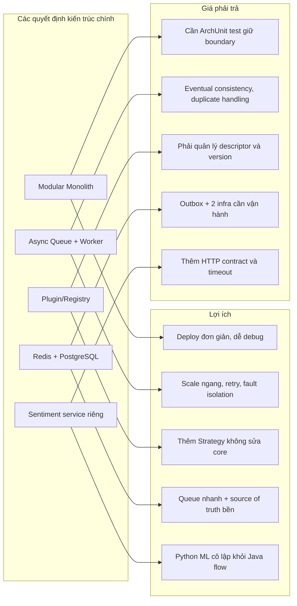

# 12. Trade-off quan trọng nhất của kiến trúc nhóm là gì?

## Trả lời ngắn

Hai trade-off trọng tâm nhất là: **(1) Modular Monolith thay vì Microservices** — giữ deployment đơn giản cho nhóm nhỏ nhưng phải có build test để ranh giới không suy thoái; **(2) Async Queue/Worker thay vì synchronous call** — cho phép scale và retry nhưng tạo ra eventual consistency, duplicate và tracing phức tạp. Mỗi quyết định có driver rõ ràng và hệ quả được ghi nhận trong ADR.

## Minh họa — Ma trận trade-off

## Bảng trade-off đầy đủ

| Quyết định | Driver | Lợi ích | Giá phải trả |
| --- | --- | --- | --- |
| Modular Monolith | Nhóm nhỏ, ít ops | Deploy đơn giản, debug dễ | Boundary cần enforce bằng test |
| Plugin/Registry | Modifiability | Thêm Strategy 2 dòng | Contract/versioning overhead |
| Async Queue/Worker | Scalability, Performance | Scale, retry, stop | Eventual consistency, duplicate |
| Redis + PostgreSQL | Reliability | Queue nhanh, state bền | Outbox, 2 infra |
| Sentiment riêng | Failure isolation | ML cô lập, scale riêng | HTTP contract, cold start |
| Leaderboard projection | Performance | Đọc Top-K nhanh | Rebuild/synchronize projection |
| Không full CQRS/Event Sourcing | Đơn giản cho MVP | Ít complexity | Không có generic replay |

## Câu trả lời cho "Tại sao không dùng Microservices ngay?"

Tách service khi có driver rõ ràng: scale độc lập, fault isolation khác runtime, independent deployment cadence. Nhóm chỉ tách Worker (tải CPU dài) và Sentiment (Python/ML runtime khác). Tách thêm khi chưa có driver là thêm network failure và ops complexity mà không mua được gì.

## Bằng chứng trong project

- [ADR-0001 — Modular Monolith](../../adr/0001-modular-monolith.md)
- [ADR-0006 — Queue và Worker](../../adr/0006-queue-worker-backtesting.md)
- [ADR-0008 — Sentiment boundary](../../adr/0008-sentiment-service-boundary.md)
- [Architecture Overview — Deliberate Trade-offs](../../architecture/architecture-overview.md)

## Nguồn đề bài

Slide 68–69 (Trade-off Matrix), slide 47 và phụ lục I trong [slide kiến trúc](../../KienTrucDoAn_slide.pdf).
