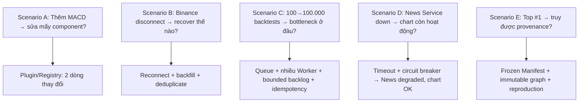

# 13. ATAM scenario nào nguy hiểm nhất và nhóm giải quyết ra sao?

## Trả lời ngắn

Slide đề xuất 5 ATAM scenario để "đập" kiến trúc. Nguy hiểm nhất với nhóm là **Scenario C** (100.000 backtests — bottleneck ở đâu?) vì nó test cả Scalability lẫn Reliability cùng lúc. Kiến trúc giải quyết bằng Job Queue + Consumer Group + idempotency. **Scenario D** (News down → chart có sống?) là test Failure Isolation quan trọng thứ hai, và giải pháp là timeout/circuit breaker biệt lập Sentiment.

## 5 Scenario ATAM

## Phân tích từng scenario

| Scenario | Kiến trúc test cái gì? | Câu trả lời của nhóm |
| --- | --- | --- |
| A — Thêm MACD | Modifiability | `+ MACDStrategy, register()` — 2 dòng, không sửa Backtester/Evaluator/UI |
| B — Binance disconnect | Reliability | RealtimeRecoveryCoordinator: reconnect → backfill gap → deduplicate |
| C — 100.000 backtests | Scalability + Performance | Async Queue, Consumer Group, bounded batch, idempotency |
| D — News Service down | Failure Isolation | SentimentClient: timeout → retry giới hạn → circuit open → News degraded |
| E — Top #1 provenance | Reproducibility | Frozen Manifest → Dataset checksum → Strategy fingerprint → Reproduction run |

## Điểm yếu kiến trúc cần thành thật

- Scenario C: mục tiêu "3 Worker đạt ít nhất 2× một Worker" vẫn là **Planned** — chưa có benchmark thật.
- Scenario B: Binance gap recovery có test đơn vị nhưng end-to-end với mạng thật chưa đo độ trễ.
- Kiến trúc cô lập failure theo capability, không cô lập hoàn toàn shared API/DB.

## Bằng chứng trong project

- [Architecture Evidence](../../architecture/architecture-evidence.md)
- [Quality Attribute Scenarios](../../architecture/quality-attributes.md)
- [Backtest pipeline test](../../../apps/worker/src/test/java/com/cryptostrategy/platform/worker/integration/BacktestExecutionPipelineIntegrationTest.java)
- [Stale attempt recovery test](../../../apps/worker/src/test/java/com/cryptostrategy/platform/worker/integration/StaleAttemptAndRecoveryIntegrationTest.java)
- [Sentiment resilience test](../../../apps/worker/src/test/java/com/cryptostrategy/platform/worker/news/sentiment/SentimentClientResilienceTest.java)
- [Realtime recovery test](../../../modules/market-data/src/test/java/com/cryptostrategy/platform/marketdata/internal/realtime/RealtimeRecoveryCoordinatorTest.java)

## Nguồn đề bài

Slide 67–68 (ATAM crash-test), slide 71–73 (Architecture Proof) trong [slide kiến trúc](../../KienTrucDoAn_slide.pdf).
