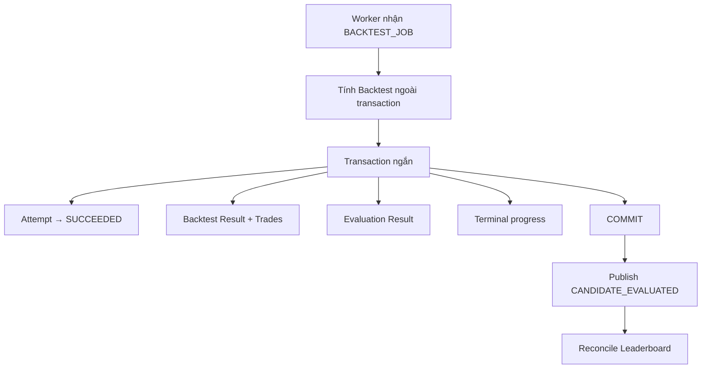

# 14. Một kết quả Backtest “hoàn tất” nghĩa là gì về mặt transaction? Nếu Worker crash giữa chừng thì sao?

## Trả lời ngắn

Worker chia việc hoàn tất Backtest thành hai phần:

1. Tính toán Backtest ở ngoài transaction để không giữ database lock lâu.
2. Trong một transaction ngắn, cập nhật Attempt thành công, lưu Backtest Result/Trades, tạo Evaluation Result và cập nhật progress.

Nếu Worker crash trước khi transaction commit, database rollback và Recovery Sweeper có thể xử lý Attempt bị stale. Nếu crash sau commit, kết quả đã lưu không mất. Tuy nhiên, event `CANDIDATE_EVALUATED` hiện được publish trực tiếp sau commit, chưa qua Outbox; đây là một khoảng trống reliability cần trình bày trung thực.

## Minh họa



## Transaction hiện bảo vệ những gì?

`CompleteBacktestAttemptService` dùng `TransactionTemplate` để thực hiện bốn thay đổi database trong cùng một transaction:

```java
experimentUseCase.finalizeSuccess(jobId, attemptId);
BacktestResult result = commitBacktestUseCase.commit(preparedOutcome);
EvaluationResult evaluation = evaluateBacktestUseCase.evaluate(result, metricVersion, rankingVersion);
experimentUseCase.recordTerminalProgress(jobId, TerminalWorkOutcome.SUCCEEDED,
        evaluation.overallScore());
```

Vì vậy, consumer khác chỉ nên xem một Candidate hoàn tất khi các record bền vững này đã commit. Phần tính toán nặng được làm trước transaction để giảm thời gian giữ connection và lock.

Bằng chứng: [`BacktestJobHandler.java`](../../../apps/worker/src/main/java/com/cryptostrategy/platform/worker/consumer/BacktestJobHandler.java) và [`CompleteBacktestAttemptService.java`](../../../modules/experiment-execution/src/main/java/com/cryptostrategy/platform/execution/internal/CompleteBacktestAttemptService.java).

## Worker crash ở từng thời điểm thì sao?

| Thời điểm crash | Kết quả |
| --- | --- |
| Trong lúc tính toán | Chưa có Result; Attempt đang chạy sẽ trở thành stale và được recovery |
| Trong transaction, trước commit | Các thay đổi database rollback |
| Sau commit, trước ACK Job | Job có thể được giao lại; idempotency và database constraint phải ngăn effect trùng |
| Sau commit, trước khi publish event | Result vẫn còn, nhưng downstream có thể chưa nhận `CANDIDATE_EVALUATED` |

Recovery Sweeper tìm Attempt stale, Job chưa queue hoặc retry đã đến hạn. Processed-message guard giúp nhận biết message đã xử lý.

Bằng chứng: [`RecoverySweeperEngine.java`](../../../apps/worker/src/main/java/com/cryptostrategy/platform/worker/engine/RecoverySweeperEngine.java), [`DualLayerIdempotencyGuard.java`](../../../apps/worker/src/main/java/com/cryptostrategy/platform/worker/consumer/DualLayerIdempotencyGuard.java) và [`StaleAttemptAndRecoveryIntegrationTest.java`](../../../apps/worker/src/test/java/com/cryptostrategy/platform/worker/integration/StaleAttemptAndRecoveryIntegrationTest.java).

## Outbox đang được dùng ở đâu?

Transactional Outbox đã được dùng cho các thay đổi như tạo/requeue/cancel Job: dữ liệu nghiệp vụ và Outbox record được ghi cùng database transaction; `OutboxPublisherEngine` gửi record chưa publish sang Redis sau đó.

Nhưng trong luồng hoàn tất Backtest hiện tại, `CandidateEvaluatedPublisher` được gọi trực tiếp sau database transaction. Do đó không nên nói rằng Result và event hoàn tất đã atomic tuyệt đối. Cách hardening phù hợp là ghi `CANDIDATE_EVALUATED` vào Outbox trong cùng transaction hoặc có reconciliation định kỳ để phát hiện Evaluation chưa được đưa lên Leaderboard.

Bằng chứng: [`JdbcJobStore.java`](../../../modules/persistence/src/main/java/com/cryptostrategy/platform/persistence/internal/experiment/JdbcJobStore.java), [`OutboxPublisherEngine.java`](../../../apps/worker/src/main/java/com/cryptostrategy/platform/worker/engine/OutboxPublisherEngine.java) và [`CandidateEvaluatedPublisher.java`](../../../apps/worker/src/main/java/com/cryptostrategy/platform/worker/infra/redis/CandidateEvaluatedPublisher.java).

## Trạng thái hiện tại

- **Đã có:** transaction ngắn cho Result/Evaluation/progress, recovery Attempt stale, message dedup và Outbox cho Job lifecycle.
- **Còn rủi ro:** publish `CANDIDATE_EVALUATED` sau commit chưa được bảo vệ bởi Outbox.
- **Trade-off:** transaction ngắn giảm lock contention, nhưng boundary DB–Redis cần Outbox hoặc reconciliation để không mất notification.

## Cách nói khi trình bày

> Backtest được tính ngoài transaction. Khi có kết quả, Worker mở một transaction ngắn để chốt Attempt, Result, Evaluation và progress. Crash trước commit thì rollback và recovery; crash sau commit thì dữ liệu vẫn còn. Riêng event Candidate Evaluated đang publish sau commit nên nhóm xác định đây là điểm cần hardening bằng Outbox hoặc reconciliation.

## Nguồn đề bài

Slide 17 về transaction boundary và slide 32–33 về ATM analogy trong [slide kiến trúc](../../KienTrucDoAn_slide.pdf), cùng nội dung Transactional Processing của môn học.
