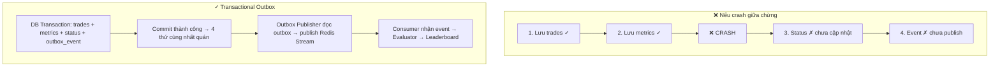

# 14. Một kết quả Backtest "hoàn tất" nghĩa là gì về mặt transaction? Nếu Worker crash giữa chừng thì sao?

## Trả lời ngắn

"Hoàn tất" theo nghĩa kiến trúc nghĩa là bốn thứ phải thành một đơn vị nguyên vẹn: Trades ✓, Metrics ✓, Status = COMPLETED ✓ và Event published ✓. Nếu crash sau bước 2 (Trades + Metrics đã lưu nhưng Status và Event chưa), Leaderboard đọc dữ liệu không nhất quán. Giải pháp: dùng **Transactional Outbox** — DB commit và Outbox ghi cùng một transaction; Outbox Publisher gửi lại sau. Worker reclaim bằng Stale Attempt sweeper.

## Minh họa — vấn đề và giải pháp

## Câu hỏi kiến trúc quan trọng

1. **Atomicity cần tới đâu?** → Trades + Metrics + Status + Outbox phải cùng transaction. Event publish ra Queue là at-least-once separate step.
2. **Retry có tạo duplicate?** → Có. Consumer phải idempotent: kiểm tra messageId trước khi xử lý.
3. **Event publish và DB commit phối hợp thế nào?** → Outbox pattern: ghi record vào DB cùng transaction, publisher đọc và forward sau. Không bao giờ publish trực tiếp trước commit.
4. **Worker crash thì sao?** → Stale Attempt sweeper phát hiện Attempt quá cũ, reclaim → tạo Attempt mới → retry bounded.

## Trạng thái và trade-off

**Implemented:** Outbox Publisher, DualLayerIdempotencyGuard, StaleAttempt sweeper và tests. Outbox thêm một bước async nhưng tránh được "phantom event" — event phát ra mà DB chưa commit.

## Bằng chứng trong project

- [ADR-0006 — Queue/Worker/Outbox](../../adr/0006-queue-worker-backtesting.md)
- [Outbox publisher](../../../apps/worker/src/main/java/com/cryptostrategy/platform/worker/engine/OutboxPublisherEngine.java)
- [DualLayerIdempotencyGuard](../../../apps/worker/src/main/java/com/cryptostrategy/platform/worker/consumer/DualLayerIdempotencyGuard.java)
- [Outbox/Redis integration test](../../../apps/worker/src/test/java/com/cryptostrategy/platform/worker/integration/OutboxRedisPublishingIntegrationTest.java)
- [Stale attempt recovery test](../../../apps/worker/src/test/java/com/cryptostrategy/platform/worker/integration/StaleAttemptAndRecoveryIntegrationTest.java)

## Nguồn đề bài

Slide 17 (transaction boundary), slide 32–33 (ATM analogy) trong [slide kiến trúc](../../KienTrucDoAn_slide.pdf); Syllabus: Transactional Processing.
