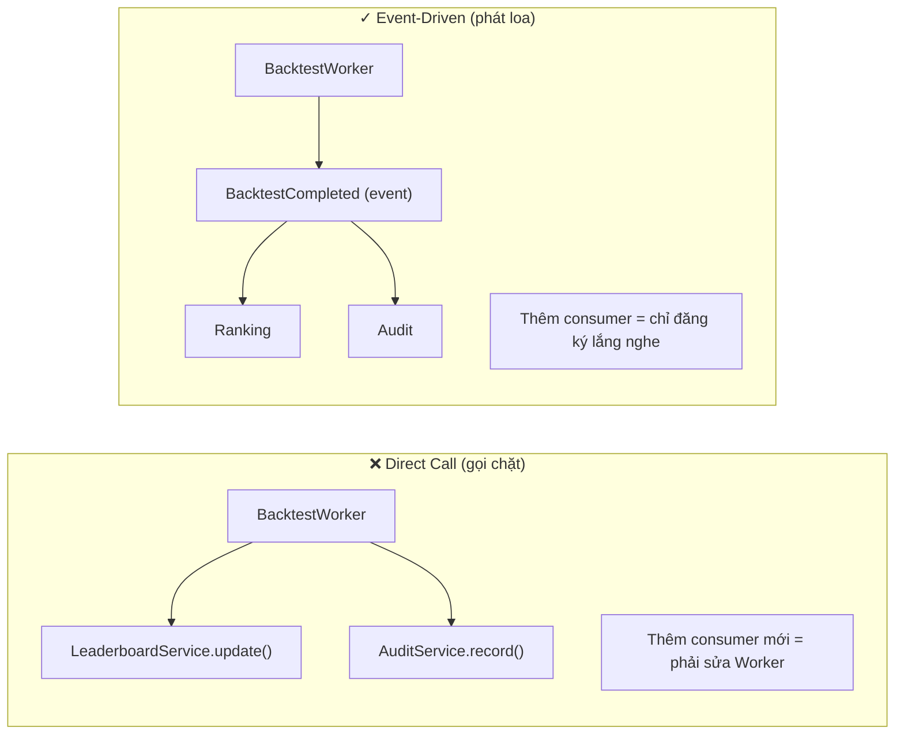

# 15. Nhóm chọn Event-Driven cho phần nào? Tại sao không dùng Direct Call?

## Trả lời ngắn

Nhóm dùng Event-Driven tại hai ranh giới chính: **(1) Worker → Evaluator/Ranking** sau khi Backtest hoàn tất (publish `BacktestCompleted`), và **(2) Outbox → Redis Stream** để đảm bảo at-least-once delivery. Direct Call bị loại ở đây vì nó buộc Worker phải biết tên cụ thể của Leaderboard/Audit service, tạo tight coupling — thêm consumer mới phải sửa code Worker.

## Minh họa — Direct Call vs Event-Driven

## Tại sao không Event-Driven toàn bộ?

Nhóm dùng synchronous call cho các luồng đơn giản (ví dụ: API nhận request → gọi application service → trả response). Event-Driven chỉ được dùng khi có driver rõ ràng:

| Driver | Giải pháp |
| --- | --- |
| Tác vụ dài không block API | Async Queue + event |
| Scale độc lập consumer | Event broker |
| Retry khi consumer fail | At-least-once + idempotency |
| Thêm consumer không sửa producer | Publish/Subscribe |

**Không dùng event khi**: read đơn giản cần kết quả ngay (query user profile, lấy danh sách strategy), hay khi synchronous đã đủ nhanh và đủ đơn giản.

## Event Catalog của hệ thống

9 sự kiện chính: `MarketPriceUpdated`, `CandleClosed`, `StrategyGenerated`, `BacktestStarted`, `BacktestCompleted`, `StrategyEvaluated`, `LeaderboardUpdated`, `NewsCollected`, `SentimentAnalyzed`. Mỗi event có: owner, schema/version, key/order, cách xử lý duplicate, hành vi khi consumer fail và cần replay không.

## Trạng thái và trade-off

Event-Driven mua được loose coupling và scale, đổi lại phải xử lý tracing, ordering và duplicate. Đặt tên event dễ; định nghĩa semantics đầy đủ mới khó.

## Bằng chứng trong project

- [ADR-0006 — Queue/Worker/Event](../../adr/0006-queue-worker-backtesting.md)
- [ADR-0004 — WebSocket realtime](../../adr/0004-websocket-realtime.md)
- [Outbox publisher](../../../apps/worker/src/main/java/com/cryptostrategy/platform/worker/engine/OutboxPublisherEngine.java)
- [WebSocket event contract](../../api/websocket-events.md)

## Nguồn đề bài

Slide 39–42 (Event-Driven, Event Catalog) trong [slide kiến trúc](../../KienTrucDoAn_slide.pdf); Syllabus: Event-Driven Architecture.
