# 15. Nhóm chọn Event-Driven cho phần nào? Tại sao không dùng Direct Call?

## Trả lời ngắn

Nhóm dùng Event-Driven ở những ranh giới cần chạy nền, retry hoặc tách tốc độ xử lý:

- API/Coordinator tạo `SEARCH_REQUEST` hoặc `BACKTEST_JOB` qua Outbox và Redis Stream;
- Worker publish `CANDIDATE_EVALUATED` để kích hoạt cập nhật Leaderboard;
- Worker publish `PROGRESS_EVENT` và `LIFECYCLE_NOTIFICATION` để API/Web cập nhật realtime;
- message lỗi vĩnh viễn đi `DEAD_LETTER`.

Các query cần kết quả ngay như lấy Strategy catalog hoặc đọc Leaderboard vẫn dùng direct call/REST. Nhóm không dùng event cho mọi lời gọi.

## Minh họa

```mermaid
flowchart LR
    API["API / Search Coordinator"] --> OUTBOX["PostgreSQL Outbox"]
    OUTBOX --> JOB["Redis: BACKTEST_JOB"]
    JOB --> WORKER["Backtest Worker"]
    WORKER --> EVAL["CANDIDATE_EVALUATED"]
    EVAL --> LB["Leaderboard projection"]
    LB --> PROGRESS["PROGRESS_EVENT"]
    PROGRESS --> WEB["API WebSocket → UI"]
```



## Vì sao không gọi trực tiếp toàn bộ pipeline?

Nếu HTTP request gọi thẳng Search → Backtest → Evaluation → Ranking, request phải chờ toàn bộ tác vụ dài và lỗi ở một bước có thể làm cả chuỗi thất bại. Queue tách thời điểm producer tạo việc khỏi thời điểm Worker xử lý việc.

Event cũng giúp producer không cần biết toàn bộ consumer. Ví dụ Worker publish `CANDIDATE_EVALUATED`; handler phía sau chịu trách nhiệm reconcile Leaderboard và phát progress.

Bằng chứng: [`BacktestJobHandler.java`](../../../apps/worker/src/main/java/com/cryptostrategy/platform/worker/consumer/BacktestJobHandler.java) và [`CandidateEvaluatedHandler.java`](../../../apps/worker/src/main/java/com/cryptostrategy/platform/worker/consumer/CandidateEvaluatedHandler.java).

## Event contract thực tế

Các message type đang được code định nghĩa là:

```java
BACKTEST_JOB
CANDIDATE_EVALUATED
DEAD_LETTER
PROGRESS_EVENT
LIFECYCLE_NOTIFICATION
SEARCH_REQUEST
```

Mỗi message được bọc trong `MessageEnvelope` có `messageId`, version, thời điểm và `correlationId`. Đây là dữ liệu cần cho versioning, tracing và idempotency.

Bằng chứng: [`MessageTypes.java`](../../../modules/contracts/src/main/java/com/cryptostrategy/platform/contracts/api/MessageTypes.java), [`MessageEnvelope.java`](../../../modules/contracts/src/main/java/com/cryptostrategy/platform/contracts/api/MessageEnvelope.java) và [`CandidateEvaluatedPublisher.java`](../../../apps/worker/src/main/java/com/cryptostrategy/platform/worker/infra/redis/CandidateEvaluatedPublisher.java).

## Khi nào vẫn dùng Direct Call?

| Tình huống | Cách phù hợp |
| --- | --- |
| UI lấy danh sách Strategy, trạng thái hoặc Leaderboard | REST/query đồng bộ |
| Các bước trong cùng transaction database | Application service gọi trực tiếp |
| Backtest/Search dài, cần retry và scale Worker | Queue/event bất đồng bộ |
| Cập nhật progress cho nhiều client | Event + WebSocket |

Direct Call dễ đọc, debug và trả lỗi ngay. Event-Driven giúp decouple theo thời gian và scale, nhưng tạo eventual consistency, duplicate, ordering và tracing phức tạp hơn.

## Outbox và giới hạn hiện tại

Outbox bảo vệ các event Job được tạo cùng thay đổi database. Publisher có thể thử gửi lại nếu Redis tạm lỗi. Tuy nhiên, `CANDIDATE_EVALUATED`, progress và lifecycle hiện được publish trực tiếp; các event này chưa có cùng mức bảo đảm Outbox. Vì vậy không nên tuyên bố toàn bộ event flow là exactly-once hoặc atomic.

Bằng chứng: [`OutboxPublisherEngine.java`](../../../apps/worker/src/main/java/com/cryptostrategy/platform/worker/engine/OutboxPublisherEngine.java), [`ProgressEventPublisher.java`](../../../apps/worker/src/main/java/com/cryptostrategy/platform/worker/infra/redis/ProgressEventPublisher.java) và [ADR-0006 — Queue/Worker/Event](../../adr/0006-queue-worker-backtesting.md).

## Trạng thái hiện tại

- **Đã có:** Redis Stream, Consumer Group, versioned envelope, Outbox cho Job lifecycle, Candidate Evaluated, progress/lifecycle và DLQ.
- **Không dùng:** full Event Sourcing hoặc event cho mọi thao tác CRUD/query.
- **Còn hardening:** đưa các event downstream quan trọng qua Outbox hoặc bổ sung reconciliation.

## Cách nói khi trình bày

> Nhóm dùng event khi cần tách tác vụ dài khỏi HTTP và chia việc cho Worker. Các query cần kết quả ngay vẫn gọi đồng bộ. Event giúp scale và retry, nhưng consumer phải xử lý duplicate và eventual consistency; riêng event hoàn tất Backtest vẫn là điểm nhóm cần hardening thêm bằng Outbox.

## Nguồn đề bài

Slide 39–42 về Event-Driven và Event Catalog trong [slide kiến trúc](../../KienTrucDoAn_slide.pdf), cùng nội dung Event-Driven Architecture của môn học.
