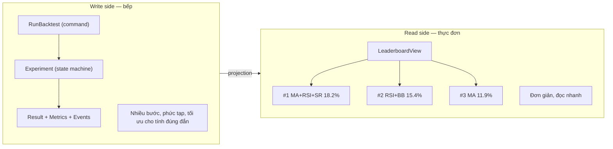

# 16. CQRS có được dùng không? Nếu có ở đâu và tại sao? Nếu không, tại sao?

## Trả lời ngắn

Nhóm **dùng tư duy CQRS có chọn lọc** cho Leaderboard: write side là luồng phức tạp (Backtest → Evaluate → Rank), còn read side là Leaderboard View tối ưu cho hiển thị nhanh Top-K. Tuy nhiên nhóm **không implement full CQRS/Event Sourcing** vì chưa có driver đủ mạnh — CRUD với immutable records và frozen Manifest đã đáp ứng nhu cầu audit và truy vết. CQRS là đánh đổi, không phải huy hiệu để khoe.

## Minh họa — Write side vs Read side

## Khi nào CQRS đáng dùng?

| Driver | Có không? | Quyết định |
| --- | --- | --- |
| Write và read model có shape khác nhau nhiều | Có — Leaderboard Top-K ≠ Experiment lifecycle | Áp dụng tư duy CQRS tại Leaderboard |
| Cần audit/replay đầy đủ lịch sử state | Không — immutable records đủ | Không dùng Event Sourcing |
| Read cần scale độc lập với write | Không đủ driver cho MVP | Không tách read/write service |
| CRUD đơn giản đã đủ | Hầu hết các entity khác | Dùng CRUD thông thường |

## Tại sao không dùng full Event Sourcing?

Event Sourcing lưu lịch sử thay đổi thay vì trạng thái cuối — lợi ích là audit và replay đầy đủ, giá phải trả là schema evolution phức tạp, storage overhead và cần replay mechanism. Nhóm đã có provenance đủ qua immutable Manifest và frozen graph — không cần `ExperimentCreated → CandidateAssigned → BacktestStarted → ...` làm event stream.

## Trạng thái và trade-off

**Implemented:** Leaderboard projection từ Evaluation Result. **Không implement:** event store, replay engine, separate read/write database. Thêm complexity chỉ khi CRUD đơn giản không còn đủ — đây là nguyên tắc kiến trúc quan trọng.

## Bằng chứng trong project

- [ADR-0009 — Reproducible Experiments](../../adr/0009-reproducible-experiments.md)
- [Leaderboard module](../../../modules/leaderboard/)
- [Architecture Overview — không full CQRS](../../architecture/architecture-overview.md)

## Nguồn đề bài

Slide 55–58 (CQRS và Event Sourcing) trong [slide kiến trúc](../../KienTrucDoAn_slide.pdf); Phụ lục I Q3: "Có cần CQRS + Event Sourcing? — Không. Chỉ dùng khi driver đủ mạnh."
