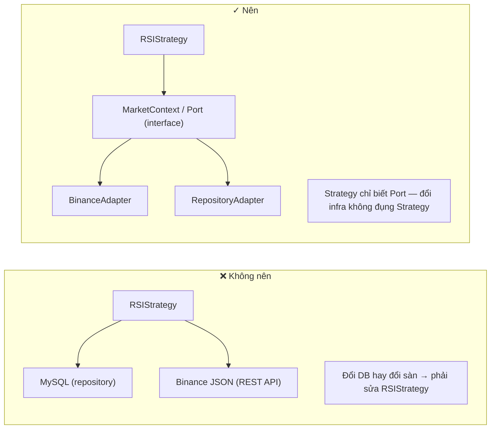

# 17. Strategy có được gọi trực tiếp DB hay Binance không? Tại sao?

## Trả lời ngắn

**Không.** Strategy nhận dữ liệu đã được chuẩn bị qua `StrategyContext`; nó không import repository, không gọi Binance REST API, không biết Spring và không biết database schema. Đây là Dependency Rule của Clean Architecture: business policy không phụ thuộc infrastructure.

## Minh họa — Sai vs Đúng



## Clean Architecture — Dependency Rule

Dependency chỉ đi từ ngoài vào trong: Infrastructure → Adapter → Port/Interface → Domain/Business Policy.

```
[Domain/Application định nghĩa Port]
                ↑ adapter implement
[Adapter: BinanceAdapter, JDBC persistence]
                ↓ gọi infrastructure
[Infrastructure: Binance, PostgreSQL, Redis]
```

**Strategy nằm ở lớp Domain** — chỉ phụ thuộc vào abstraction (port), không bao giờ phụ thuộc vào concretion (adapter/infrastructure).

## Câu hỏi "bẫy" từ giảng viên

> "Strategy có được query DB không?"

**Trả lời chuẩn:** Nên tránh. Nếu Strategy cần data (ví dụ: lịch sử candle để tính RSI), data đó được truyền vào qua `StrategyContext` hoặc `StrategyInput` — Strategy nhận data đã được chuẩn bị sẵn, không tự kéo từ DB. Đây là Dependency Inversion ngược lại với cách thông thường.

## Bằng chứng trong project

- [ADR-0005 — Strategy Plugin/Registry](../../adr/0005-strategy-plugin-registry.md)
- [ADR-0002 — Module Boundaries](../../adr/0002-module-boundaries.md)
- [Strategy contract](../../../modules/strategy-core/src/main/java/com/cryptostrategy/platform/strategy/api/)
- [StrategyContext](../../../modules/strategy-core/src/main/java/com/cryptostrategy/platform/strategy/api/model/StrategyContext.java)
- [Architecture boundary test](../../../architecture-tests/src/test/java/com/cryptostrategy/platform/architecture/ModuleBoundaryTest.java)

## Cách nói khi trình bày

> Strategy nhận Candle rồi quyết định BUY, SELL hoặc HOLD; nó không tự đi lấy Candle. Application/Backtest chuẩn bị dữ liệu, còn adapter chịu trách nhiệm gọi Binance hoặc PostgreSQL. Vì vậy đổi nguồn dữ liệu không làm đổi thuật toán Strategy.

## Nguồn đề bài

Slide 23–24 (Clean Architecture, đảo dependency), slide 12 trong [slide kiến trúc](../../KienTrucDoAn_slide.pdf); Phụ lục I Q4: "Strategy có được query DB? — Nên tránh"; [R2] Clean Architecture.
