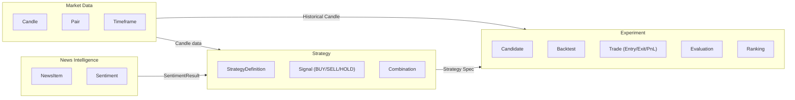

# 18. Bounded Context của nhóm là gì? Signal trong Strategy Context khác gì Trade trong Experiment Context?

## Trả lời ngắn

Nhóm có bốn Bounded Context: **Market Data** (Candle, Pair, Timeframe), **Strategy** (StrategyDefinition, Signal, Combination), **Experiment** (Candidate, Backtest, Evaluation, Ranking) và **News Intelligence** (NewsItem, Sentiment). Ranh giới ngữ nghĩa quan trọng nhất: `Signal` trong Strategy Context là **quyết định phân tích kỹ thuật** (BUY/SELL/HOLD từ RSI hay MA), còn `Trade` trong Experiment Context là **hành động giao dịch đã được mô phỏng** với Entry, Exit, PnL — cùng nói về "mua/bán" nhưng khác nghĩa, dùng chung định nghĩa sẽ tạo ra semantic coupling.

## Minh họa — 4 Bounded Context

## Signal vs Trade — tại sao không dùng chung một khái niệm?

| Thuộc tính | Signal (Strategy Context) | Trade (Experiment Context) |
| --- | --- | --- |
| Nguồn gốc | RSIStrategy.analyze(context) | BacktestEngine.simulate() |
| Nội dung | BUY / SELL / HOLD | Entry price, Exit price, PnL, timestamp |
| Mục đích | Quyết định phân tích kỹ thuật | Hành động giao dịch mô phỏng |
| Thời điểm | Tại mỗi candle | Khi signal được thực thi theo assumptions |
| Phụ thuộc | Chỉ cần market data | Cần Signal + fee + slippage + position sizing |

Nếu dùng chung: Strategy phải biết về fee và slippage → Strategy coupled với Backtest engine → vi phạm Single Responsibility và boundary.

## Tại sao Bounded Context quan trọng?

Giúp xác định ai "sở hữu" một khái niệm và tránh "semantic collision" — cùng từ nhưng khác nghĩa theo context. Boundary giúp module thay đổi độc lập: đổi cách tính fee trong Backtest không làm Strategy API thay đổi.

## Bằng chứng trong project

- [ADR-0002 — Module Boundaries](../../adr/0002-module-boundaries.md)
- [ADR-0005 — Strategy contract](../../adr/0005-strategy-plugin-registry.md)
- [Strategy module API](../../../modules/strategy-core/src/main/java/com/cryptostrategy/platform/strategy/api/)
- [Backtesting module](../../../modules/backtesting/)

## Nguồn đề bài

Slide 21–22 (DDD Bounded Context), slide 11 trong [slide kiến trúc](../../KienTrucDoAn_slide.pdf); [R3] Learning Domain-Driven Design, [R20] Domain-Driven Design.
