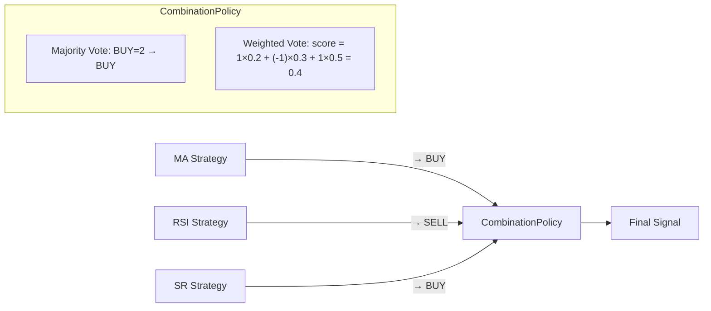

# 19. Composite Strategy hoạt động thế nào? Ai quyết định kết quả cuối khi 3 strategy "cãi nhau"?

## Trả lời ngắn

Composite Strategy tổng hợp tín hiệu từ nhiều strategy con qua một `CombinationPolicy`. Nhóm implement hai policy: **Majority Vote** (BUY=2/3 → BUY) và **Weighted Vote** (mỗi strategy có trọng số, tổng điểm ≥ threshold → BUY). Điểm kiến trúc quan trọng: Strategy signals và CombinationPolicy là **hai trách nhiệm riêng biệt** — không strategy nào tự quyết định kết quả tổng hợp, và CombinationPolicy không biết MA hay RSI là gì.

## Minh họa

## Hai Policy so sánh

| Policy | Cách tính | Dùng khi nào |
| --- | --- | --- |
| Majority Vote | Đếm vote BUY/SELL/HOLD, lấy đa số | Strategy ngang nhau về độ tin cậy |
| Weighted Vote | Mỗi strategy có weight, tính tổng điểm so threshold | Strategy có độ tin cậy khác nhau |

**Ví dụ Weighted Vote:**
- MA weight=0.2, RSI weight=0.3, SR weight=0.5
- Score = (1)×0.2 + (-1)×0.3 + (1)×0.5 = **0.4**
- Nếu threshold = 0.3 → BUY

## Tại sao tách Signal và CombinationPolicy?

Nếu để mỗi Strategy tự tổng hợp kết quả của các strategy khác, Strategy phải biết danh sách strategy khác và logic tổng hợp → Single Responsibility bị vi phạm. Tách CombinationPolicy cho phép:
- Thêm policy mới (ví dụ: Veto Vote) mà không sửa Strategy
- Test policy độc lập với strategy implementation
- Strategy chỉ trả `Signal`, không biết mình đang bị combine với ai

## Bằng chứng trong project

- [ADR-0005 — Strategy Plugin/Registry](../../adr/0005-strategy-plugin-registry.md)
- [Composite Strategy module](../../../modules/strategy-core/src/main/java/com/cryptostrategy/platform/strategy/)
- [Strategy contract](../../../modules/strategy-core/src/main/java/com/cryptostrategy/platform/strategy/api/)

## Nguồn đề bài

Slide 14 (Composite Strategy), slide 26–27 (CombinationPolicy) trong [slide kiến trúc](../../KienTrucDoAn_slide.pdf); mục 13–14 trong [đề đồ án](../../Crypto%20Strategy%20Lab%20%E2%80%93%20%C4%90%E1%BB%93%20%C3%A1n%20cu%E1%BB%91i%20k%E1%BB%B3.pdf).
