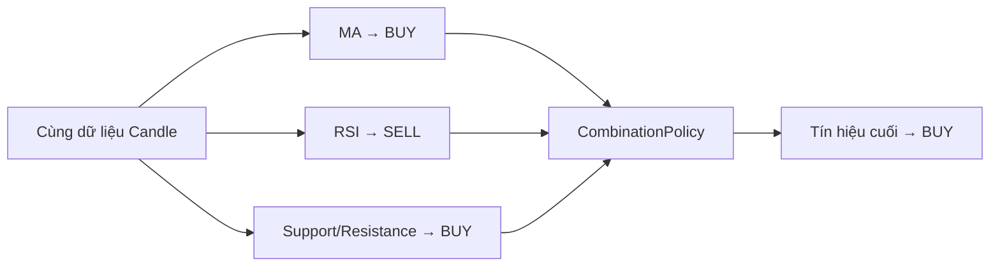

# 19. Composite Strategy hoạt động thế nào? Ai quyết định kết quả cuối khi các Strategy “cãi nhau”?

## Trả lời ngắn

Composite Strategy chạy từng Strategy con trên cùng dữ liệu để lấy các tín hiệu `BUY`, `SELL` hoặc `HOLD`. Sau đó, một `CombinationPolicy` độc lập tổng hợp chúng thành tín hiệu cuối cùng.

Project hỗ trợ hai cách kết hợp:

1. **Majority Vote:** tín hiệu có nhiều phiếu nhất thắng; nếu hòa thì trả `HOLD`.
2. **Weighted Vote:** cộng trọng số của các Strategy theo từng loại tín hiệu; tín hiệu có tổng trọng số lớn nhất thắng; nếu hòa thì trả `HOLD`.

Strategy con chỉ tạo tín hiệu. `CombinationPolicy` mới là thành phần giải quyết xung đột.

## Minh họa



## Contract chung

Mọi policy đều triển khai cùng một contract:

```java
public interface CombinationPolicy {
    CombinationPolicyReference reference();
    StrategySignal combine(
        List<StrategyDecision> decisions,
        StrategyParameterSet parameters
    );
}
```

`CompositeStrategy` không chứa các câu `if` để nhận biết MA, RSI hay Bollinger. Nó chỉ gọi từng component, thu các `StrategyDecision` rồi chuyển danh sách đó cho policy.

Bằng chứng: [`CombinationPolicy.java`](../../../modules/combination/src/main/java/com/cryptostrategy/platform/combination/api/CombinationPolicy.java) và [`CompositeStrategy.java`](../../../modules/combination/src/main/java/com/cryptostrategy/platform/combination/internal/CompositeStrategy.java).

## Majority Vote hoạt động thế nào?

Majority Vote đếm số lượng từng tín hiệu:

```text
MA                 → BUY
RSI                → SELL
Support/Resistance → BUY

BUY = 2, SELL = 1, HOLD = 0
Kết quả cuối = BUY
```

Nếu hai tín hiệu đứng đầu có số phiếu bằng nhau, policy trả `HOLD` để không tự ý giao dịch khi chưa có sự đồng thuận.

Bằng chứng: [`MajorityVotePolicy.java`](../../../modules/combination/src/main/java/com/cryptostrategy/platform/combination/internal/MajorityVotePolicy.java) và [`MajorityVotePolicyTest.java`](../../../modules/combination/src/test/java/com/cryptostrategy/platform/combination/internal/MajorityVotePolicyTest.java).

## Weighted Vote hoạt động thế nào?

Weighted Vote dùng khi các Strategy có mức độ tin cậy khác nhau. Mỗi component được gán một trọng số dương:

```text
MA                 → BUY  × 0.2
RSI                → SELL × 0.3
Support/Resistance → BUY  × 0.5

Tổng BUY  = 0.2 + 0.5 = 0.7
Tổng SELL = 0.3
Kết quả cuối = BUY
```

Implementation hiện tại chọn tín hiệu có **tổng trọng số lớn nhất**, không sử dụng một threshold riêng. Nếu hai tổng cao nhất bằng nhau thì kết quả là `HOLD`.

Bằng chứng: [`WeightedVotePolicy.java`](../../../modules/combination/src/main/java/com/cryptostrategy/platform/combination/internal/WeightedVotePolicy.java), [`CombinationPolicies.java`](../../../modules/combination/src/main/java/com/cryptostrategy/platform/combination/api/CombinationPolicies.java) và phần validate trọng số trong [`UserStrategyService.java`](../../../modules/strategy-core/src/main/java/com/cryptostrategy/platform/strategy/internal/application/UserStrategyService.java).

## Vì sao phải tách Strategy và CombinationPolicy?

Nếu Strategy con tự xử lý tín hiệu của các Strategy khác, MA phải biết RSI hoặc Bollinger là gì. Khi thêm một cách kết hợp mới, nhóm sẽ phải sửa thuật toán đang hoạt động.

Việc tách policy mang lại ba lợi ích:

- Strategy con chỉ chịu trách nhiệm tạo tín hiệu.
- Có thể thêm policy mới mà không sửa các Strategy con.
- Policy có thể được test độc lập và lưu version để tái lập Backtest.

Policy, version, trọng số và thứ tự component đều thuộc cấu hình Composite. Vì vậy cùng cấu hình và cùng dữ liệu sẽ tái lập được cùng quyết định.

Bằng chứng: [`CompositeStrategyDraftSource.java`](../../../modules/strategy-core/src/main/java/com/cryptostrategy/platform/strategy/api/model/user/CompositeStrategyDraftSource.java), [`CompositeStrategyFactory.java`](../../../modules/combination/src/main/java/com/cryptostrategy/platform/combination/api/CompositeStrategyFactory.java) và [ADR-0005 — Strategy Plugin Registry](../../adr/0005-strategy-plugin-registry.md).

## Trạng thái hiện tại

- **Đã có:** Composite Strategy, Majority Vote, Weighted Vote, quy tắc hòa trả `HOLD`, lưu policy parameters và validation trọng số.
- **Có thể mở rộng:** thêm policy khác như Veto hoặc Unanimous bằng cách implement `CombinationPolicy`.
- **Trade-off:** Weighted Vote linh hoạt hơn nhưng nhóm phải giải thích trọng số lấy từ đâu và tránh tối ưu quá mức trên dữ liệu lịch sử.

## Nguồn đề bài

Mục 13–14 trong [đề đồ án](../../Crypto%20Strategy%20Lab%20%E2%80%93%20%C4%90%E1%BB%93%20%C3%A1n%20cu%E1%BB%91i%20k%E1%BB%B3.pdf), slide 14 và slide 26–27 trong [slide kiến trúc](../../KienTrucDoAn_slide.pdf).
