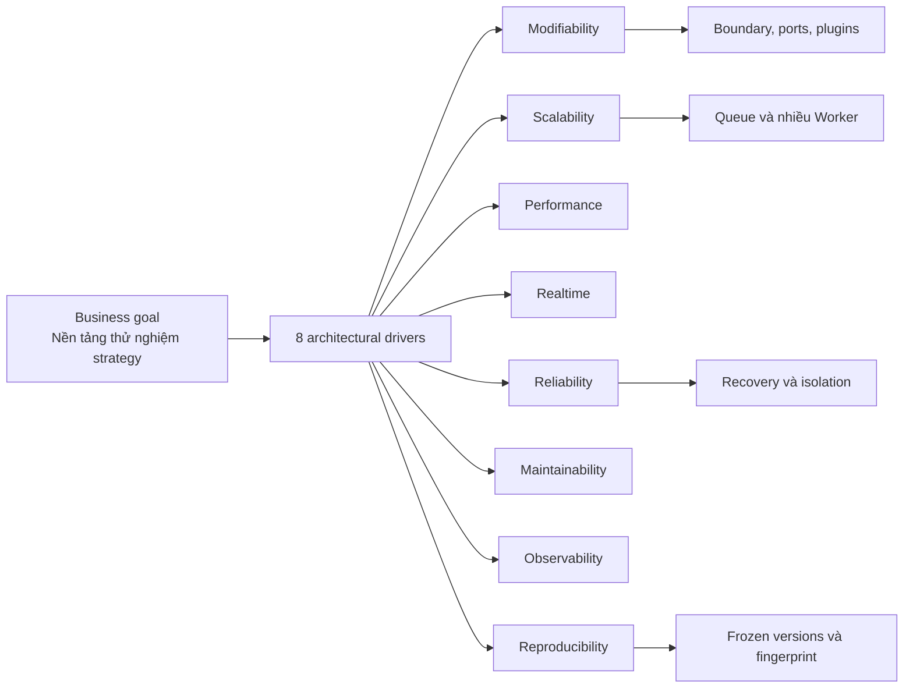

# 1. Architectural drivers là gì?

## Trả lời ngắn

Architectural drivers là những yêu cầu quan trọng **buộc kiến trúc phải có hình dạng nhất định**. Crypto Strategy Lab có tám driver chính: dễ thêm Strategy, mở rộng số Backtest, hiệu năng, realtime, độ tin cậy, dễ bảo trì/thay thuật toán, quan sát được và tái tạo được kết quả. Vì vậy nhóm chọn module boundary, Plugin/Registry, provider adapter, queue/Worker, idempotency và frozen provenance — không chọn công nghệ chỉ vì phổ biến.

## Minh họa

## Hiểu đơn giản

Driver giống các tiêu chí bắt buộc khi thiết kế một ngôi nhà. Nếu cần thêm phòng dễ dàng, chịu tải lớn và vẫn an toàn khi một khu vực gặp sự cố, bản thiết kế phải chuẩn bị cho các điều đó từ đầu.

| Driver | Câu hỏi kiểm chứng | Quyết định chính |
| --- | --- | --- |
| Modifiability | Thêm MACD sửa mấy nơi? | Strategy Plugin và Registry |
| Scalability/Performance | 100 → 100.000 Backtest thế nào? | Job bất đồng bộ, bounded queue, nhiều Worker |
| Realtime | Candle đến chart trễ bao lâu? | WebSocket, multiplexing, coalescing |
| Reliability | Binance mất kết nối có mất nến? | Reconnect, backfill, deduplicate |
| Maintainability | Đổi generator có viết lại Backtester? | `StrategyGenerator` contract |
| Observability | Job nào đang chạy/lỗi? | ID tương quan, progress event, durable state |
| Reproducibility | Top #1 được tạo từ dữ liệu nào? | Immutable manifest, versions, checksums/fingerprints |

## Trạng thái và trade-off

Các cấu trúc chính đã có implementation và test. Những mục tiêu định lượng như p95 realtime hoặc throughput 1→3 Worker vẫn là **Planned verification**, chưa phải kết quả đo. Kiến trúc này thêm contract và metadata, đổi lại giảm ảnh hưởng khi thay đổi và tăng khả năng truy vết.

## Bằng chứng trong project

- [Architecture Overview](../../architecture/architecture-overview.md)
- [Quality Attribute Scenarios QA-01–QA-10](../../architecture/quality-attributes.md)
- [Architecture Evidence](../../architecture/architecture-evidence.md)
- [ADR-0001 — Modular Monolith](../../adr/0001-modular-monolith.md)

## Nguồn đề bài

- Slide 4–5 và checklist slide 39 trong [slide kiến trúc](../../KienTrucDoAn_slide.pdf).
- Mục 2, 11–24, 32 và 35–36 trong [đề đồ án](../../Crypto%20Strategy%20Lab%20%E2%80%93%20%C4%90%E1%BB%93%20%C3%A1n%20cu%E1%BB%91i%20k%E1%BB%B3.pdf).

