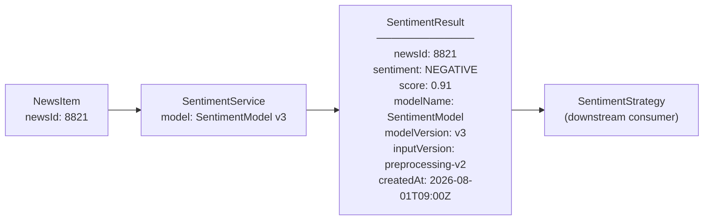

# 20. Kết quả Sentiment của một bản tin được truy vết về model nào, version nào?

## Trả lời ngắn

Mỗi `SentimentResult` lưu đủ metadata để trả lời "prediction này do model nào, data version nào tạo ra": `newsId`, `sentiment` (POSITIVE/NEGATIVE/NEUTRAL), `score`, `modelName`, `modelVersion`, `inputVersion`, `createdAt`. Khi phát hiện sự cố (ví dụ: model v2 trả sai), nhóm có thể xác định đúng lô kết quả bị ảnh hưởng và chạy lại chỉ những bản tin đó với model mới — không phải xóa toàn bộ.

## Minh họa

## Bảng metadata cần monitor (MLOps)

| Metric | Mô tả | Cảnh báo khi |
| --- | --- | --- |
| model/version đang deploy | Phiên bản model nào đang chạy | Deploy mới mà không ghi log |
| inference failures | Số lần model trả lỗi | Vượt ngưỡng % |
| latency | Thời gian inference | P95 > threshold |
| input/data issues | Bản tin không đúng format | Tỷ lệ parse error tăng |
| quality drift | Phân phối sentiment thay đổi bất thường | Đột biến NEGATIVE |

## Tại sao phải version model?

Giảng viên có thể hỏi: "Nếu model mới cho kết quả tệ hơn thì làm sao phát hiện?" — Nhờ `modelVersion` trong mỗi record, nhóm có thể so sánh kết quả model v2 vs v3 trên cùng tập bản tin, phát hiện regression và rollback về v2 mà không mất data.

## Trạng thái

**Implemented:** SentimentResult schema với model metadata và versioning. **Planned:** automated drift detection và alerting pipeline.

## Bằng chứng trong project

- [ADR-0008 — Sentiment Service boundary](../../adr/0008-sentiment-service-boundary.md)
- [Sentiment module](../../../apps/sentiment/app/)
- [News Intelligence module](../../../modules/news-intelligence/)

## Nguồn đề bài

Slide 60–62 (MLOps, prediction tracing), slide 29–30 trong [slide kiến trúc](../../KienTrucDoAn_slide.pdf); Syllabus Topic 11 – MLOps; [R24] ML in Production.
