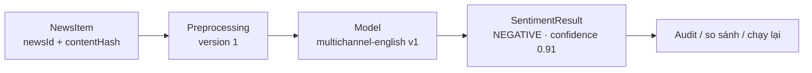

# 20. Kết quả Sentiment của một bản tin được truy vết về model nào, version nào?

## Trả lời ngắn

Mỗi kết quả Sentiment không chỉ lưu nhãn `POSITIVE`, `NEGATIVE` hoặc `NEUTRAL`. Nó còn lưu:

- bản tin và nội dung nào được phân tích: `newsId`, `contentHash`, `language`;
- model nào tạo kết quả: `modelName`, `modelVersion`;
- cách tiền xử lý và HTTP contract nào được dùng: `preprocessingVersion`, `contractVersion`;
- output và thời điểm inference: `label`, `confidence`, `polarityScore`, `analyzedAt`.

Nhờ vậy, nhóm có thể trả lời chính xác: **kết quả này được tạo từ nội dung nào, bằng model nào và pipeline version nào**.

## Minh họa



## Model release được định danh thế nào?

Project gom thông tin version thành `SentimentModelRelease`:

```java
public record SentimentModelRelease(
    String modelVersion,
    String modelName,
    String preprocessingVersion,
    String contractVersion
) {}
```

`modelVersion` cho biết trọng số model nào được dùng. `preprocessingVersion` cũng bắt buộc vì cùng một model nhưng tokenizer hoặc cách chuẩn hóa text khác nhau vẫn có thể tạo output khác.

Bằng chứng: [`SentimentModelRelease.java`](../../../modules/news/src/main/java/com/cryptostrategy/platform/news/api/model/SentimentModelRelease.java) và [`SentimentResult.java`](../../../modules/news/src/main/java/com/cryptostrategy/platform/news/api/model/SentimentResult.java).

## Chuỗi truy vết một prediction

```text
newsId + contentHash
        ↓
modelName + modelVersion
        ↓
preprocessingVersion + contractVersion
        ↓
label + confidence + polarityScore + analyzedAt
```

Java Worker gửi toàn bộ release identity sang Python Service. Python chỉ chấp nhận request nếu release được yêu cầu khớp với manifest đang chạy; response sau đó được Java đối chiếu lại trước khi lưu.

Bằng chứng: [`SentimentContractMapper.java`](../../../apps/worker/src/main/java/com/cryptostrategy/platform/worker/news/sentiment/SentimentContractMapper.java), [Sentiment endpoint](../../../apps/sentiment/app/api/routes/sentiment.py) và [`SentimentResponseValidator.java`](../../../modules/news/src/main/java/com/cryptostrategy/platform/news/internal/validation/SentimentResponseValidator.java).

## Làm sao biết đúng model artifact?

Python Service tải một release bundle gồm model, vocabulary và `manifest.json`. Manifest chứa tên/version cùng checksum của artifact. Khi khởi động, service tính lại SHA-256; nếu checksum không khớp thì không đưa model vào trạng thái ready.

Bằng chứng: [`manifest.py`](../../../apps/sentiment/app/model/manifest.py), [`runtime.py`](../../../apps/sentiment/app/model/runtime.py) và [active release manifest](../../../apps/sentiment/artifacts/active_release/manifest.json).

## Database bảo vệ provenance thế nào?

Model release được đăng ký một lần và không được âm thầm đổi metadata của cùng `modelVersion`. Sentiment Result cũng là dữ liệu immutable.

Khóa duy nhất:

```text
newsId + contentHash + modelVersion
```

ngăn cùng một model tạo nhiều kết quả logic cho đúng một phiên bản nội dung. Khi kích hoạt model mới, các bản tin liên quan được chuyển về trạng thái chờ phân tích cho version mới; kết quả cũ không bị ghi đè.

Bằng chứng: [`JdbcSentimentModelReleaseStore.java`](../../../modules/persistence/src/main/java/com/cryptostrategy/platform/persistence/internal/news/JdbcSentimentModelReleaseStore.java), [`JdbcAnalysisWorkStoreAdapter.java`](../../../modules/persistence/src/main/java/com/cryptostrategy/platform/persistence/internal/news/JdbcAnalysisWorkStoreAdapter.java), [database baseline](../../../supabase/migrations/20260827000100_create_database_baseline.sql) và [migration Sentiment workflow](../../../supabase/migrations/20260830000100_add_news_sentiment_workflow.sql).

## Nếu model mới có vấn đề thì làm gì?

Ví dụ model v2 tạo quá nhiều kết quả `NEGATIVE`:

1. Lọc các Sentiment Result có `modelVersion = v2`.
2. So sánh với version trước trên cùng `newsId + contentHash`.
3. Ngừng kích hoạt v2 hoặc đưa một release mới vào sử dụng.
4. Chạy lại các bản tin cần thiết mà không xóa kết quả cũ.

Versioning giúp audit, rollback và reprocessing, nhưng **không tự động phát hiện model kém**. Hệ thống vẫn cần metric chất lượng hoặc tập benchmark để quyết định version mới tốt hơn hay tệ hơn.

## Trạng thái hiện tại

- **Đã có:** model/release versioning, preprocessing và contract version, content hash, immutable result, artifact checksum, correlation và metric đếm outcome phân tích.
- **Chưa có đầy đủ:** pipeline tự động phát hiện data drift/model drift và cảnh báo chất lượng.
- **Trade-off:** phải lưu thêm metadata và quản lý nhiều release, nhưng đây là điều kiện để audit và tái lập prediction.

Metric lifecycle hiện có được ghi tại [`NewsAnalysisObservability.java`](../../../apps/worker/src/main/java/com/cryptostrategy/platform/worker/news/analysis/NewsAnalysisObservability.java). Quyết định kiến trúc nằm tại [ADR-0008 — Sentiment Service Boundary](../../adr/0008-sentiment-service-boundary.md).

## Nguồn đề bài

Slide 60–62 về MLOps và prediction tracing trong [slide kiến trúc](../../KienTrucDoAn_slide.pdf), cùng Syllabus Topic 11 — MLOps.
