# 21. Tại sao Sentiment là service Python riêng? Nếu nó down, cả hệ thống có down không?

## Trả lời ngắn

Sentiment được tách thành Python/FastAPI Service vì nó có runtime, thư viện và tài nguyên khác Java: model dùng TensorFlow/Keras, cần tải artifact khi khởi động và có thể gặp timeout, hết inference capacity hoặc lỗi model.

Nếu Sentiment Service down thì **không làm cả hệ thống down**. News mới chưa được phân tích sẽ ở trạng thái chờ hoặc retry; Market Dashboard, các Strategy kỹ thuật và Backtest vẫn tiếp tục hoạt động vì không nằm trên dependency path của Sentiment Service.

## Minh họa

```mermaid
flowchart LR
    MARKET["Market Data"] --> CHART["Market Dashboard ✓"]
    MARKET --> BACKTEST["Technical Backtest ✓"]

    NEWS["News Collector"] --> STORE[("PostgreSQL")]
    STORE --> WORKER["News Analysis Worker"]
    WORKER --> SENT["Python Sentiment Service ⚠ DOWN"]
    SENT -. "timeout / circuit open" .-> RETRY["Pending / Retry"]

    style SENT fill:#5a2429,stroke:#ff6f78
    style CHART fill:#153c2a,stroke:#53df9a
    style BACKTEST fill:#153c2a,stroke:#53df9a
```



## Tại sao phải tách thành Python Service?

| Driver | Ý nghĩa kiến trúc |
| --- | --- |
| Runtime khác | ML dùng Python, NumPy và TensorFlow; Java API không cần mang dependency ML |
| Tài nguyên khác | Inference có CPU/RAM và thời gian khởi động riêng |
| Failure mode khác | Model có thể load lỗi, timeout, quá tải hoặc OOM |
| Scale khác | Có thể tăng replica Sentiment mà không tăng API hoặc Backtest Worker |
| Chu kỳ release khác | Có thể thay model artifact mà không sửa Strategy Engine |

Python Service chỉ nhận text và trả prediction qua HTTP contract; nó không crawl News, không truy cập PostgreSQL và không điều khiển Backtest.

Bằng chứng: [FastAPI application](../../../apps/sentiment/app/main.py), [TensorFlow inference engine](../../../apps/sentiment/app/model/multichannel_engine.py), [Python dependencies](../../../apps/sentiment/pyproject.toml) và [ADR-0008 — Sentiment Service Boundary](../../adr/0008-sentiment-service-boundary.md).

## Java và Python giao tiếp thế nào?

```text
Java News Worker
      ↓ POST /api/v1/sentiment/analyze
Python Sentiment Service
      ↓ label + confidence + polarity + release metadata
Java validate
      ↓
PostgreSQL
```

Java phụ thuộc vào `SentimentInferencePort` và versioned wire contract, không phụ thuộc class TensorFlow. `HttpSentimentInferenceAdapter` chịu trách nhiệm gọi HTTP và chuyển mã lỗi thành lỗi retryable hoặc permanent.

Bằng chứng: [`SentimentInferencePort.java`](../../../modules/news/src/main/java/com/cryptostrategy/platform/news/api/port/out/SentimentInferencePort.java), [`HttpSentimentInferenceAdapter.java`](../../../apps/worker/src/main/java/com/cryptostrategy/platform/worker/news/sentiment/HttpSentimentInferenceAdapter.java) và [Sentiment v1 contracts](../../../modules/contracts/src/main/resources/contracts/sentiment-v1/).

## Khi Sentiment Service lỗi, hệ thống xử lý thế nào?

Luồng gọi model được bảo vệ bởi:

- connect timeout **2 giây** và response timeout **30 giây**;
- concurrency limit để không gửi quá nhiều inference cùng lúc;
- circuit breaker mở khi tỷ lệ lỗi vượt ngưỡng;
- tối đa **3 attempt**, với khoảng chờ retry **5 giây** và **30 giây**;
- trạng thái phân tích được lưu ở PostgreSQL thay vì giữ trong RAM.

Khi circuit đang mở hoặc concurrency đã đầy, request được defer mà không tiếp tục dồn tải vào Python Service. Lỗi tạm thời chuyển News sang `FAILED_RETRYABLE`; hết số lần thử hoặc lỗi permanent thì chuyển `FAILED`. Bản tin vẫn được giữ lại.

Bằng chứng: [`NewsWorkerProperties.java`](../../../apps/worker/src/main/java/com/cryptostrategy/platform/worker/config/NewsWorkerProperties.java), [`SentimentClientGuard.java`](../../../apps/worker/src/main/java/com/cryptostrategy/platform/worker/news/sentiment/SentimentClientGuard.java), [`NewsAnalysisCoordinator.java`](../../../apps/worker/src/main/java/com/cryptostrategy/platform/worker/news/analysis/NewsAnalysisCoordinator.java) và [`JdbcAnalysisWorkStoreAdapter.java`](../../../modules/persistence/src/main/java/com/cryptostrategy/platform/persistence/internal/news/JdbcAnalysisWorkStoreAdapter.java).

## Vì sao Market và Backtest vẫn chạy?

Sentiment Analysis là một nhánh bất đồng bộ sau bước lưu News. Market Dashboard lấy Candle từ Market Data API; Backtest kỹ thuật chạy từ Dataset và Strategy riêng. Hai luồng này không gọi Python Sentiment Service.

```text
Sentiment down → News chưa có prediction mới
Sentiment down ↛ Market Dashboard down
Sentiment down ↛ Technical Backtest down
```

Sentiment-based Strategy là trường hợp đặc biệt: nếu Strategy đó cần dữ liệu Sentiment chưa sẵn sàng thì chính lần chạy đó phải chờ, từ chối hoặc dùng policy fallback rõ ràng; không được âm thầm giả dữ liệu. Điều này vẫn không làm các Strategy kỹ thuật khác ngừng chạy.

## Health và readiness

Python Service cung cấp:

- `GET /health/live`: process còn hoạt động;
- `GET /health/ready`: model đã load và đúng release để nhận inference.

Worker kiểm tra readiness, nhưng vẫn phải xử lý timeout và lỗi runtime vì service có thể hỏng sau lần health check.

Bằng chứng: [health routes](../../../apps/sentiment/app/api/routes/health.py), [`SentimentReadinessProbe.java`](../../../apps/worker/src/main/java/com/cryptostrategy/platform/worker/news/sentiment/SentimentReadinessProbe.java) và [`SentimentClientResilienceTest.java`](../../../apps/worker/src/test/java/com/cryptostrategy/platform/worker/news/sentiment/SentimentClientResilienceTest.java).

## Trạng thái hiện tại

- **Đã có:** Python/FastAPI boundary, real TensorFlow/Keras inference, versioned HTTP contract, timeout, concurrency limit, circuit breaker, retry có giới hạn, persisted status và readiness check.
- **Ảnh hưởng khi down:** News/Sentiment degraded; Market Dashboard và Technical Backtest không bị kéo xuống theo.
- **Trade-off:** tăng network latency, deployment và contract management; đổi lại có fault isolation và khả năng scale/release model độc lập.

## Nguồn đề bài

Slide 59–60 về ML component và slide 8 về failure isolation trong [slide kiến trúc](../../KienTrucDoAn_slide.pdf), cùng ATAM Scenario D.
