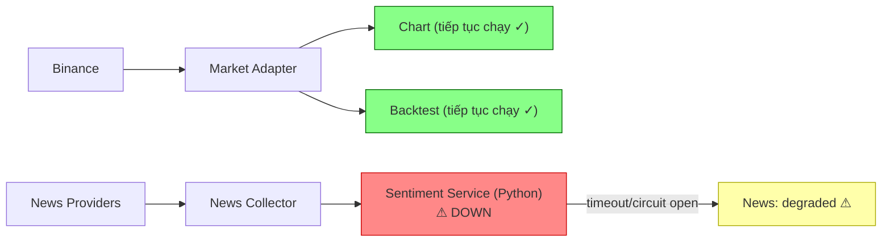

# 21. Tại sao Sentiment là service Python riêng? Nếu nó down, cả hệ thống có down không?

## Trả lời ngắn

Sentiment Service chạy Python/FastAPI riêng vì **ba driver khác Java**: runtime khác (Python + ML libraries), failure mode khác (model load, GPU/CPU, inference latency), và có thể scale độc lập theo workload Sentiment. Khi Sentiment down, **chỉ News/Sentiment pipeline degraded** — Market Chart, Strategy Engine và Backtest hoàn toàn không phụ thuộc Sentiment Service và tiếp tục chạy bình thường.

## Minh họa — Isolation boundary

## Tại sao tách runtime?

| Driver | Giải pháp |
| --- | --- |
| ML/Python runtime khác Java | Python service riêng, không nhúng vào JVM |
| Model load chậm, inference có thể timeout | Timeout contract + circuit breaker rõ ràng |
| Scale theo workload Sentiment riêng | Deploy thêm Sentiment replica độc lập với API |
| Failure của ML không nên block market flow | HTTP boundary với timeout và degraded state |

## Cơ chế isolation

1. **Timeout contract**: Java Worker gọi Sentiment qua HTTP với timeout cố định
2. **Retry giới hạn**: thử lại N lần, không retry vô hạn
3. **Circuit breaker**: sau nhiều failure liên tiếp, mở circuit → News jobs chuyển sang `PENDING_SENTIMENT` hoặc degraded
4. **Không blocking**: Market Data và Backtest pipeline không import hoặc gọi Sentiment package

## Trạng thái và trade-off

**Implemented:** isolation boundary, SentimentClient với timeout, sentiment resilience test. Tách service thêm HTTP contract overhead và deployment complexity, đổi lại Python ML runtime không ảnh hưởng Java Backtest Worker khi crash hoặc OOM.

## Bằng chứng trong project

- [ADR-0008 — Sentiment Service boundary](../../adr/0008-sentiment-service-boundary.md)
- [Sentiment FastAPI app](../../../apps/sentiment/app/main.py)
- [Sentiment resilience test](../../../apps/worker/src/test/java/com/cryptostrategy/platform/worker/news/sentiment/SentimentClientResilienceTest.java)
- [News analysis coordinator test](../../../apps/worker/src/test/java/com/cryptostrategy/platform/worker/news/analysis/NewsAnalysisCoordinatorTest.java)

## Nguồn đề bài

Slide 59–60 (ML là component, không phải trung tâm vũ trụ), slide 8 (failure isolation) trong [slide kiến trúc](../../KienTrucDoAn_slide.pdf); ATAM Scenario D.
