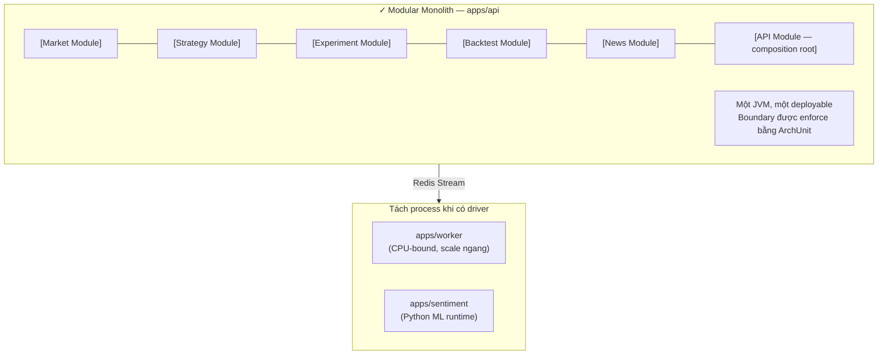

# 22. Modular Monolith vs Microservices: nhóm chọn gì và vì sao?

## Trả lời ngắn

Nhóm chọn **Modular Monolith** cho backend Java cốt lõi: một deployable duy nhất chứa nhiều module (Market, Strategy, Experiment, Backtest, News, API) với boundary được enforce bằng package rule và ArchUnit test. Nhóm **chỉ tách process** khi có driver cụ thể: `apps/worker` (tải CPU dài cần scale ngang độc lập) và `apps/sentiment` (Python/ML runtime khác Java). Không tách thêm vì nhóm 4 người không cần ops overhead của distributed system.

## Minh họa

## Khi nào nên tách service?

Slide đề cập 4 driver để tách process/service:

| Driver | Có trong nhóm? | Quyết định |
| --- | --- | --- |
| Scale độc lập | Có — Worker cần nhiều instance | Tách apps/worker |
| Fault isolation khác runtime | Có — Python ML crash khác Java | Tách apps/sentiment |
| Independent deployment cadence | Không rõ | Chưa tách |
| Runtime/resource profile khác nhau | Có (Worker vs API) | Tách Worker |
| Nhiều team sở hữu service | Nhóm 4 người | Không tách thêm |

## Tại sao không Microservices ngay?

"Distributed monolith" nguy hiểm hơn monolith: tách service mà không tách boundary đúng thì vẫn tight coupling, thêm network failure, thêm deployment phức tạp. Modular Monolith với boundary test tốt có thể tốt hơn distributed monolith không có boundary.

Câu trả lời chuẩn cho giảng viên: *"Microservices không được điểm cao hơn monolith vì tên nghe hiện đại — mỗi style có bối cảnh riêng."*

## Bằng chứng trong project

- [ADR-0001 — Modular Monolith](../../adr/0001-modular-monolith.md)
- [ADR-0002 — Module Boundaries](../../adr/0002-module-boundaries.md)
- [API Application](../../../apps/api/src/main/java/com/cryptostrategy/platform/api/ApiApplication.java)
- [Worker Application](../../../apps/worker/src/main/java/com/cryptostrategy/platform/worker/WorkerApplication.java)
- [ArchUnit boundary tests](../../../modules/)

## Nguồn đề bài

Slide 47 (Modular Monolith là đáp án hợp lệ), phụ lục I Q2 trong [slide kiến trúc](../../KienTrucDoAn_slide.pdf); [R13] Microservices Patterns, [R15] Monolith to Microservices.
