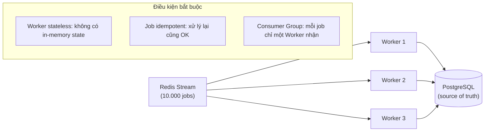

# 23. Để Worker scale stateless, điều kiện bắt buộc là gì?

## Trả lời ngắn

Để thêm Worker instance mà không tạo thêm lỗi, Worker phải **stateless** và Job phải **idempotent**. Stateless nghĩa là Worker không lưu trạng thái trong memory giữa các Job — mọi state ở PostgreSQL và Redis. Idempotent nghĩa là xử lý cùng một Job nhiều lần không tạo ra kết quả nghiệp vụ khác nhau — `DualLayerIdempotencyGuard` kiểm tra messageId trước khi xử lý. Nếu thiếu một trong hai, thêm Worker chỉ nhanh hơn gây ra lỗi.

## Minh họa — Scale Worker



## Hai điều kiện bắt buộc

### 1. Worker Stateless

| Làm đúng | Làm sai |
| --- | --- |
| Lưu Job state vào PostgreSQL | Lưu "đang xử lý job X" trong RAM |
| Lưu progress vào Redis | Dùng static field để track progress |
| Đọc config từ DB/env | Cache config trong memory giữa các request |

Nếu Worker lưu state trong memory, khi crash thì state mất, Worker mới không biết đang làm gì.

### 2. Job Idempotent

At-least-once delivery → cùng message có thể đến nhiều lần. Worker phải bỏ qua duplicate:

```
Nhận message → Kiểm tra messageId đã xử lý chưa?
    → Đã xử lý → Bỏ qua (ACK và tiếp tục)
    → Chưa → Xử lý → Lưu messageId đã xử lý → ACK
```

### 3. Consumer Group (Redis Streams)

Redis Streams Consumer Group đảm bảo mỗi message chỉ đến một Worker trong group — tránh hai Worker cùng chạy một Job.

## Bottleneck khi scale Worker

Thêm Worker tăng throughput nhưng tạo áp lực lên:
- **PostgreSQL**: nhiều connection concurrent, lock contention khi ghi result
- **Network**: nhiều Worker cùng kéo Dataset từ storage
- **Connection pool**: pool size cần tăng theo số Worker

→ Cần benchmark để tìm bottleneck thật, không giả định thêm Worker = tuyến tính nhanh hơn.

## Bằng chứng trong project

- [ADR-0006 — Queue/Worker/Idempotency](../../adr/0006-queue-worker-backtesting.md)
- [DualLayerIdempotencyGuard](../../../apps/worker/src/main/java/com/cryptostrategy/platform/worker/consumer/DualLayerIdempotencyGuard.java)
- [Worker Application](../../../apps/worker/src/main/java/com/cryptostrategy/platform/worker/WorkerApplication.java)
- [DualLayer dedup integration test](../../../apps/worker/src/test/java/com/cryptostrategy/platform/worker/integration/DualLayerDedupIntegrationTest.java)

## Nguồn đề bài

Slide 49–50 (Kubernetes stateless + idempotency), slide 37–38 (Job Queue vs for-loop) trong [slide kiến trúc](../../KienTrucDoAn_slide.pdf); mục 24 trong [đề đồ án](../../Crypto%20Strategy%20Lab%20%E2%80%93%20%C4%90%E1%BB%93%20%C3%A1n%20cu%E1%BB%91i%20k%E1%BB%B3.pdf).
