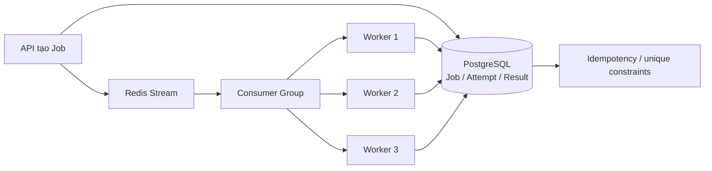

# 23. Để Worker scale stateless, điều kiện bắt buộc là gì?

## Trả lời ngắn

Để có thể chạy thêm nhiều Worker an toàn, hệ thống cần ba điều kiện:

1. **Worker stateless:** Worker không giữ trạng thái nghiệp vụ quan trọng chỉ trong RAM; Job, attempt và kết quả được lưu ở PostgreSQL, còn hàng đợi nằm ở Redis.
2. **Job idempotent:** cùng một message được giao lại nhiều lần vẫn không tạo nhiều kết quả nghiệp vụ khác nhau.
3. **Consumer Group và recovery:** nhiều Worker chia nhau nhận Job; nếu một Worker lỗi thì Job có thể được xử lý hoặc đưa vào quy trình recovery.

Nhờ đó, có thể tăng số Worker để tăng throughput mà không cần chia thủ công Job cho từng máy.

## Minh họa



## Worker stateless là gì?

Stateless không có nghĩa là Worker không có biến trong bộ nhớ. Nó có nghĩa là **RAM của một Worker không phải source of truth**.

Ví dụ, Worker có thể giữ dữ liệu tạm trong lúc chạy một Backtest. Tuy nhiên, Job đang ở trạng thái nào, attempt nào đang chạy và kết quả cuối cùng đều phải được lưu bền vững. Nếu Worker 1 bị tắt, Worker 2 vẫn có thể đọc dữ liệu từ PostgreSQL và tiếp tục quy trình.

Trong project, `BacktestJobHandler` nhận định danh Experiment, Job và Candidate từ message; sau đó cập nhật trạng thái qua các use case thay vì giữ trạng thái Job trong static field hoặc bộ nhớ riêng của Worker.

Bằng chứng: [`BacktestJobHandler.java`](../../../apps/worker/src/main/java/com/cryptostrategy/platform/worker/consumer/BacktestJobHandler.java) và [`WorkerServiceConfig.java`](../../../apps/worker/src/main/java/com/cryptostrategy/platform/worker/config/WorkerServiceConfig.java).

## Job idempotent là gì?

Redis Stream sử dụng cơ chế giao message **at-least-once**. Worker có thể xử lý xong nhưng bị lỗi trước khi ACK, khiến message được giao lại. Vì vậy, Worker phải nhận biết message trùng.

```java
if (idempotencyGuard.isAlreadyProcessed(consumerName, messageId)) {
    messageReader.ack(streamKey, consumerGroup, record.getId());
    return;
}
```

Sau khi xử lý thành công, Worker lưu `messageId` rồi mới ACK message. Bảng `processed_message` có khóa chống trùng và câu lệnh insert sử dụng `ON CONFLICT DO NOTHING`.

Bằng chứng: [`DualLayerIdempotencyGuard.java`](../../../apps/worker/src/main/java/com/cryptostrategy/platform/worker/consumer/DualLayerIdempotencyGuard.java), [`JdbcProcessedMessageStore.java`](../../../modules/persistence/src/main/java/com/cryptostrategy/platform/persistence/internal/worker/JdbcProcessedMessageStore.java) và [`WorkerSql.java`](../../../modules/persistence/src/main/java/com/cryptostrategy/platform/persistence/internal/worker/WorkerSql.java).

Ngoài chống trùng message, các bước hoàn tất Backtest còn sử dụng transaction, trạng thái attempt và các ràng buộc database để bảo vệ kết quả nghiệp vụ.

Bằng chứng: [`CompleteBacktestAttemptService.java`](../../../modules/experiment-execution/src/main/java/com/cryptostrategy/platform/execution/internal/CompleteBacktestAttemptService.java) và [migration Backtest/Evaluation](../../../supabase/migrations/20260901000100_f006_backtest_evaluation_leaderboard.sql).

## Consumer Group và recovery hoạt động thế nào?

Các Worker sử dụng chung Redis Consumer Group. Khi có Job mới, Redis phân phối Job giữa các consumer thay vì yêu cầu mỗi Worker đọc toàn bộ hàng đợi.

```text
Redis Stream → Consumer Group → Worker đang rảnh → xử lý → ACK
```

`BacktestJobConsumer` đọc cả message mới và message pending. `RecoverySweeperEngine` cũng tìm các Job chưa được đưa vào queue, retry đã đến hạn và attempt bị stale để khôi phục quy trình khi có lỗi.

Bằng chứng: [`BacktestJobConsumer.java`](../../../apps/worker/src/main/java/com/cryptostrategy/platform/worker/consumer/BacktestJobConsumer.java), [`RedisStreamMessageReader.java`](../../../apps/worker/src/main/java/com/cryptostrategy/platform/worker/infra/redis/RedisStreamMessageReader.java) và [`RecoverySweeperEngine.java`](../../../apps/worker/src/main/java/com/cryptostrategy/platform/worker/engine/RecoverySweeperEngine.java).

Consumer Group không thay thế idempotency. Nó giúp chia tải, nhưng message vẫn có thể được xử lý lại khi Worker lỗi trước ACK.

## Vì sao có thể scale ngang?

Vì các Worker không phụ thuộc vào bộ nhớ riêng của nhau và cùng đọc một contract Job, có thể chạy thêm instance với cùng cấu hình:

```text
1 Worker   → xử lý ít Job đồng thời
3 Worker   → Consumer Group chia Job cho 3 instance
Worker lỗi → dữ liệu nghiệp vụ vẫn còn trong PostgreSQL
Job lặp    → idempotency và database ngăn kết quả trùng
```

Tuy nhiên, tốc độ không tăng tuyến tính mãi. Khi thêm nhiều Worker, bottleneck có thể chuyển sang PostgreSQL connection pool, lock, Redis, network hoặc việc đọc Dataset. Vì vậy cần theo dõi queue lag và benchmark trước khi tăng số lượng lớn.

## Trạng thái hiện tại

- **Đã có:** Worker runtime, Redis Stream Consumer Group, processed-message guard, ACK, transaction hoàn tất Backtest và recovery sweeper.
- **Trade-off:** tăng thêm thao tác với Redis/PostgreSQL và độ phức tạp recovery, nhưng đổi lại Worker có thể scale và xử lý lại an toàn hơn.

Thiết kế được ghi tại [ADR-0006 — Queue, Worker và Idempotency](../../adr/0006-queue-worker-backtesting.md). Test chống xử lý trùng nằm tại [`DualLayerDedupIntegrationTest.java`](../../../apps/worker/src/test/java/com/cryptostrategy/platform/worker/integration/DualLayerDedupIntegrationTest.java).

## Nguồn đề bài

Slide 49–50 về stateless và idempotency, slide 37–38 về Job Queue trong [slide kiến trúc](../../KienTrucDoAn_slide.pdf), cùng mục 24 trong [đề đồ án](../../Crypto%20Strategy%20Lab%20%E2%80%93%20%C4%90%E1%BB%93%20%C3%A1n%20cu%E1%BB%91i%20k%E1%BB%B3.pdf).
