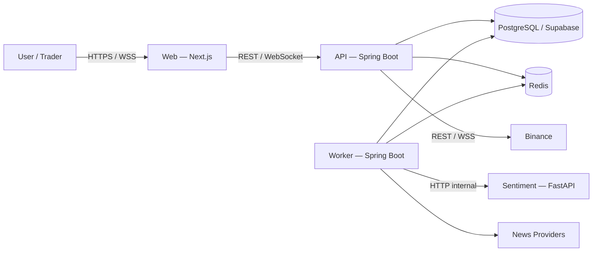

# 2. C4 Context và Container của nhóm?

## Trả lời ngắn

C4 Context cho biết **hệ thống giao tiếp với ai**: User/Trader dùng Crypto Strategy Lab; hệ thống lấy market data từ Binance và tin từ News Providers. C4 Container mở hộp hệ thống ra: Next.js Web gọi Spring Boot API qua REST/WebSocket; API và Worker dùng PostgreSQL làm nguồn dữ liệu bền vững, Redis làm queue/cache; Worker gọi Sentiment FastAPI. API và Worker tách runtime để tác vụ dài không chặn request.

## Minh họa gộp Context và Container

## Phân biệt hai mức

- **Context (C1)**: coi Crypto Strategy Lab là một hộp duy nhất, thể hiện người dùng và hệ thống ngoài.
- **Container (C2)**: thể hiện các ứng dụng/runtime và data store lớn bên trong, chưa đi sâu đến class.
- **Module (C3)**: câu 3 mới mở Java Backend thành Market, Strategy, Experiment, Backtest…

| Container | Nhiệm vụ | Khi lỗi |
| --- | --- | --- |
| Web | Giao diện, auth session, REST/WebSocket client | Không làm mất dữ liệu nguồn |
| API | Validate/auth, use-case đồng bộ, realtime gateway | Không chạy tác vụ dài trong request |
| Worker | Xử lý Backtest/Search/News bất đồng bộ | Job bền vững để retry/recovery |
| Sentiment | Phân tích cảm xúc bằng Python/model | Có thể degraded mà chart vẫn chạy |
| PostgreSQL | Source of truth | Cần backup/recovery |
| Redis | Queue/cache/progress tạm | Có thể phục hồi từ PostgreSQL/Outbox |

## Trạng thái và trade-off

Các container backend, Worker và Sentiment đã có source; Web foundation cũng đã có. Sơ đồ deployment là target architecture nên hosting/port/benchmark nào chưa kiểm chứng vẫn phải ghi Planned. Tách Worker/Sentiment tăng chi phí vận hành nhưng cô lập tác vụ dài và runtime Python.

## Bằng chứng trong project

- [C4 System Context](../../architecture/system-context.md)
- [C4 Container View](../../architecture/container-view.md)
- [Deployment View](../../architecture/deployment-view.md)
- [API application](../../../apps/api/src/main/java/com/cryptostrategy/platform/api/ApiApplication.java)
- [Worker application](../../../apps/worker/src/main/java/com/cryptostrategy/platform/worker/WorkerApplication.java)
- [Sentiment application](../../../apps/sentiment/app/main.py)

## Nguồn đề bài

Slide 11–12 và checklist slide 39 trong [slide kiến trúc](../../KienTrucDoAn_slide.pdf); mục 2–5 và 27–30 trong [đề đồ án](../../Crypto%20Strategy%20Lab%20%E2%80%93%20%C4%90%E1%BB%93%20%C3%A1n%20cu%E1%BB%91i%20k%E1%BB%B3.pdf).

