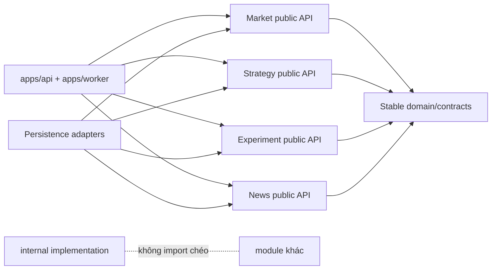

# 3. Boundary của Market / Strategy / Experiment / News?

## Trả lời ngắn

Mỗi capability sở hữu nghiệp vụ và dữ liệu của mình, chỉ công bố `api`, port hoặc event cần thiết. Module khác không import package `internal` hay repository của nó. `apps/api` và `apps/worker` làm composition/orchestration; `persistence` là adapter triển khai output port do capability công bố. Dù dùng chung PostgreSQL, module không được tự ý đọc/ghi bảng của owner khác.

## Minh họa

## Ai sở hữu gì?

| Boundary | Sở hữu | Công bố ra ngoài |
| --- | --- | --- |
| Market | Candle, Dataset, provider normalization/recovery | Market query/subscription và Dataset reader |
| Strategy | Strategy contract, Registry, parameter/provenance | Strategy public API/plugin/materializer |
| Experiment | Manifest, Candidate, Job, Attempt, Outbox | lifecycle/query/output ports |
| News | News Item, collection và analysis lifecycle | News/provider/sentiment contracts |

Ví dụ: Persistence cần lưu Dataset nên nó **implement** output port của Market; Market không import JDBC. Nhờ vậy có thể đổi PostgreSQL adapter mà domain Market không đổi.

## Trạng thái và trade-off

Boundary đã được thể hiện bằng Gradle modules, package `api`/`internal` và architecture tests. Shared database vẫn có nguy cơ coupling nếu truy cập chéo bảng, nên constraint, owner convention và review vẫn cần thiết.

## Bằng chứng trong project

- [Module View](../../architecture/module-view.md)
- [ADR-0002 — Module boundaries](../../adr/0002-module-boundaries.md)
- [Architecture tests](../../../architecture-tests/src/test/java/com/cryptostrategy/platform/architecture)
- [Strategy public API](../../../modules/strategy-core/src/main/java/com/cryptostrategy/platform/strategy/api)
- [Market public API](../../../modules/market-data/src/main/java/com/cryptostrategy/platform/marketdata/api)
- [Experiment public API](../../../modules/experiment/src/main/java/com/cryptostrategy/platform/experiment/api)
- [News public API](../../../modules/news/src/main/java/com/cryptostrategy/platform/news/api)

## Nguồn đề bài

Slide 13–16 và checklist slide 39 trong [slide kiến trúc](../../KienTrucDoAn_slide.pdf); mục 32 về kiến trúc và các module nghiệp vụ trong [đề đồ án](../../Crypto%20Strategy%20Lab%20%E2%80%93%20%C4%90%E1%BB%93%20%C3%A1n%20cu%E1%BB%91i%20k%E1%BB%B3.pdf).

